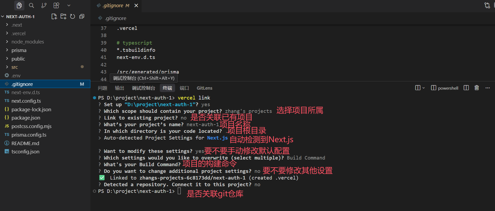
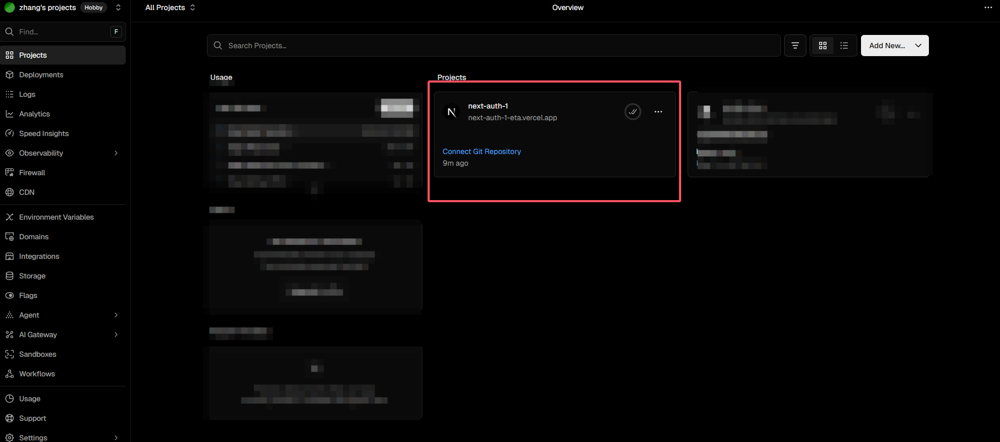
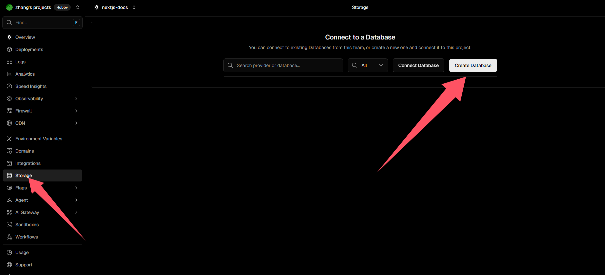
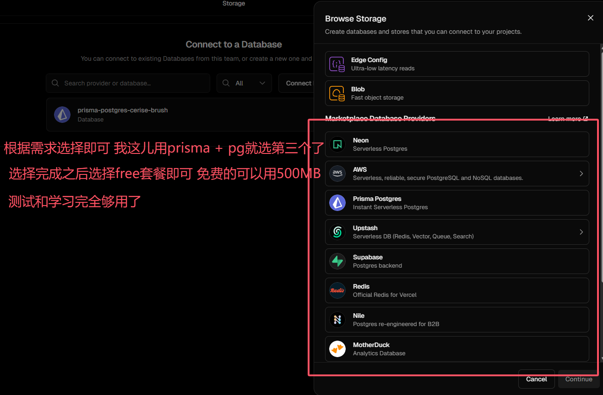
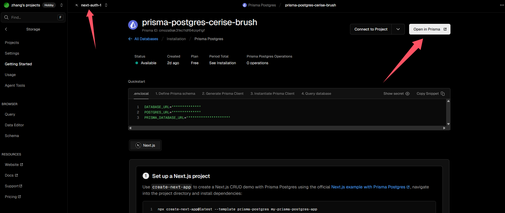
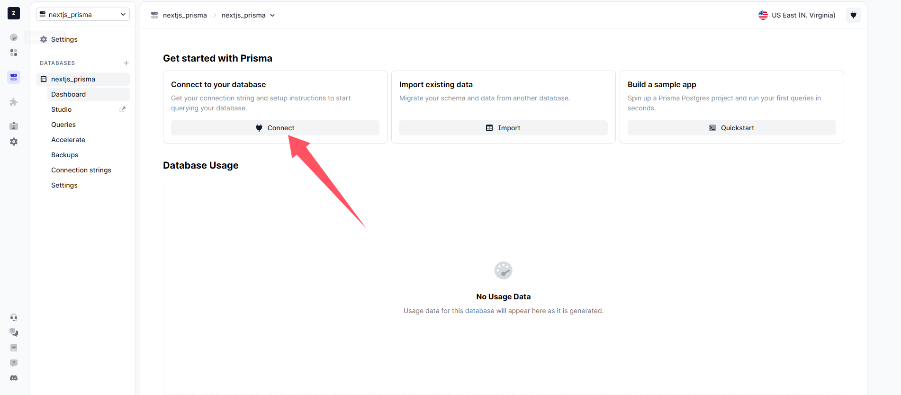
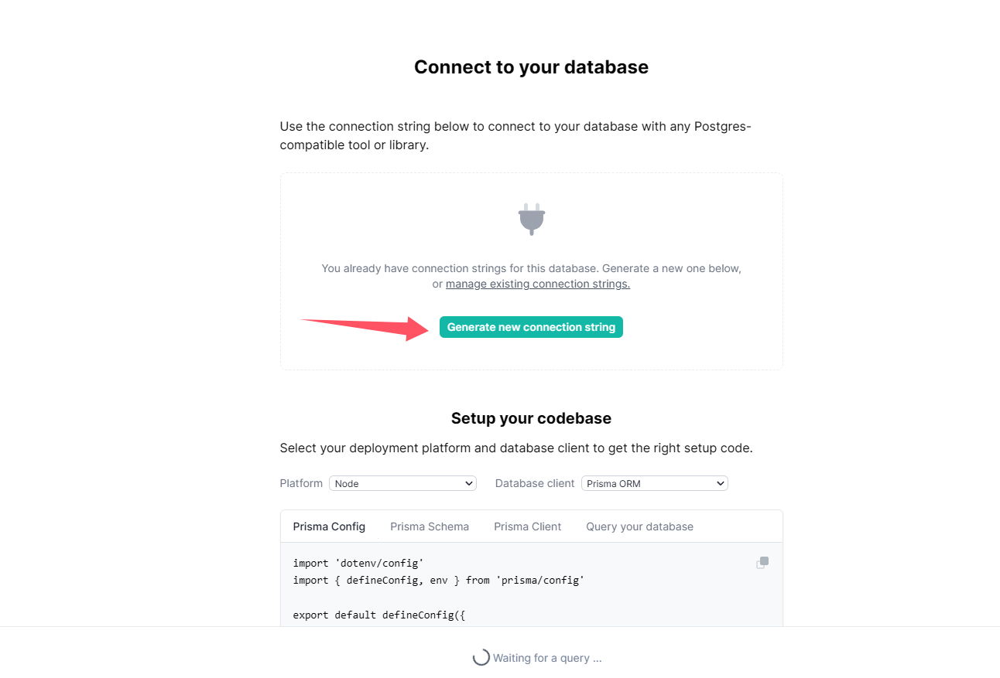
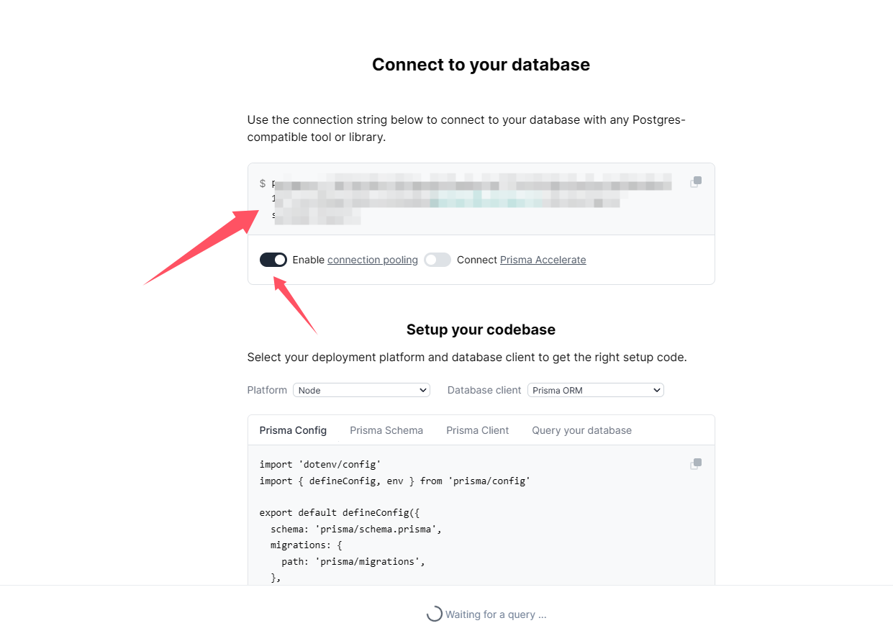

# Vercel 部署

### 为什么选择 Vercel？

1. **与 Next.js 同源**：Vercel 与 Next.js 由同一团队维护，新版本特性、运行时行为与文档往往最先在 Vercel 上得到验证，踩坑相对较少。
2. **边缘网络**：部署在全球边缘节点，静态资源与部分动态能力可就近响应，有利于降低首屏与 API 延迟（具体能力随套餐与路由配置而异）。
3. **HTTPS 与域名**：默认提供 **HTTPS**（自动证书），并支持绑定自有域名；也提供 `*.vercel.app` 子域名用于快速上线与测试。
4. **Git 工作流**：连接 Git 仓库后，推送到主分支可自动构建与生产部署；每个 Pull Request 可生成**独立预览地址**，方便 Code Review 与联调。
5. **与 Next.js 能力对齐**：对 App Router、Server Actions、ISR、Middleware、Edge Runtime 等常见能力有较好支持，控制台可管理环境变量、重定向与部分运行时设置。

>注意事项：免费套餐流量限制: 每月 100GB，其他付费套餐自行选择。

>注意事项2：对国内网络不友好，如果需要国内访问，需要使用代理。


### 部署流程
1. 打开vercel官网: [Vercel](https://vercel.com/login)
2. 登录账号(邮箱，Google，Github等)
3. 安装依赖 
```bash
npm i vercel -g #全局安装
```
4. 打开我们的项目根目录，执行以下命令：
```bash
vercel link #连接我们的项目
```


5. 创建数据库





6. 配置环境变量

在项目中执行以下命令：

```bash
vercel env pull .env.development.local
```
将你在 Vercel 云端控制台配置的「开发环境（Development）」环境变量，一键同步下载到本地项目中

执行完成后，你可以在项目中看到`.env.development.local`文件，并且可以看到你配置的环境变量。添加三个环境变量

```bash
VERCEL_OIDC_TOKEN="vercel自带的不需要管"
PRISMA_DATABASE_URL="postgres://xxxxxx" #三个写成一样的就行
POSTGRES_URL="postgres://xxxxxx" #三个写成一样的就行
PRISMA_DATABASE_URL="postgres://xxxxxx" #三个写成一样的就行
```


接着把本地的.env文件里面的DATABASE_URL修改

```bash
DATABASE_URL="postgres://xxxxxx" #改成和上面一样的就行
```

接着执行命令

```bash
npx prisma migrate dev --name init
npx prisma generate
```

输出以下内容表示成功

```bash
PS D:\project\next-auth-1> npx prisma migrate dev --name init
Loaded Prisma config from prisma.config.ts.

Prisma schema loaded from prisma\schema.prisma.
Datasource "db": PostgreSQL database "postgres", schema "public" at "pooled.db.prisma.io:5432"

Applying migration `20260512044029_init`

The following migration(s) have been created and applied from new schema changes:

prisma\migrations/
  └─ 20260512044029_init/
    └─ migration.sql

Your database is now in sync with your schema.

PS D:\project\next-auth-1> npx prisma generate
Loaded Prisma config from prisma.config.ts.

Prisma schema loaded from prisma\schema.prisma.

✔ Generated Prisma Client (7.8.0) to .\src\generated\prisma in 60ms

PS D:\project\next-auth-1>
```

7. 执行部署命令

```bash
vercel deploy
```
输出以下内容表示成功
```bash
PS D:\project\next-auth-1> vercel deploy
🔍  Inspect: https://vercel.com/zXXXXXXXXX [3s]
✅  Production: https://nexXXXXXXXXXXXX [41s]
🔗  Aliased: https://next-auth-1-eta.vercel.app [41s]
📝  Deployed to production. Run `vercel --prod` to overwrite later (https://vercel.link/2F).
💡  To change the domain or build command, go to https://vercel.com/zXXXXXXX/settings
PS D:\project\next-auth-1> 
```

测试网址：<https://next-auth-1-psi.vercel.app/home>大家可以访问测试一下。