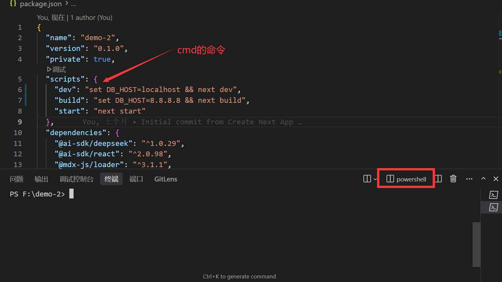
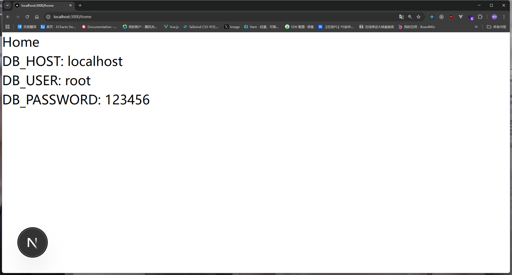

# 环境变量

环境变量一般是指程序在运行时，所需要的一些配置信息，例如数据库连接字符串，API密钥，端口号等。其次就是环境变量跟我们的操作系统有关，例如Linux，Windows，Mac等。

### 基本用法

我先带大家熟悉各种操作系统（Linux，Windows /cmd/powershell，Mac）的临时环境变量的命令：

#### 查询环境变量

1. Linux / MacOS / wsl (通用命令): 

>提示：wsl是Windows Subsystem for Linux的缩写，是Windows 10/11操作系统的一个子系统，允许用户在Windows上运行Linux命令行工具。

```bash
echo $PATH #查询PATH环境变量
```

2. Windows /cmd:

```bash
echo %PATH% #查询PATH环境变量
echo %USERNAME% #查询用户名环境变量
```

3. Windows /powershell:

```bash
dir Env:* #查询所有环境变量
```

输出展示：
```txt
RlsSvcPort                     22112
SESSIONNAME                    Console
SystemDrive                    C:
SystemRoot                     C:\WINDOWS
TEMP                           C:\Users\11955\AppData\Local\Temp
TERM_PROGRAM                   vscode
TERM_PROGRAM_VERSION           2.1.25
TMP                            C:\Users\11955\AppData\Local\Temp
USERDOMAIN                     XIAOMAN
USERDOMAIN_ROAMINGPROFILE      XIAOMAN
USERNAME                       11955
USERPROFILE                    C:\Users\11955
```

#### 设置临时环境变量

1. Linux / MacOS / wsl (通用命令) 提示：这个必学，后期进行部署的时候也很常用。: 

```bash
export XM=123 #设置XM环境变量为123
echo $XM #查询XM环境变量
```

2. Windows /cmd:

```bash
set XM=123 #设置XM环境变量为123
echo %XM% #查询XM环境变量
```

3. Windows /powershell:

```bash
$env:XM='123' #设置XM环境变量为123
echo $env:XM #查询XM环境变量
```
### script-shell

那么我们学会临时环境变量之后有什么用呢？ 我们可以应用到项目中，例如本地环境连接数据库`localhost`,`root`,`12346`,生产环境就会变成`8.8.8.8`,`xiaoman`,`^&TG*H#**P`，等等诸如此类。

打开package.json文件，找到`scripts`配置项，添加一个脚本：

set DB_HOST=localhost(本地环境 自定义环境变量)

set DB_HOST=8.8.8.8(生产环境 自定义环境变量)

这样我们就可以根据不同的环境变量，连接不同的数据库

```json
"scripts": {
    "dev": "set DB_HOST=localhost && next dev",
    "build": "set DB_HOST=8.8.8.8 && next build",
    "start": "next start"
},
```

为什么我在`powershell`终端，编写`cmd`的命令，而且是可以运行的！！！


原理解释:[script-shell](https://docs.npmjs.com/cli/v9/commands/npm-run-script), 是因为npm运行`script`脚本的时候会单独开一个线程，这个线程在`Linux/MacOs`下是`/bin/sh`，在`Windows`下是`cmd`,所以我们在`script`脚本中要编写`cmd`的命令。

### cross-env

我们可以观察上一小节的问题，我们在`script`脚本中编写了`cmd`的命令，但是如果他在powershell终端/MacOs终端/Linux终端，他就无法运行，也就是跨平台问题。

所以我们可以使用`cross-env`来解决这个问题，`cross-env`是一个跨平台的环境变量设置工具，他可以让我们在不同的操作系统下，使用相同的命令来设置环境变量。

```bash
npm install cross-env -D #安装cross-env
```

然后我们就可以在`package.json`文件中使用`cross-env`来设置环境变量：


```json
"scripts": {
    "dev": "cross-env DB_HOST=localhost next dev",
    "build": "cross-env DB_HOST=8.8.8.8 next build",
    "start": "next start"
},
```

这样我们就可以在不同的操作系统下，使用相同的命令来设置环境变量了。


### 最佳实践

因为上述方式依旧麻烦，如果有很多的环境变量，我们的命令就会变得非常长，所以我们可以使用`.env`文件来存储环境变量。

Next.js 环境变量查找规则(官方规定)，如果在其中一个链路中找到了环境变量，那么就不会继续往下找了。

 1. process.env
 2. .env.$(NODE_ENV).local
 3. .env.local（未检查的情况NODE_ENV。test）
 4. .env.$(NODE_ENV)
 5. .env

>提示：NODE_ENV是Next.js自动注入的环境变量，开发模式他会注入`development`，生产模式他会注入`production`。

所以我们就可以创建两个不同的`env`文件，一个是开发环境，一个是生产环境。

创建 `.env.development.local`文件(表示开发环境)，并添加环境变量：

```env
DB_HOST=localhost
DB_USER=root
DB_PASSWORD=123456
```

创建 `.env.production.local`文件(表示生产环境)，并添加环境变量：

```env
DB_HOST=8.8.8.8
DB_USER=xiaoman
DB_PASSWORD=^&TG*H#**P
```

创建`/src/app/home/page.tsx`文件，并添加环境变量：

```tsx
//服务器组件 不要增加`use client`
export default function Home() {
  return <div>
    <h1>Home</h1>
    <p>DB_HOST: {process.env.DB_HOST}</p>
    <p>DB_USER: {process.env.DB_USER}</p>
    <p>DB_PASSWORD: {process.env.DB_PASSWORD}</p>
  </div>;
}
```

当我们执行`npm run dev`时，他会自动读取`.env.development.local`文件中的环境变量，当我们执行`npm run build`时，他会自动读取`.env.production.local`文件中的环境变量。

