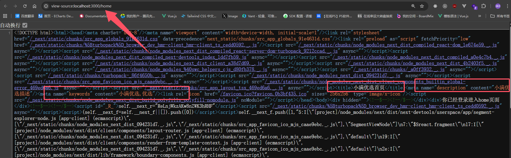
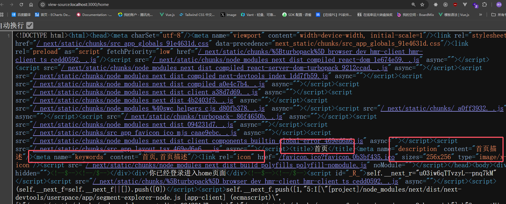

# TDK + meta

TDK 是 `Title`、`Description`、`Keywords` 的缩写，是 SEO（搜索引擎优化）里的核心元信息，也常统称为页面的**元数据**。

在原生 HTML 里，它们大致对应 `<head>` 中的 `<title>`、`<meta name="description">`、`<meta name="keywords">` 等。使用 **App Router** 时，Next.js 通过 **`export const metadata`** 或 **`generateMetadata`** 生成上述标签，由框架写入文档头部，无需手写整段 `<head>`。

### TDK 的作用

#### title

`title` 是页面标题，通常会出现在浏览器标签页和搜索引擎结果页（SERP）上，**对点击率影响最大**。建议简洁、准确，并体现当前页与站点/栏目的关系（例如与根布局的 `title.template` 搭配使用，见下文）。

#### description

`description` 是页面摘要，常被用作 SERP 中的描述文案（搜索引擎也可能根据内容自行改写）。应用一两句话概括页面价值，避免堆砌关键词。

#### keywords

`keywords` 用于概括页面主题。主流搜索引擎对 `<meta name="keywords">` 的排序权重已很低，但**规范填写**仍有利于内部归类、CMS 或后续扩展；不要为 SEO 而重复、堆砌无意义词组。

### 书写上的小建议（实践向）

- **title**：不同页面应有区分度；全站共用的后缀可通过根布局的 `title.template` 统一拼接。
- **description**：长度适中即可（常见建议约 150 字以内作参考），重点写清「这一页解决什么问题」。
- **keywords**：用数组表达多个词即可，与页面内容一致即可。

### Next.js 中如何配置 TDK

我们使用 **App Router**，一般在 **`app` 目录下的根布局 `layout.tsx`** 中导出 `metadata`，作为全站默认 TDK；子路由下的 `layout.tsx` / `page.tsx` 若再次导出 `metadata`，会对父级进行**覆盖或按字段合并**（例如子页面的 `title` 会覆盖继承来的默认标题，具体以 [Metadata 文档](https://nextjs.org/docs/app/building-your-application/optimizing/metadata) 为准）。

`metadata` 为**静态对象**，适合不依赖请求参数、不依赖异步接口数据的场景。

```tsx
// app/layout.tsx
import type { Metadata } from 'next';

export const metadata: Metadata = {
  title: '小满优选',
  description: '小满优选描述',
  keywords: ['小满优选', '优选'],
};
```



子路由需要单独展示时，在对应 **`page.tsx`（或该段的 `layout.tsx`）** 中再导出一份 `metadata` 即可；未声明的字段会继续沿用祖先布局的配置。

根布局里还可以用 **`title.default` + `title.template`**，让子页面只写短标题、全站自动带上后缀，例如：

```tsx
// app/layout.tsx（节选）
export const metadata: Metadata = {
  title: {
    default: '小满优选',
    template: '%s | 小满优选',
  },
  description: '小满优选描述',
  keywords: ['小满优选', '优选'],
};
```

子页面写 `title: '首页'` 时，在支持模板合并的情况下，浏览器标题可呈现为 **`首页 | 小满优选`**（具体以当前 Next 版本行为为准）。

```tsx
// app/home/page.tsx
import type { Metadata } from 'next';

export const metadata: Metadata = {
  title: '首页',
  description: '首页描述',
  keywords: ['首页', '小满优选'],
};

export default function Page() {
  return <div>首页</div>;
}
```



### 进阶：用 `generateMetadata` 动态配置 TDK

当标题、描述等需要依赖 **动态路由参数**、**查询参数** 或 **接口 / 数据库** 时，在对应 `page.tsx`（或 `layout.tsx`）中导出异步函数 **`generateMetadata`**，返回 `Metadata` 对象即可。它在服务端执行，可与页面数据使用同一套请求逻辑（注意缓存与性能，必要时配合 `fetch` 的缓存选项或数据层）。

#### 参数说明

1. **第一个参数 `props`**
   - **`params`**：动态路由段，例如 `app/posts/[id]/page.tsx` 中的 `id`。
   - **`searchParams`**：当前 URL 的查询参数，例如 `?id=123`。
2. **第二个参数 `parent`**
   - 类型为 **`ResolvingMetadata`**，表示**父级布局已解析的 metadata**。`await parent` 后可用于拼接标题、继承 `openGraph` 图片等。

下面示例假定路由为 **`app/posts/[id]/page.tsx`**，根据 `id` 请求文章并生成 TDK（接口仅为演示，可换成你的真实 API）：

```tsx
// app/posts/[id]/page.tsx
import type { Metadata, ResolvingMetadata } from 'next';

type Props = {
  params: Promise<{ id: string }>;
};

export async function generateMetadata(
  { params }: Props,
  parent: ResolvingMetadata
): Promise<Metadata> {
  const { id } = await params;
  const resolvedParent = await parent;

  const res = await fetch(
    `https://jsonplaceholder.typicode.com/posts/${id}`
  );
  if (!res.ok) {
    return { title: '文章未找到' };
  }
  const data = await res.json();

  return {
    title: `${data.title} | ${resolvedParent.title?.absolute ?? '文章'}`,
    description: data.body.slice(0, 160),
    keywords: [data.title],
  };
}

export default async function PostPage({ params }: Props) {
  const { id } = await params;
  return <div>文章 id：{id}</div>;
}
```

若还需根据 **`searchParams`**（例如 `?tab=reviews`）切换描述，把函数第一个参数写为 `{ params, searchParams }` 并在需要时同样 **`await searchParams`** 即可。

### 其他常用 Metadata（了解即可）

除 TDK 外，`Metadata` 还可配置 **Open Graph**、**Twitter Card**、**robots**、**站点图标**、**添加到主屏幕（PWA）相关** 等。配置 **相对路径的图片**（如 OG 图）时，建议在根 `metadata` 中设置 **`metadataBase`**（站点根 URL），以便 Next 正确拼出绝对地址。

```tsx
import type { Metadata } from 'next';

export const metadata: Metadata = {
  metadataBase: new URL('https://example.com'),
  title: '小满优选',
  description: '小满优选描述',
  keywords: ['小满优选', '优选'],
  openGraph: {
    title: '...',
    description: '...',
    type: 'website',
    images: ['/og.png'],
  },
  twitter: {
    card: 'summary_large_image',
    title: '...',
    description: '...',
    images: ['/og.png'],
  },
  robots: {
    index: true,
    follow: true,
  },
  icons: {
    icon: '/favicon.ico',
  },
  appleWebApp: {
    capable: true,
    title: '小满优选',
    statusBarStyle: 'black-translucent',
  },
};
```