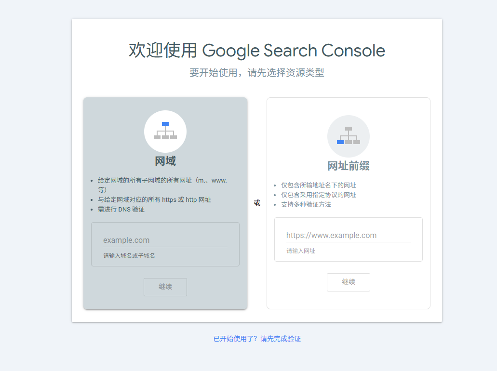
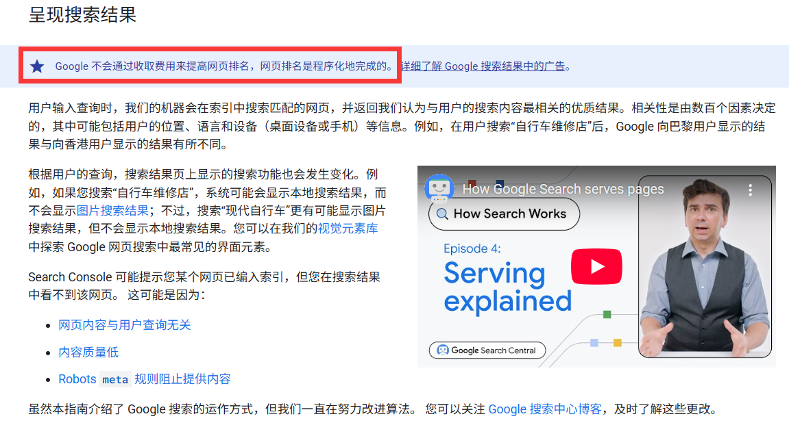

# Google搜索引擎

Google 搜索是一款`全自动搜索引擎`，会使用名为“网页抓取工具”的软件定期探索网络，找出可添加到 Google 索引中的网页。实际上，Google 搜索结果中收录的大多数网页都不是手动提交的，而是网页抓取工具在探索网络时找到并自动添加的。

## Google搜索引擎原理

Google 搜索的工作流程分为 3 个阶段:

1. `抓取`：Google 会使用名为“抓取工具”的自动程序从互联网上发现各类网页，并下载其中的文本、图片和视频。
2. `索引编制`：Google 会分析网页上的文本、图片和视频文件，并将信息存储在大型数据库 Google 索引中。
3. `呈现搜索结果`：当用户在 Google 中搜索时，Google 会返回与用户查询相关的信息。

所以答案就是：抓取->索引编制->呈现搜索结果

### 抓取

谷歌会使用(Googlebot)去抓取网页，Googlebot也被称为(抓取工具、漫游器或“蜘蛛”程序)，他会通过算法来决定哪些网页需要抓取，并且确保不会过快抓取，以免对网站造成负担。

那么它是怎么抓取的呢？

1. 通过链接抓取例如你的网站有a标签，那么Googlebot会通过a标签的href属性来抓取网页。`<a href="https://www.xxxxxx.com">xxxxx</a>`
2. robots.txt(告诉爬虫机器人哪些页面可以抓取，哪些页面不能抓取，后面会详细讲)
2. 站点地图 `sitemap.xml`（列出网站中的网页、文件、视频等 URL，方便爬虫发现和抓取这些资源
3. 如果网站未收录，可以通过`Google Search Console`提交网站。


4. RSS订阅，例如你的网站有RSS订阅，那么Googlebot会通过RSS订阅来抓取网页。

5. 重定向，谷歌机器人也会根据你301/302重定向来抓取网页。

6. JavaScript，现代谷歌浏览器已经可以识别JavaScript代码中动态生成的链接，也会被收录。

### 索引编制

什么是索引编制？

1. 索引编制是把抓取到的内容匹配成用户查询的形式，插入到索引数据库中。用户搜索时，Google 是在索引数据库中进行匹配和排序的，并不是实时抓取全网的，所以你修改的网页一般要(2-3周)才会被同步

2. 被抓取 ≠ 被索引如果你在代码中编写了`noindex`，则该页面不会加入索引数据库中。
```html
<meta name="robots" content="noindex">
```

3. 索引信号
索引信号是指Googlebot分析网页的内容，例如`TDK`，`HTML语义化标签`，`JSON-LD`，`Open Graph`，`Web Vitals`，`alt属性`，分析这些内容和网站质量，用于进行评估提升排名。

4. 注意事项
如果你的网站有以下情况，则会被降低排名：`伪装真实内容` `滥用门页` `滥用过期域名` `被黑内容` `滥用隐藏文字和链接` `关键字堆砌` `垃圾链接` `机器生成的流量` `恶意软件和恶意行为` `误导性功能` `滥用规模化内容` `滥用网站声誉` `内容贫乏的联属营销` `用户生成的垃圾内容` 

>原文链接:https://developers.google.com/search/docs/essentials/spam-policies?hl=zh-cn

### 呈现搜索结果

谷歌官方承诺：`Google 不会通过收取费用来提高网页排名，网页排名是程序化地完成的`(靠的是你对SEO的实力)

1. 排名的考量(相关性-内容与搜搜意图的匹配)(权威性-域名权重，外链质量)(用户体验-加载速度SEO友好)
2. 收录，在被抓如到索引之后，通常是2-3周才会被收录，排名需要一段时间的积累权重，一般是2-3个月。
3. 结果，搜索的结果会全方面考量，用户的语言，设备，历史记录，SEO优化的是整体，而不是固定某个位置。
