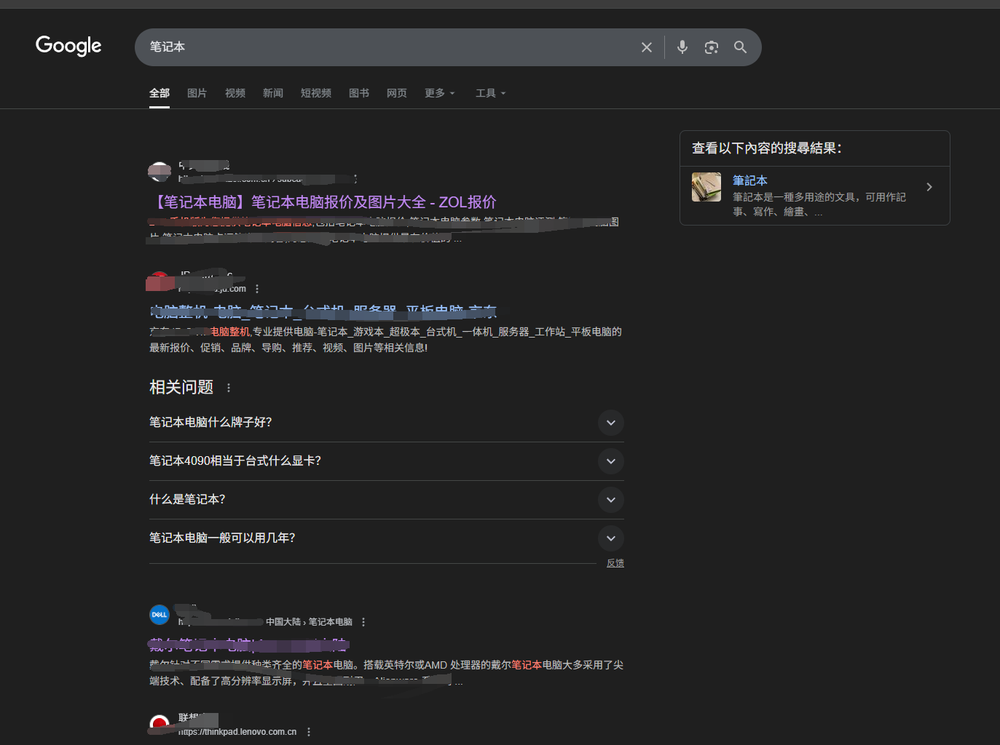
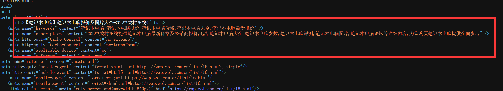

# SEO介绍

SEO(Search Engine Optimization)，即搜索引擎优化，是一种通过优化网站结构和内容，提高网站在搜索引擎中的排名，从而吸引更多流量和用户的策略。

tips: SEO是一个长期优化过程(一般优化1-3个月才能看到效果)，无需急于求成。

### 黑帽SEO

黑帽SEO是指通过不正当的手段，如关键词堆砌、隐藏文本、欺诈性链接等，来提高网站在搜索引擎中的排名。这种做法虽然可以在短期内获得较好的效果，但长期来看会对网站造成严重的负面影响，甚至可能导致网站被搜索引擎惩罚。

例如我们在Google搜索`笔记本`,我们找排名第一的网站

然后进去网站之后

鼠标右键->查看网页源代码,发现他用了非常多的关键词堆砌(笔记本)，这就是黑帽SEO(豆包说的,不是我说的😏)。

### 白帽SEO

白帽SEO就是通过正当技术手段，例如优化`TDK`，优化网站结构，优化`robots.txt`，优化`sitemap.xml`，优化`JSON-LD`，优化`Open Graph`，优化`Web Vitals`等，来提高网站在搜索引擎中的排名。

### SEO实践

1. 理解搜索引擎的工作原理
2. robots.txt 和 sitemap.xml 的配置
3. TDK优化 + HTML语义化标签
4. JSON-LD
5. Open Graph
6. Web Vitals
7. SEO工具的使用