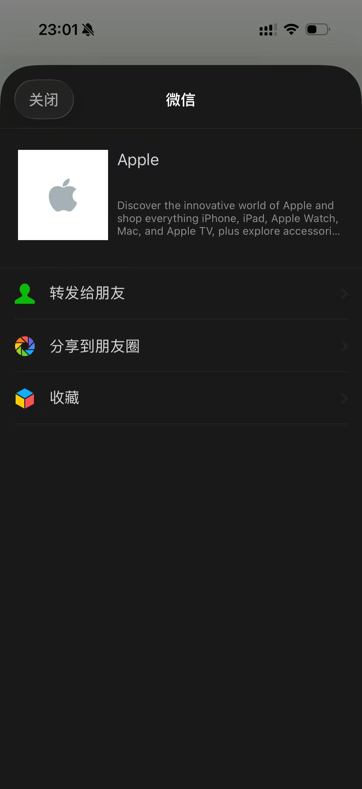

# Open Graph（OG）

**Open Graph** 是 Facebook（现 Meta）提出的一套页面元数据协议，通过 `<meta property="og:*">` 描述标题、描述、封面图、类型等。当链接被分享到微信、Slack、Discord、LinkedIn 等平台时，抓取方会读取这些标签来生成**卡片预览**，因此 OG 与 **SEO**（点击率、品牌呈现）和 **传播体验** 都密切相关。

在 **App Router** 中，Next.js 通过导出 **`metadata`** 或 **`generateMetadata`** 中的 `openGraph` 字段，自动生成对应的 OG 标签，无需手写整段 `<head>`。官方说明见 [Metadata API](https://nextjs.org/docs/app/api-reference/functions/generate-metadata) 与 [Optimizing Metadata](https://nextjs.org/docs/app/building-your-application/optimizing/metadata)。

## 实例：苹果官网的 OG 标签与分享效果

下面这段是 [Apple 官网](https://www.apple.com/) 首页实际输出的部分 OG 元数据（与页面在浏览器「查看源代码」中可见的 `og:*` 一致；`og:image` 上的查询串常用于**缓存版本**控制，可按需更新）：

```html
<meta property="og:image" content="https://www.apple.com/ac/structured-data/images/open_graph_logo.png?202604211141" />
<meta property="og:title" content="Apple" />
<meta property="og:description" content="Discover the innovative world of Apple and shop everything iPhone, iPad, Apple Watch, Mac, and Apple TV, plus explore accessories, entertainment, and expert device support." />
<meta property="og:url" content="https://www.apple.com/" />
<meta property="og:locale" content="en_US" />
<meta property="og:site_name" content="Apple" />
<meta property="og:type" content="website" />
```

在微信里转发该链接时，客户端会按上述字段拼出**链接卡片**：左侧一般为 `og:image`（此处为白底灰苹果 Logo），右侧为 **`og:title`** 粗体标题，其下为 **`og:description`** 摘要（各客户端会按自己的规则截断并加省略号）。



同一组信息在 Next.js 里可写成 `Metadata['openGraph']`（图片用绝对 URL 时不必依赖 `metadataBase`）：

```tsx
import type { Metadata } from 'next';

export const metadata: Metadata = {
  openGraph: {
    title: 'Apple',
    description:
      'Discover the innovative world of Apple and shop everything iPhone, iPad, Apple Watch, Mac, and Apple TV, plus explore accessories, entertainment, and expert device support.',
    url: 'https://www.apple.com/',
    siteName: 'Apple',
    locale: 'en_US',
    type: 'website',
    images: [
      {
        url: 'https://www.apple.com/ac/structured-data/images/open_graph_logo.png?202604211141',
      },
    ],
  },
};
```

## `openGraph` 能配置什么

在 `Metadata` 对象里的 `openGraph` 还支持视频、音频、多图、文章发布时间等。常用字段归纳如下：

| 配置项 | 典型用途 |
| --- | --- |
| `title` / `description` | 卡片标题与摘要（可与页面 TDK 一致或单独优化分享文案） |
| `url` | 规范链接，建议与当前页可访问 URL 一致 |
| `siteName` | 站点名称 |
| `images` | 预览图（可多图）；常配宽高与 `alt` |
| `videos` / `audio` | 富媒体预览（需绝对 URL） |
| `locale` | 语言区域，如 `en_US` |
| `type` | 资源类型，如 `website`；文章常用 `article` |


```tsx
// app/layout.tsx 或任意 page.tsx / layout.tsx
import type { Metadata } from 'next';

export const metadata: Metadata = {
  openGraph: {
    title: 'Next.js',
    description: 'The React Framework for the Web',
    url: 'https://nextjs.org',
    siteName: 'Next.js',
    images: [
      {
        url: 'https://nextjs.org/og.png',
        width: 800,
        height: 600,
      },
      {
        url: 'https://nextjs.org/og-alt.png',
        width: 1800,
        height: 1600,
        alt: 'My custom alt',
      },
    ],
    locale: 'en_US',
    type: 'website',
  },
};
```

文章类页面可设置 `type: 'article'`，并配合 `publishedTime`、`authors` 等，框架会输出 `article:*` 系列属性（详见 [官方 openGraph 小节](https://nextjs.org/docs/app/api-reference/functions/generate-metadata#opengraph)）。

## Open Graph 官网与 `type` 去哪查

如果你想确认协议原文或查 `og:type` 的语义，优先看 Open Graph 官方站点：

- 协议首页：[`ogp.me`](https://ogp.me/)
- `type` 说明与扩展类型入口：[`ogp.me/#types`](https://ogp.me/#types)
- 已定义的对象类型列表（如 `website`、`article`、`video.movie` 等）：[`ogp.me/#structured`](https://ogp.me/#structured)

在 Next.js 项目里，`openGraph.type` 还受 Next 的 TypeScript 类型约束。你可以通过两种方式确认当前版本支持的值：

- 查看 Next.js 文档中的 `openGraph` 字段示例与说明：[`generateMetadata#opengraph`](https://nextjs.org/docs/app/api-reference/functions/generate-metadata#opengraph)
- 在编辑器里把鼠标悬停到 `Metadata['openGraph']['type']`（或跳转到 `next` 包类型定义）查看联合类型，以你项目安装的 Next 版本为准。

## `metadataBase` 与相对路径

OG 图片等 **URL 类字段** 在多数场景下需要**绝对地址**。根布局中设置 **`metadataBase`** 后，当前段及子路由里的相对路径会与基址拼接，避免到处写死域名：

```tsx
import type { Metadata } from 'next';

export const metadata: Metadata = {
  metadataBase: new URL('https://acme.com'),
  openGraph: {
    images: '/og-image.png',
  },
};
```

若某字段已是完整 `https://...`，则不再套用 `metadataBase`。未配置 `metadataBase` 却在 URL 类元数据里使用相对路径，构建可能报错，这一点以你当前 Next.js 版本文档为准。

## 动态路由：`generateMetadata` 与父级 `images`

详情页等需要按参数拉数据时，使用 **`generateMetadata`**。第二个参数 **`parent`** 可拿到父布局已解析的 metadata，便于在子页面**追加** OG 图而不是整段覆盖，例如把当前商品图插到继承来的图片列表前面：

```tsx
import type { Metadata, ResolvingMetadata } from 'next';

type Props = { params: Promise<{ id: string }> };

export async function generateMetadata(
  { params }: Props,
  parent: ResolvingMetadata
): Promise<Metadata> {
  const { id } = await params;
  const product = await fetch(`https://api.example.com/products/${id}`).then(
    (r) => r.json()
  );
  const previousImages = (await parent).openGraph?.images || [];

  return {
    title: product.title,
    openGraph: {
      images: ['/some-specific-page-image.jpg', ...previousImages],
    },
  };
}
```

同一数据请求在 `generateMetadata` 与页面 Server Component 之间会被 **memoized**，避免重复打接口（见官方 [generateMetadata](https://nextjs.org/docs/app/api-reference/functions/generate-metadata) 说明）。

## 基于文件的 OG 图（推荐场景）

单独维护「导出里的图片 URL」和「仓库里的真实文件」容易不同步。对 OG 图而言，更省事的做法是使用 **基于文件的 Metadata**，例如在路由段放置 `opengraph-image.png` 或 `opengraph-image.tsx` 动态生成图，由框架生成正确 meta。详见 [opengraph-image](https://nextjs.org/docs/app/api-reference/file-conventions/metadata/opengraph-image)。

## 与布局继承的关系（简要）

子路由若**导出**了自己的 `openGraph` 对象，会与父级按官方规则做**合并或覆盖**；若子段完全不设置 `openGraph`，则继续沿用祖先布局的配置。具体嵌套行为以 [Metadata 字段与继承](https://nextjs.org/docs/app/api-reference/functions/generate-metadata#metadata-fields) 为准。

## 实践建议

- **一图多用**：分享图尺寸需符合各平台建议（常见如 1200×630 等），并保持主体在安全区内，避免裁切后信息丢失。品牌站也可用苹果这种**方形 Logo 图**，在部分客户端里会以缩略图形式出现。
- **与 TDK 协调**：`openGraph.title` / `openGraph.description` 可与 `metadata.title`、`metadata.description` 相同，也可为分享单独写更「点击率友好」的短文案。
- **验证**：改完后用各平台提供的调试/预览工具（如部分平台提供的 URL 调试器）拉取一次，确认缓存更新后再对外发链接。

更多字段与 HTML 对照表仍以 Next.js 官网 [openGraph](https://nextjs.org/docs/app/api-reference/functions/generate-metadata#opengraph) 为准。
