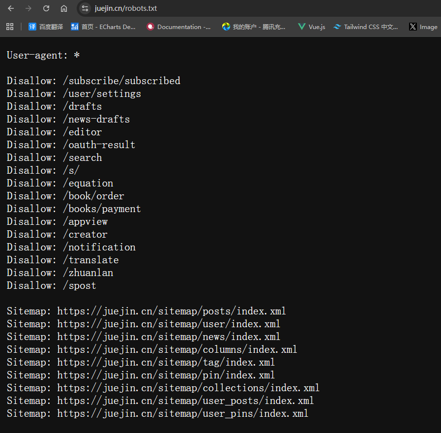
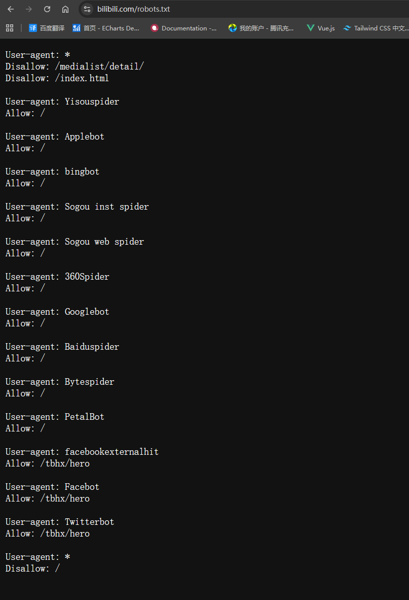

# robots.txt

robots.txt是搜索引擎爬虫访问网站时遵循的规则，它告诉搜索引擎哪些页面可以抓取，哪些页面不能抓取。一般是存放在网站根目录下。


### 参数说明

#### User-agent
user-agent是搜索引擎爬虫的名称，例如`Googlebot`，`Baiduspider`，`Bingbot`，`YandexBot`，`Sogou spider`，`Yahoo! Slurp`，`BingPreview`等，也可以直接使用`*`表示所有搜索引擎爬虫都可以访问。

#### Disallow
disallow是搜索引擎爬虫不能访问的页面，例如/admin/，/api/，/login/，/logout/等。

#### Allow
allow是搜索引擎爬虫可以访问的页面，例如/，/about/，/contact/等。

#### Crawl-delay
crawl-delay是搜索引擎爬虫访问网站的间隔时间，例如10，表示搜索引擎爬虫访问网站的间隔时间为10秒。
>注意: Google机器人不支持该参数，其他部分爬虫机器人支持该参数

#### Sitemap
sitemap是网站地图的URL，例如https://www.某某某.com/sitemap.xml。

#### Host
host是网站的域名，例如https://www.某某某.com。

### 示例

#### 掘金

掘金的User-agent是*，表示所有搜索引擎爬虫都可以访问。

以及配置了Disallow: /subscribe/subscribed，表示搜索引擎爬虫不能访问/subscribe/subscribe这个路由，等等其他路由也是同理。

配置了Sitemap: <https://juejin.cn/sitemap/posts/index.xml>，表示搜索引擎爬虫可以访问网站地图，网站地图会列出网站中的所有页面，方便搜索引擎爬虫抓取。

#### 哔哩哔哩

> 若同一份 robots.txt 里既有通配符 *，又有具名爬虫（如 Googlebot），则对某只爬虫而言，会优先采用与其名称匹配的那一组规则；没有单独声明时再回退到 *

##### 第一组规则

```txt
User-agent: *
Disallow: /medialist/detail/
Disallow: /index.html
```
通配符 `*` 段：声明不得抓取 `/medialist/detail/` 与 `/index.html`。下文已单独写出 `User-agent` 的爬虫（如 `Googlebot`）按各自分组执行，一般**不适用**本段这两条限制。

##### 第二组规则

```txt
User-agent: Yisouspider
Allow: /

User-agent: Applebot
Allow: /

User-agent: bingbot
Allow: /

User-agent: Sogou inst spider
Allow: /

User-agent: Sogou web spider
Allow: /

User-agent: 360Spider
Allow: /

User-agent: Googlebot
Allow: /

User-agent: Baiduspider
Allow: /

User-agent: Bytespider
Allow: /

User-agent: PetalBot
Allow: /
```
为各主流搜索引擎爬虫单独声明 `Allow: /`，表示允许抓取整站路径。

##### 第三组规则

```txt
User-agent: facebookexternalhit
Allow: /tbhx/hero

User-agent: Facebot
Allow: /tbhx/hero

User-agent: Twitterbot
Allow: /tbhx/hero
```

面向 Facebook、Twitter 等社交/预览类爬虫，声明允许 `/tbhx/hero`（多用于分享卡片、链接预览等）。

##### 第四组规则
```txt
User-agent: *
Disallow: /
```
兜底：对**未在上面单独列名**的爬虫，禁止抓取全站（`/`）。若文件中出现多段 `User-agent: *`，路径规则如何合并以各搜索引擎实现为准。

### Next.js中实现robots.txt

Next.js中实现robots.txt非常简单，我们是`AppRouter`，所以直接在`app`目录下创建一个`robots.[ts | js]`文件即可。

```ts
import type { MetadataRoute } from "next";
export default function robots(): MetadataRoute.Robots {
    return {
        //如果是通用规则，可以这样写，就直接是一个对象类似于掘金
        // rules: {
        //    userAgent: '*',
        //    allow: '/',
        //    disallow: '/private/',
        //  },
        //自定义爬虫机器人规则可以用数组形式，就是一个数组类似于哔哩哔哩
        rules: [
            {
                userAgent: 'Googlebot', //搜索引擎爬虫的名称
                allow: '/', //允许访问的页面
                disallow: '/api/', //不允许访问的页面
                crawlDelay: 10, //访问间隔时间(Google机器人不支持该参数，其他部分爬虫机器人支持该参数)
            },
            {
                userAgent: 'Baiduspider',
                allow: '/',
                disallow: '/api/',
                crawlDelay: 10,
            },
            {
                userAgent: 'Bingbot',
                allow: '/',
                disallow: '/api/',
                crawlDelay: 10,
            },
            {
                userAgent: 'YandexBot',
                allow: '/',
                disallow: '/api/',
                crawlDelay: 10,
            },
            {
                userAgent: 'Sogou spider',
                allow: '/',
                disallow: '/api/',
                crawlDelay: 10,
            },
        ],
        sitemap: 'xxxx', //网站地图的URL
        //如果有多个可以写成一个数组
        //sitemaps: ['https://www.xxxxxx.com/sitemap.xml', 'https://www.xxxxxx.com/sitemap2.xml'],
    }
}
```

代码保存之后Next.js会自动生成一个robots.txt文件。

```txt
User-Agent: Googlebot
Allow: /
Disallow: /api/
Crawl-delay: 10

User-Agent: Baiduspider
Allow: /
Disallow: /api/
Crawl-delay: 10

User-Agent: Bingbot
Allow: /
Disallow: /api/
Crawl-delay: 10

User-Agent: YandexBot
Allow: /
Disallow: /api/
Crawl-delay: 10

User-Agent: Sogou spider
Allow: /
Disallow: /api/
Crawl-delay: 10

Sitemap: xxxx
```