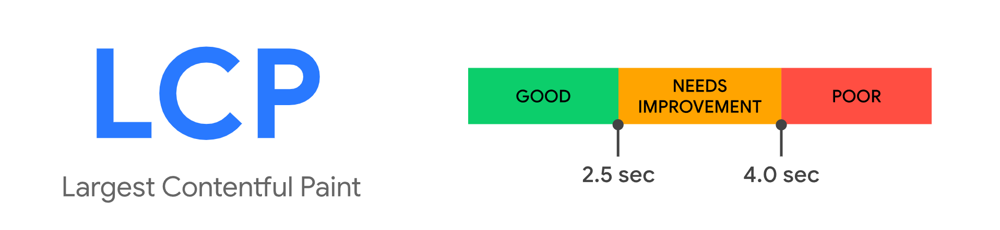
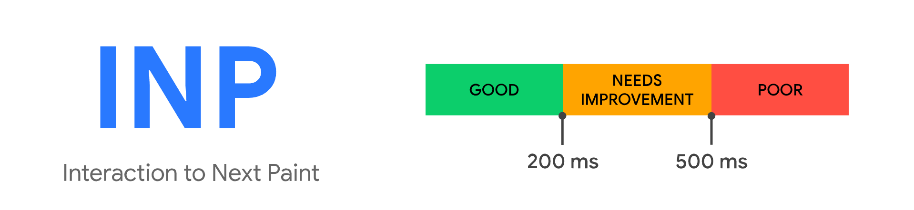
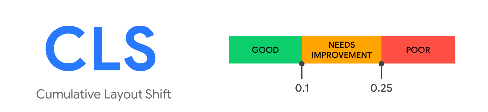
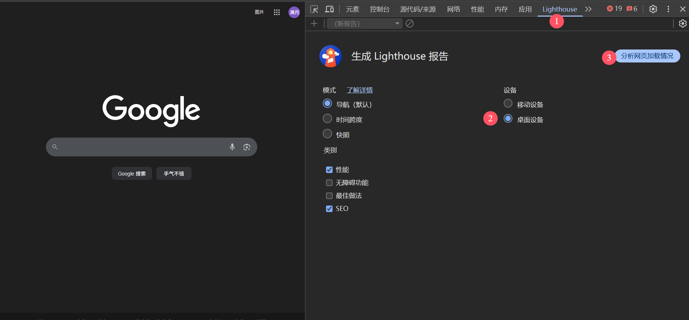
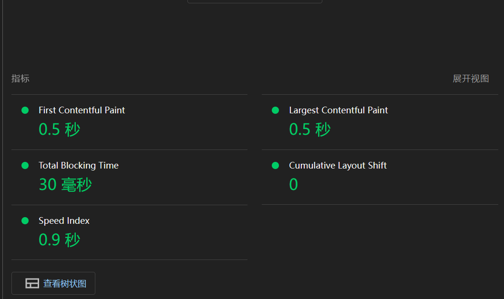
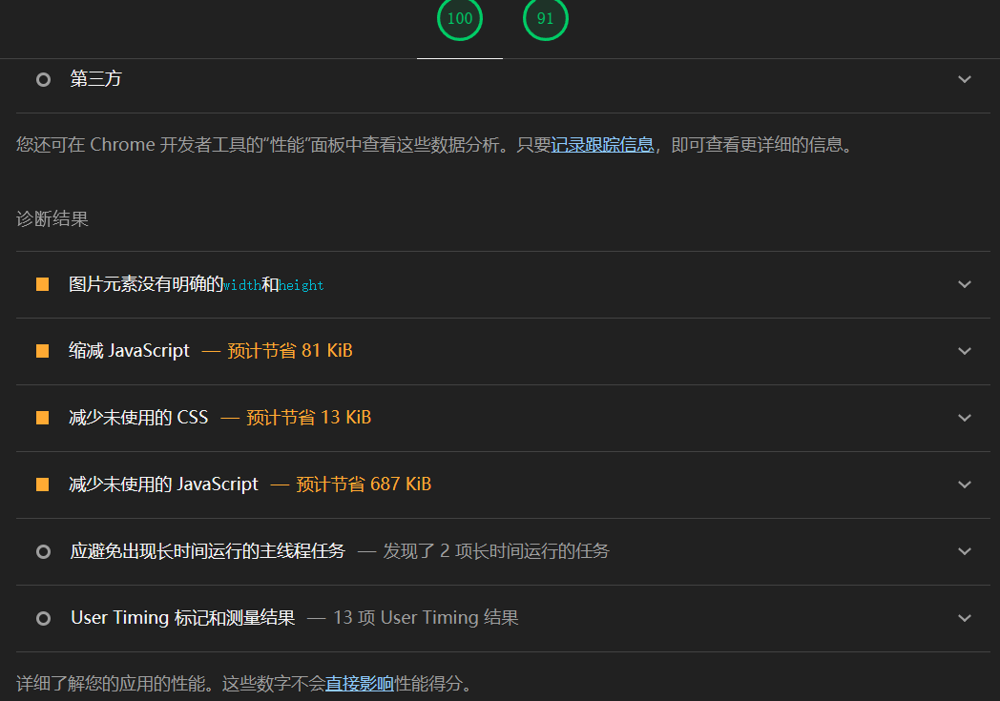

# web vitals

Web Vitals 是 Google 推出的一套以用户为中心的网页性能指标体系，用来衡量真实用户在加载速度、交互响应、页面稳定性三个维度的体验表现，也是 SEO 评估的重要参考项。

## 核心三项（LCP、INP、CLS）

截至 2026 年，Core Web Vitals 仍由以下三项组成：

### LCP（Largest Contentful Paint，最大内容绘制时间）

LCP 衡量的是视口内最大内容元素（通常是大图、视频封面或大段文本）完成渲染所需的时间，反映“主要内容何时可见”。

- Good：`<= 2.5s`
- Needs Improvement：`2.5s ~ 4.0s`
- Poor：`> 4.0s`



### INP（Interaction to Next Paint，交互到下一次绘制）

INP 衡量用户交互（点击、输入、键盘操作）到页面下一次可见更新之间的延迟，反映整体交互流畅度。

- Good：`<= 200ms`
- Needs Improvement：`200ms ~ 500ms`
- Poor：`> 500ms`



### CLS（Cumulative Layout Shift，累积布局偏移）

CLS 衡量页面在生命周期内发生的意外布局位移总量，反映视觉稳定性。比如图片未预留尺寸、异步内容插入导致页面“跳动”。

- Good：`<= 0.1`
- Needs Improvement：`0.1 ~ 0.25`
- Poor：`> 0.25`



## 如何测评

可以使用 Chrome DevTools 的 Lighthouse 面板快速进行本地评估：

1. 打开 DevTools，进入 Lighthouse 面板。
2. 选择设备（移动端/桌面端）与检测类别（建议勾选 Performance 和 SEO）。
3. 点击“分析网页加载情况”生成报告。
4. 在报告中查看 LCP、CLS 等核心指标分数与诊断建议。






## 代码示例

```bash
npm install web-vitals
```

下面示例展示在 Next.js 客户端中订阅 Web Vitals 指标并输出到控制台（可替换为埋点上报逻辑）：

```tsx
'use client'

import { useEffect } from 'react'
import { onCLS, onFCP, onINP, onLCP, type Metric } from 'web-vitals'

function reportWebVital(metric: Metric) {
  // 生产环境中建议上报到日志系统或分析平台
  console.log('[WebVitals]', metric.name, metric.value, metric.rating)
}

export default function HomePage() {
  useEffect(() => {
    onCLS(reportWebVital)
    onFCP(reportWebVital)
    onINP(reportWebVital)
    onLCP(reportWebVital)
  }, [])

  return (
    <section>
      <button type="button">点击交互</button>
      <div>你已经进入 Home 页面</div>
    </section>
  )
}
```

示例输出：

```ts
{ name: 'FCP', value: 1164, rating: 'good', delta: 1164, entries: [...] }
{ name: 'INP', value: 78, rating: 'good', delta: 78, entries: [...] }
{ name: 'CLS', value: 0, rating: 'good', delta: 0, entries: [...] }
{ name: 'LCP', value: 1530, rating: 'good', delta: 1530, entries: [...] }
```