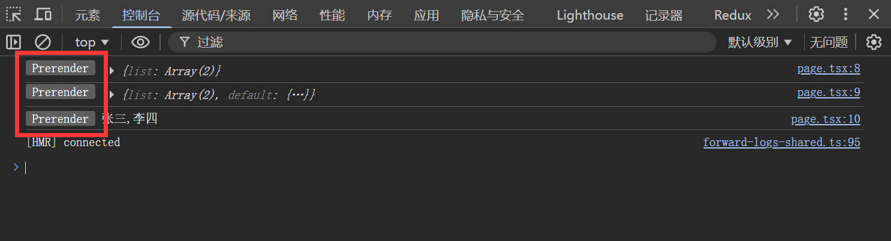
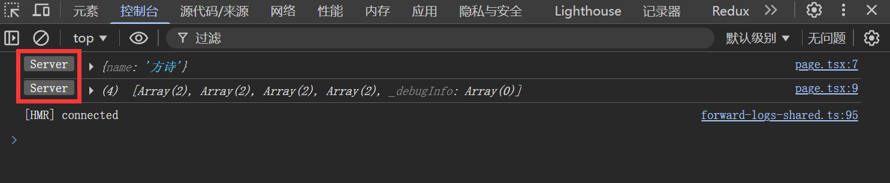
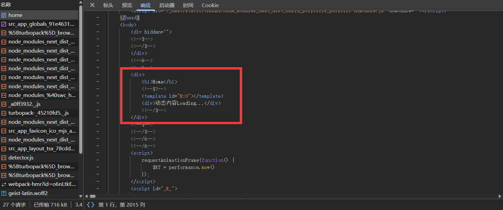
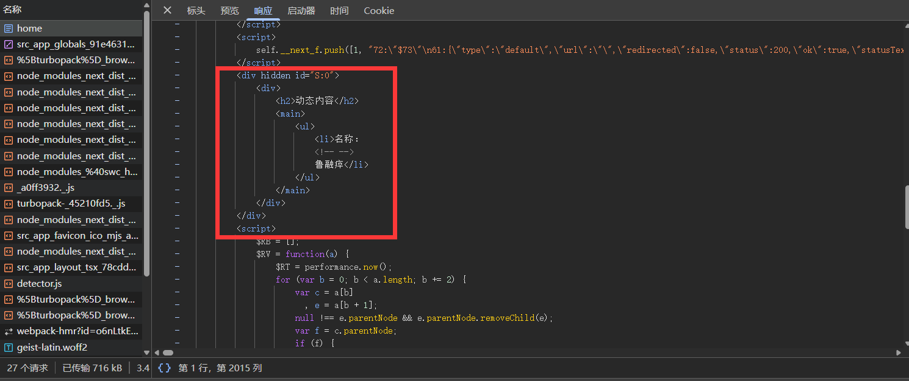
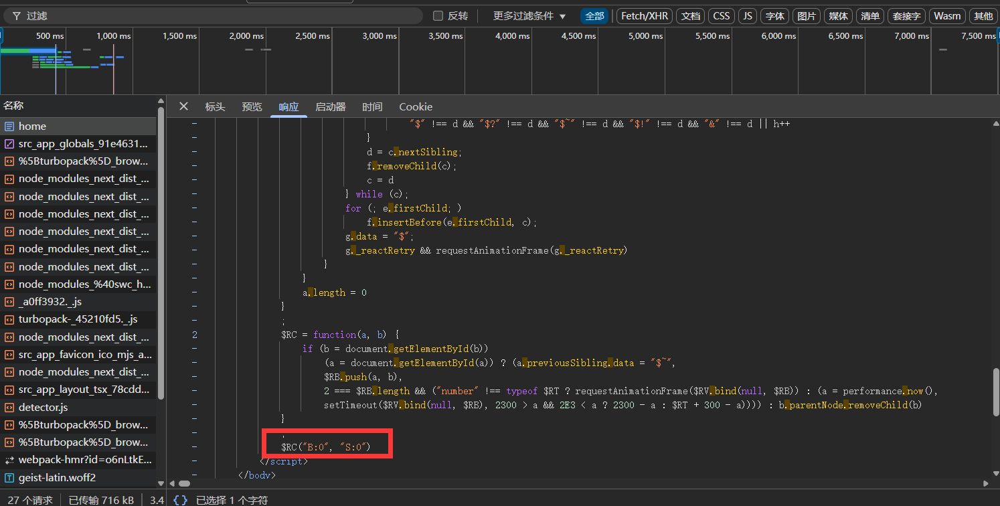

# 缓存组件(Cache Components)

### 什么是Cache Components?

Cache Components 是Next.js(16)版本特有的机制，实现了`静态内容` `动态内容` `缓存内容`的混合编排。保留了静态内容的加载速度，又具备动态渲染的灵活性，解决了`静态内容(加载快但无法实时更新数据)`和`动态内容(加载慢但可以实时更新数据)`权衡的问题。

- 静态内容: 构建(`npm run build`)时进行预渲染，例如 `「本地文件」「模块导入」「纯计算」（无网络请求、无用户相关数据）`,会被直接编译成`HTML`瞬间加载、立即响应。

- 动态内容：用户发起请求时才开始渲染的内容，依赖 “实时数据” 或 “用户个性化信息”，每次请求都可能生成不同结果，不会被缓存。例如`「实时数据源」（如实时接口、数据库实时查询）或「用户请求上下文」（如 Cookie、请求头、URL 参数）`。

- 缓存内容：缓存内容的本质就是缓存动态数据，缓存之后会被纳入`静态外壳(Static Shell)`,静态外壳就类似于`毛坯房`，会提前把结构搭建好，后续在通过(流式传输)填充里面的动态内容。

| 传统方案 | Cache Components |
| -------- | ---------------- |
| 静态页面：数据无法实时更新 | 支持缓存内容重新验证，动态内容流式补充         |
| 动态页面：初始加载慢、服务器压力大 | 静态外壳优先返回，动态内容并行渲染         |
| 客户端渲染：bundle 体积大、首屏慢 | 服务器预渲染核心内容，客户端仅补充动态部分         |


### 启用Cache Components

Cache Components 为可选功能，需在 Next 配置文件中显式启用：

```tsx
import type { NextConfig } from "next";

const nextConfig: NextConfig = {
  cacheComponents: true, // 启用缓存组件
};

export default nextConfig;
```

#### 1. 静态内容展示

适用场景：仅依赖同步 I/O（如 fs.readFileSync）、模块导入、纯计算的组件

```tsx
import fs from 'node:fs'

export default async function Home() {
    const data = fs.readFileSync('data.json', 'utf-8') //本地文件读取
    const json = JSON.parse(data)
    const impData = await import('../../../data.json') //模块导入
    const names = impData.list.map(item=>item.name).join(',') //纯计算
    console.log(json)
    console.log(impData)
    console.log(names)
    return (
        <div>
            <h1>Home</h1>
            <ul>
                {json.list.map((item: any) => (
                    <li key={item.id}>{item.name} - {item.age}</li>
                ))}
            </ul>
        </div>
    )
}
```




#### 2.1 动态内容展示

适用场景：fetch请求、cookies、headers等动态数据

>动态内容必须配合Suspense使用。

```tsx
import { Suspense } from "react"
import { cookies } from "next/headers"

const DynamicContent = async () => {
    const data = await fetch('https://www.mocklib.com/mock/random/name') //随机生成一个名称
    const json = await data.json()
    console.log(json)
    const cookieStore = await cookies() //获取cookie
    console.log(cookieStore)
    return (
        <div>
            <h2>动态内容</h2>
            <main>
                <ul>
                    <li>名称：{json.name}</li>
                </ul>
            </main>
        </div>
    )
}

export default async function Home() {

    return (
        <div>
            <h1>Home</h1>
            <Suspense fallback={<div>动态内容Loading...</div>}>
                <DynamicContent />
            </Suspense>
        </div>
    )
}
```



#### 2.2 实现原理

Next.js 会通过`(Partial Prerendering/PPR)`技术,实现静态外壳(Static Shell)渲染，提供占位符，当用户请求时，再通过流式传输(Streaming)填充里面的动态内容，以此提升首屏加载速度和用户体验。


我们观察上图

- `<h1>Home</h1>`： 纯静态内容，属于静态外壳的一部分，构建 / 请求时直接渲染，浏览器能立即显示。
- `<template id="B:0"></template>` 动态内容的容器模板，后续用来挂载异步加载的动态内容
- `<div>动态内容Loading...</div>`：占位符（fallback），属于静态外壳的一部分，在动态内容加载完成前显示。



- 这个 `<div>` 初始为 hidden，是服务器异步渲染完成的动态内容，等待客户端脚本触发后替换到占位符位置。
- id="S:0" 与前面的 `<template id="B:0">` 一一对应，是 “动态内容 - 占位符” 的关联标识。



```ts
$RC("B:0", "S:0") // 关键调用：关联 B:0 占位符和 S:0 动态内容
```

- $RC（React Content Replace）：找到 id="B:0" 的占位符和 id="S:0" 的动态内容，将其加入替换队列 $RB。
- $RV（React Content Render）：在动画帧 / 超时后执行替换，移除加载占位符，将动态内容插入到页面中，完成最终渲染。

#### 2.3 非确定操作

例如: `随机数`、`时间戳`等非确定操作，每次请求都可能生成不同结果。

直接使用就会报错如下：


>Error: Route "/home" used `Math.random()` before accessing either uncached data (e.g. `fetch()`) or Request data (e.g. `cookies()`, `headers()`, `connection()`, and `searchParams`). Accessing random values synchronously in a Server Component requires reading one of these data sources first. Alternatively, consider moving this expression into a Client Component or Cache Component. See more info here: https://nextjs.org/docs/messages/next-prerender-random
    at DynamicContent (page.tsx:5:25)
    at Home (page.tsx:27:17)

解决方案：

使用Suspense包裹，然后使用connection表示不要预渲染这部分。

Next.js默认会尝试尽可能多地静态预渲染页面内容。但像 `Math.random()` 这样的值每次调用结果都不同，如果在预渲染时执行，那这个"随机值"就被固定了，失去了意义。
通过在 Math.random() 之前调用 await connection()，你明确告诉 Next.js：
- 不要预渲染这部分
- 等真正有用户请求时再执行

```tsx
import { Suspense } from "react"
import { connection } from "next/server"

const DynamicContent = async () => {
    await connection() //使用connection表示不要预渲染这部分
    const random = Math.random()
    const now = Date.now()
    console.log(random, now)
    return (
        <div>
            <h2>动态内容</h2>
            <main>
                <ul>
                    <li>名称：{random}</li>
                    <li>时间：{now}</li>
                </ul>
            </main>
        </div>
    )
}

export default async function Home() {

    return (
        <div>
            <h1>Home</h1>
            <Suspense fallback={<div>动态内容Loading...</div>}>
                <DynamicContent />
            </Suspense>
        </div>
    )
}
```

#### 3. 缓存内容展示

缓存组件，可以使用`use cache`声明这是一个缓存组件，然后使用`cacheLife`声明缓存时间。


cacheLife参数：

- `stale`：客户端在此时间内直接使用缓存，不向服务器发请求`(单位:秒)`
- `revalidate`：超过此时间后，服务器收到请求时会在后台重新生成内容`(单位:秒)` 
- `expire`：超过此时间无访问，缓存完全失效，下次请求需要等待重新计算`(单位:秒)`

预设参数:

| Profile | 适用场景 | stale | revalidate | expire |
| ------- | -------- | ----- | ---------- | ------ |
| seconds | 实时数据（股票、比分） | 30秒 | 1秒 | 1分钟 |
| minutes | 频繁更新（社交动态） | 5分钟 | 1分钟 | 1小时 |
| hours | 每日多次更新（库存、天气） | 5分钟 | 1小时 | 1天 |
| days | 每日更新（博客文章） | 5分钟 | 1天 | 1周 |
| weeks | 每周更新（播客） | 5分钟 | 1周 | 30天 |
| max | 很少变化（法律页面） | 5分钟 | 30天 | 1年 |

```tsx
import { Suspense } from "react"
import { cacheLife } from "next/cache"

const DynamicContent = async () => {
    'use cache'
    cacheLife("hours") //使用预设参数
    //cacheLife({stale: 30, revalidate: 1, expire: 1}) //使用自定义参数
    const data = await fetch('https://www.mocklib.com/mock/random/name')
    const json = await data.json()
    console.log(json)
    return (
        <div>
            <h2>动态内容</h2>
            <main>
                <ul>
                    <li>名称：{json.name}</li>
                </ul>
            </main>
        </div>
    )
}

export default async function Home() {

    return (
        <div>
            <h1>Home</h1>
            <Suspense fallback={<div>动态内容Loading...</div>}>
                <DynamicContent />
            </Suspense>
        </div>
    )
}
```

