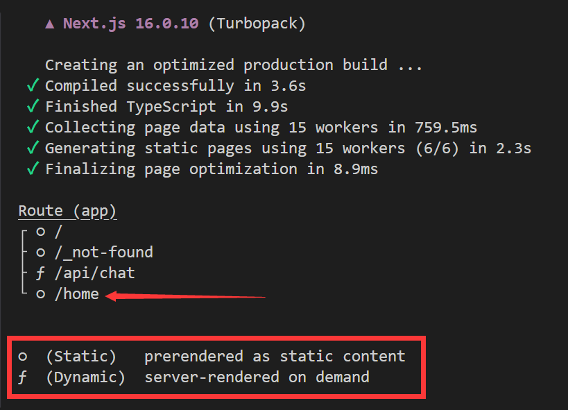
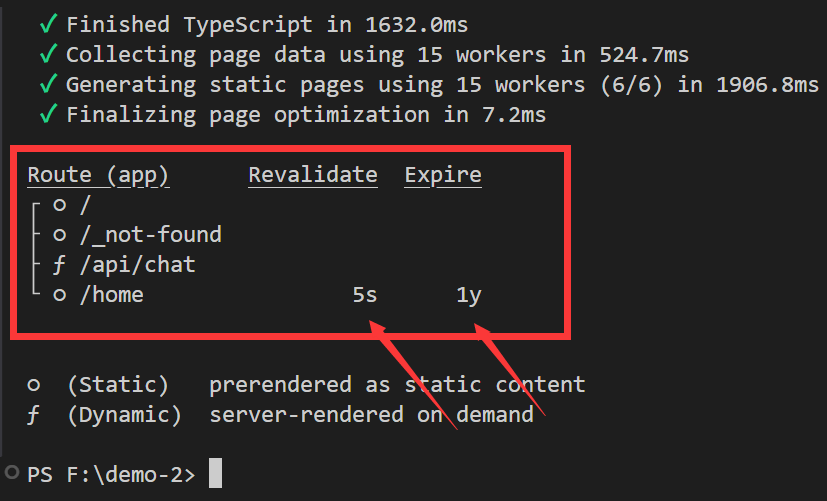
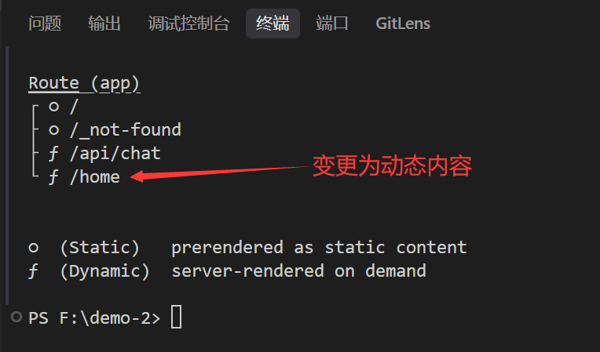
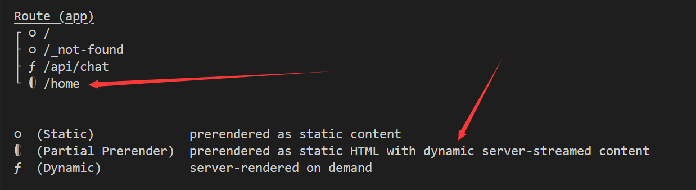

# 缓存策略(Cache Strategies)

>友情提示：光敏性癫痫患者请勿观看！！！

缓存策略分两种：

### 未启用缓存组件:
确保`cacheComponents`配置为`false`或者不配置。
```ts
import type { NextConfig } from "next";

const nextConfig: NextConfig = {
  /* config options here */
  cacheComponents: false, // 缓存组件(关闭或者不配置)
};

export default nextConfig;
```

src/app/home/page.tsx(新建一个页面)

```tsx
export default async  function Home() {
    const randomImage = await fetch('https://www.loliapi.com/acg/pc?type=json') //这个接口随机返回一个二刺猿图片
    const data = await randomImage.json()
    console.log(data)
    return (
        <div>
            <h1>Home</h1>
            
        </div>
    )
}
```

我们可以看到上图在开发模式是没有任何问题的，每次刷新图片都会重新获取。


但是当我们进行构建之后`npm run build && npm run start`我们发现每次刷新图片都不会变化，始终是同一个图片。

原因是：Next.js会尽可能多的进行缓存，以提高性能降低成本，这意味着路由会被静态渲染，以及数据请求也会被缓存，除非禁用缓存。



我们观察上图可以发现有两个符号：

- `○`(空心圆): 表示这是预渲染的静态内容。
- `ƒ`(f函数符): 表示这是动态内容。

### 那么如何退出缓存呢?

#### 第一种方案重新验证

使用`revalidate`属性，可以设置缓存时间，单位为秒。

```tsx
export const revalidate = 5 // 5秒后重新更新
//export const revalidate = 0 // 设置为0表示不缓存
export default async  function Home() {
    const randomImage = await fetch('https://www.loliapi.com/acg/pc?type=json')
    const data = await randomImage.json()
    return (
        <div>
            <h1>Home</h1>
            
        </div>
    )
}
```



当我们重新运行之后，每过5秒，图片会重新获取，并且会显示新的图片。


#### 第二种方案使用dynamic属性

使用`dynamic`属性，并且设置为`force-dynamic`，表示将禁用缓存，每次请求都会重新获取数据。

```tsx
export const dynamic = 'force-dynamic' // 动态更新 缓存组件不需要使用这个 默认都是动态内容
export default async  function Home() {
    const randomImage = await fetch('https://www.loliapi.com/acg/pc?type=json')
    const data = await randomImage.json()
    return (
        <div>
            <h1>Home</h1>
            
        </div>
    )
}
```


#### 第三种方案使用禁用缓存

使用`cache`属性，并且设置为`no-store`，表示将禁用缓存，每次请求都会重新获取数据。

```tsx
export default async  function Home() {
    const randomImage = await fetch('https://www.loliapi.com/acg/pc?type=json',{cache:'no-store'})
    const data = await randomImage.json()
    return (
        <div>
            <h1>Home</h1>
            
        </div>
    )
}
```

#### 第四种方案使用任意动态内容API

当你使用以下任意API时，该路由会被视为动态内容，不会被缓存。

- cookies
- headers
- connection
- searchParams
- fetch和{ cache: 'no-store' }

```tsx
import { connection } from "next/server"

export default async  function Home() {
    await connection()
    const randomImage = await fetch('https://www.loliapi.com/acg/pc?type=json')
    const data = await randomImage.json()
    return (
        <div>
            <h1>Home</h1>
            
        </div>
    )
}
```

### 启用缓存组件:

确保`cacheComponents`配置为`true`。
```ts
import type { NextConfig } from "next";

const nextConfig: NextConfig = {
  /* config options here */
  cacheComponents: true, //开启缓存组件
};

export default nextConfig;
```

>启用缓存组件之后，所有组件默认为`动态内容`，因此`export const dynamic = 'force-dynamic'`不需要配置。

```tsx
import { Suspense } from "react"
const DynamicImage = async () => {
  const randomImage = await fetch('https://www.loliapi.com/acg/pc?type=json')
  const data = await randomImage.json()
  return (
    
  )
}

export default async  function Home() {

    return (
        <div>
            <h1>Home</h1>
            <Suspense fallback={<div>Loading...</div>}>
                <DynamicImage />
            </Suspense>
        </div>
    )
}
```



然后你会发现多了一个符号

- `◐`(部分预渲染): 表示页面预渲染为静态 HTML，同时包含动态服务器流式传输的内容。