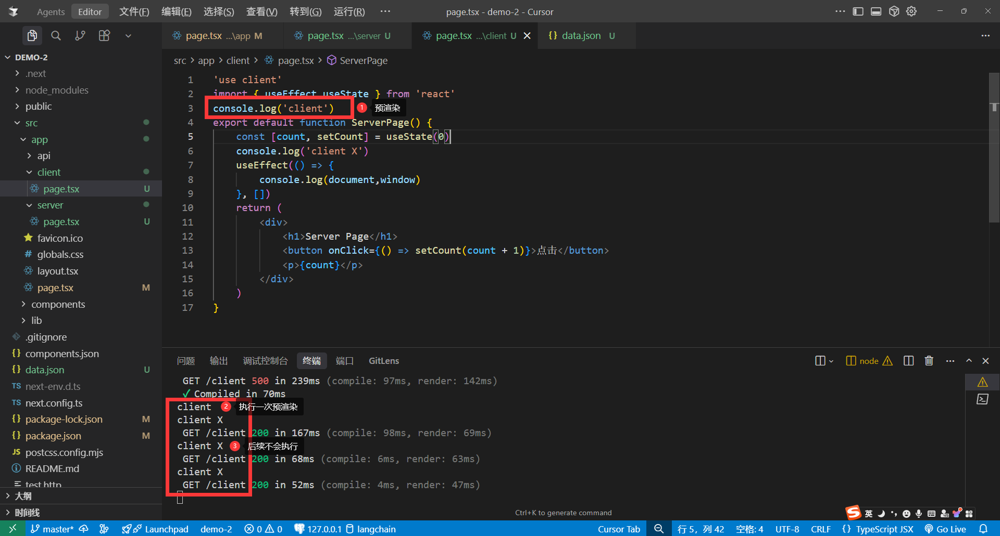
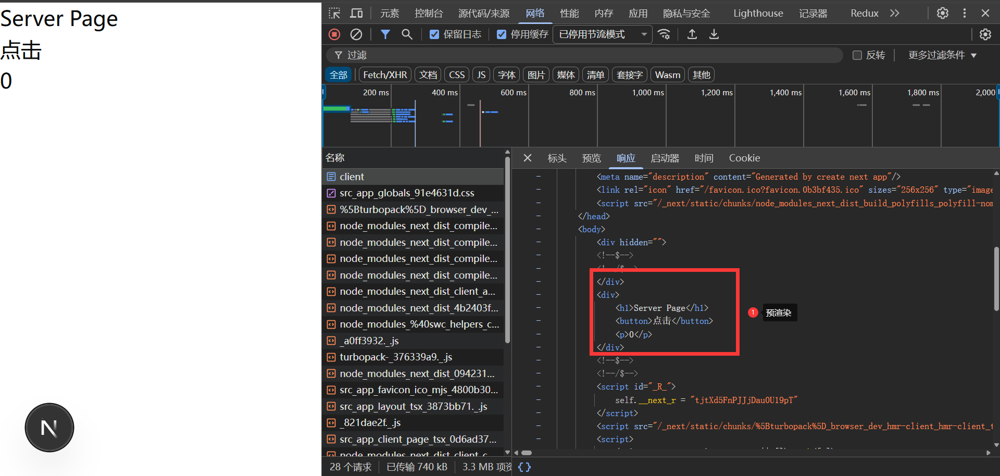
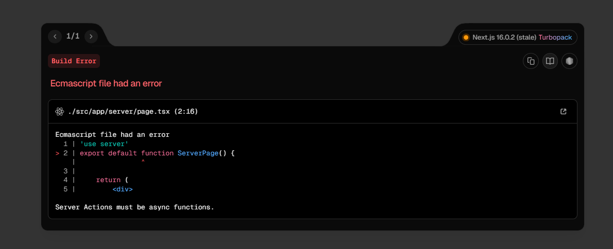
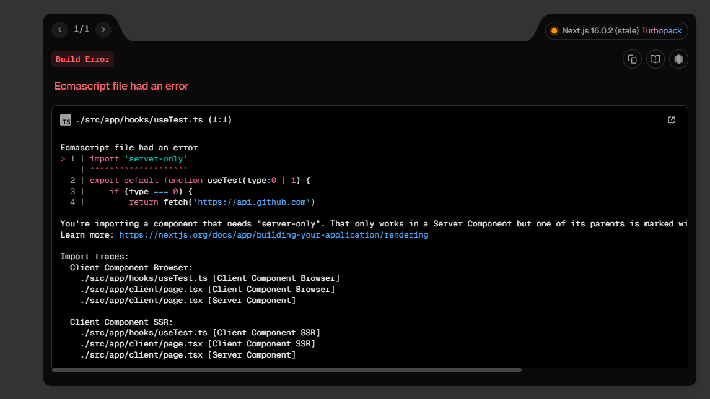

# 客户端组件(Client Components)

声明客户端组件需要在文件的顶部编写 `'use client'` 声明这是客户端组件，但是注意客户端组件会在服务端进行一次`预渲染`，所以访问`document` `window` 等API需要在`useEffect`中访问。

```tsx
'use client'
import { useEffect,useState } from 'react'
console.log('client')
export default function ServerPage() {
    const [count, setCount] = useState(0)
    console.log('client X')
    useEffect(() => {
        console.log(document,window)
    }, [])
    return (
        <div>
            <h1>Server Page</h1>
            <button onClick={() => setCount(count + 1)}>点击</button>
            <p>{count}</p>
        </div>
    )
}
```
所以我们可以看到他把`useState`的0预渲染了出来这样可以让用户先看到页面。




### 组件嵌套

>服务端组件可以嵌套客户端组件，客户端只能嵌套不能嵌套服务端组件



why:因为客户端会把他所有的模块以及子组件认为是客户端组件，那此时如果服务端组件用了`node.js`的API，或者其他服务端操作，那就会报错，因为客户端组件无法访问这些API，故此客户端组件不能嵌套服务端组件。


### server-only

随着Nodejs的发展，很多API已经可以跟浏览器共用了例如`fetch`,`webSocket`,未来Nodejs25支持`localStorage`等API,所以就会出现这种情况

下面这个函数可以在服务端组件使用，也可以在客户端组件使用，但有时候我们只想让他在服务端使用

```ts
export default function useTest(type:0 | 1) {
    if (type === 0) {
        return fetch('https://api.github.com')
    } else {
        return new WebSocket('wss://api.github.com')
    }
}
```

```bash
npm install server-only
or
yarn add server-only
or
pnpm add server-only
```

安装完成这个包之后，只需要在文件的顶部编写 `import 'server-only'` 声明即可，这样他就会在服务端执行，在客户端执行会报错。

```tsx
import 'server-only'
export default function useTest(type:0 | 1) {
    if (type === 0) {
        return fetch('https://api.github.com')
    } else {
        return new WebSocket('wss://api.github.com')
    }
}
```
客户端使用报错:
