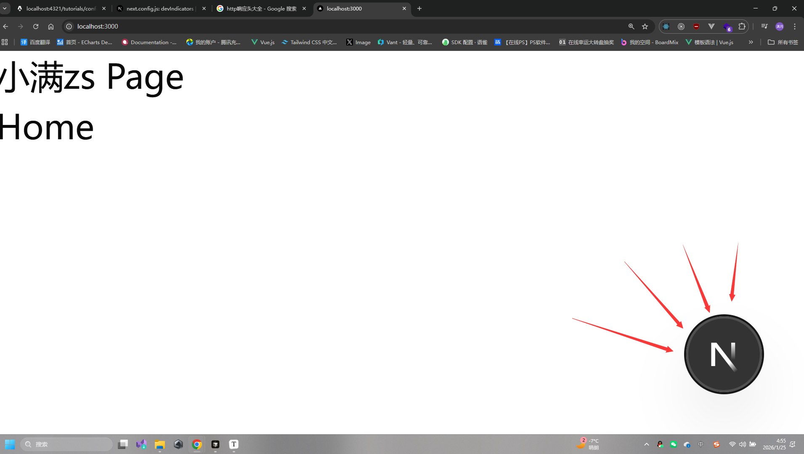

# next.config.js配置

本章会讲解Next.js的配置文件`next.config.js`的配置项。注：本章不会讲所有的配置项，只会讲使用率`50%`的配置项，以及项目中真实使用的配置项。

查看完整版配置项观看: [next.config.js配置](https://nextjs.org/docs/app/api-reference/config/next-config-js/adapterPath)


### 根据不同环境进行配置

例如我想在开发环境配置 XXX，或者生产环境配置YYY，那么我们可以使用`next/constants`来判断当前环境。

```ts
//Next.js next/constants内置的常量
export declare const PHASE_EXPORT = "phase-export"; // 导出静态站点
export declare const PHASE_PRODUCTION_BUILD = "phase-production-build"; // 生产环境构建
export declare const PHASE_PRODUCTION_SERVER = "phase-production-server"; // 生产环境服务器
export declare const PHASE_DEVELOPMENT_SERVER = "phase-development-server"; // 开发环境服务器
export declare const PHASE_TEST = "phase-test"; // 测试环境
export declare const PHASE_INFO = "phase-info"; // 信息
```
我们要根据不同环境配置，需要返回一个函数，而不是直接返回一个对象，在函数中会接受一个参数`phase`，这个参数是Next.js的环境，我们可以根据这个参数来判断当前环境。
```ts
//next.config.ts
import { PHASE_DEVELOPMENT_SERVER, PHASE_TYPE } from 'next/constants'
import type { NextConfig } from 'next'

export default (phase: PHASE_TYPE): NextConfig => {
  const nextConfig: NextConfig = {
     reactCompiler: false,
  }

  if (phase === PHASE_DEVELOPMENT_SERVER) {
    nextConfig.reactCompiler = true // 开发环境使用reactCompiler
  }

  //if() 其他环境.....

  return nextConfig
}
```

### Next.js配置端口号


这是Next.js很迷的一个操作，通过一般脚手架或者其他项目都会在配置文件进行配置端口号，但是Next.js却没有，而是在启动命令中进行配置。(默认是3000端口)


```json
  "scripts": {
    "dev": "next dev -p 8888", // 开发环境端口号
    "build": "next build",
    "start": "next start -p 9999 " // 生产环境端口号
  },
```
### Next.js导出静态站点

需要在`next.config.js`文件中配置`output`为`export`，表示导出静态站点。`distDir`表示导出目录，默认为`out`。

具体用法请查看: [静态导出SSG](./ssg)

```ts
import type { NextConfig } from "next";
const nextConfig: NextConfig = {
  /* config options here */
  output: "export", // 导出静态站点
  distDir: "dist", // 导出目录
  trailingSlash: true, // 添加尾部斜杠，生成 /about/index.html 而不是 /about.html
};

export default nextConfig;
```

### Next.js配置图片优化

Next.js`Image`组件默认只允许加载本地图片，如果需要加载远程图片，需要配置`next.config.js`文件。

详细用法请查看: [图片优化](./image)

```ts
import type { NextConfig } from "next";

const nextConfig: NextConfig = {
  /* config options here */
  images: {
    remotePatterns: [
      {
        protocol: 'https', // 协议
        hostname: 'eo-img.521799.xyz', // 主机名
        pathname: '/i/pc/**', // 路径
        port: '', // 端口
      },
    ],
    formats: ['image/avif', 'image/webp'], //默认是 ['image/webp']
    deviceSizes: [640, 750, 828, 1080, 1200, 1920, 2048, 3840], // 设备尺寸
    imageSizes: [16, 32, 48, 64, 96, 128, 256, 384], // 图片尺寸
  },
};
```

### 自定义响应标头

例如配置`CORS`跨域，或者是自定义响应标头等，只要是http支持的响应头都可以配置。

HTTP响应头参考: [HTTP响应头](https://developer.mozilla.org/zh-CN/docs/Web/HTTP/Headers)

```ts
  const nextConfig: NextConfig = {
     headers: () => {
      return [
         {
          source: '/:path*', // 匹配路径 所有路径 也支持精准匹配 例如/api/user 包括支持动态路由等 /api/user/:id 
          headers: [
            {
              key: 'Access-Control-Allow-Origin', //允许跨域
              value: '*' // 允许所有域名访问
            },
            {
              key: 'Access-Control-Allow-Methods', //允许的请求方法
              value: 'GET, POST, PUT, DELETE, OPTIONS' // 允许的请求方法
            },
            {
              key: 'Access-Control-Allow-Headers', //允许的请求头
              value: 'Content-Type, Authorization' // 允许的请求头
            }
          ]
         },
         {
          source: '/home', // 精准匹配 /home 路径
          headers: [
            {
              key: 'X-Custom-Header', //自定义响应头
              value: '123456' // 值
            },
          ]
         }
      ]
    }
  }
```

### assetPrefix配置

assetPrefix配置用于配置静态资源前缀，例如：部署到CDN后，静态资源路径会发生变化，需要配置这个配置项。

```ts
import type { NextConfig } from "next";
const nextConfig: NextConfig = {
  /* config options here */
  assetPrefix: 'https://cdn.example.com', // 静态资源前缀
};

export default nextConfig;
```

未配置assetPrefix时：
```txt
/_next/static/chunks/4b9b41aaa062cbbfeff4add70f256968c51ece5d.4d708494b3aed70c04f0.js
```

配置assetPrefix后：
```txt
https://cdn.example.com/_next/static/chunks/4b9b41aaa062cbbfeff4add70f256968c51ece5d.4d708494b3aed70c04f0.js
```

### basePath配置

应用前缀：也就是跳转路径中增加前缀，例如前缀是`/docs`，那么跳转`/home`就需要跳转到`/docs/home`。访问根目录也需要增加前缀，例如访问`/`就需要跳转到`/docs`。这儿可以使用重定向来实现。访问`/`自动跳转到`/docs`。

```ts
import type { NextConfig } from "next";
const nextConfig: NextConfig = {
  /* config options here */
  basePath: '/docs', // 基础路径
  redirects() {
    return [
      {
        source: '/', // 源路径
        destination: '/docs', // 目标路径
        basePath: false, // 是否使用basePath 默认情况下 source 和 destination 都会自动加上 basePath 前缀 就变成了/docs/docs 所以这儿不需要增加
        permanent: false, // 是否永久重定向
      },
    ]
  },
};

export default nextConfig;
```
如果使用link跳转的话，无需增加`basePath`前缀，因为`Link`组件会自动增加`basePath`前缀。
当他跳转`/home`时，会自动跳转到`/docs/home`。
```tsx
import Link from 'next/link'
export default function Page() {
  return (<div>
    <h1>小满zs Page</h1>
    <Link href="/home">Home</Link>
  </div>)
}
```

### compress

compress配置用于配置压缩，例如：压缩js/css/html等。默认情况是开启的，如果需要关闭，可以配置为false。

```ts
import type { NextConfig } from "next";
const nextConfig: NextConfig = {
  compress: true, // 压缩
};

export default nextConfig;
```

### 日志配置

日志配置用于配置日志，例如：显示完整的URL等。

```ts
import type { NextConfig } from "next";
const nextConfig: NextConfig = {
  logging:{
    fetches: {
      fullUrl: true, // 显示完整的URL
    },
  }
};

export default nextConfig;
```

### 页面扩展

默认情况下，Next.js 接受以下扩展名的文件：.tsx.js、 .js .ts、.jsx.md、.js.js。可以修改此设置以允许其他扩展名，例如 markdown（.md.md、.md .mdx）。

```ts
import type { NextConfig } from "next";
const nextConfig: NextConfig = {
  pageExtensions: ['js', 'jsx', 'md', 'mdx', 'ts', 'tsx'],
};

export default nextConfig;
```

### devIndicators

关闭调试指示器，默认情况下是开启的，如果需要关闭，可以配置为false。

```ts
import type { NextConfig } from "next";
const nextConfig: NextConfig = {
  devIndicators: false, // 关闭开发指示器
  // devIndicators:{
  //   position:'bottom-right', //也支持放入其他位置 bottom-right bottom-left top-right top-left
  // },
};

export default nextConfig;
```


### generateEtags

Next.js会为静态文件生成ETag，用于缓存控制。默认情况下是开启的，如果需要关闭，可以配置为false。

浏览器会根据ETag来判断文件是否发生变化，如果发生变化，则重新下载文件。

```ts
import type { NextConfig } from "next";
const nextConfig: NextConfig = {
  generateEtags: false, // 关闭生成ETag 默认开启
};

export default nextConfig;
```

### turbopack

Next.js已内置turbopack进行打包编译等操作，所以允许透传配置项给turbopack。

一般情况下是不需要做太多优化的，因为它都内置了例如`tree-shaking`、`压缩` `按需编译` `语法降级` 等优化。

具体用法请查看: [turbopack](https://nextjs.org/docs/app/api-reference/config/next-config-js/turbopack)

例如我们需要编译其他文件`less`配置如下:

```bash
npm i less-loader -D
```

```ts
import type { NextConfig } from "next";
const nextConfig: NextConfig = {
    turbopack:{
     rules:{
          '*.less':{
          loaders:['less-loader'],
          as:'*.css',
        }
     }
  }
}
export default nextConfig;
```