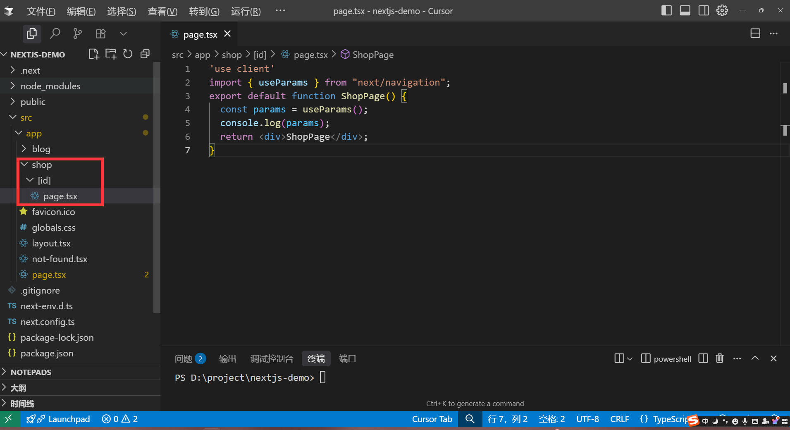
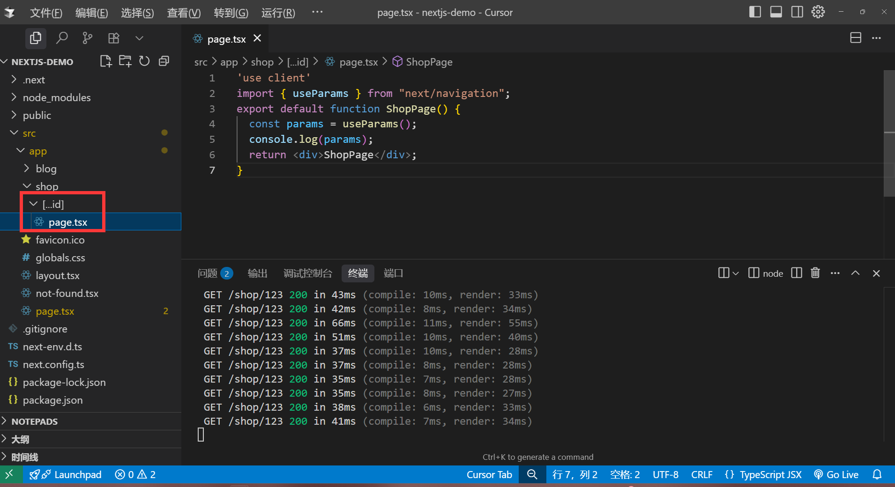
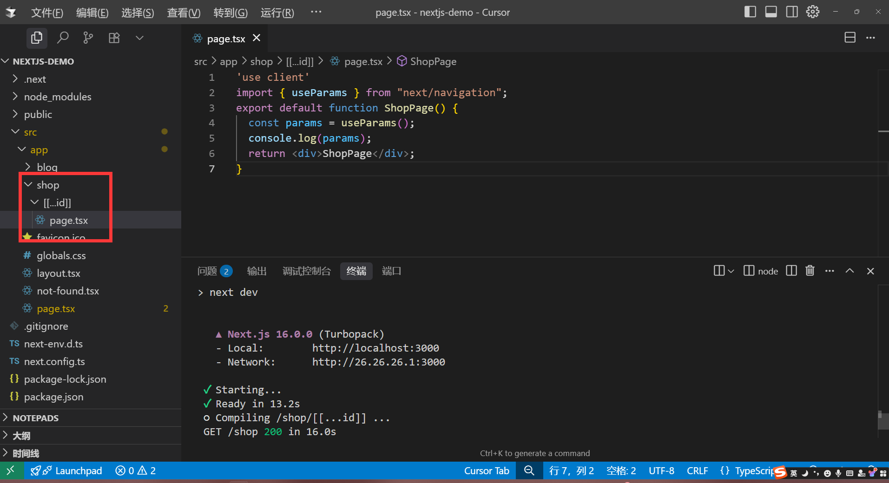

# 动态路由

动态路由是指在路由中使用方括号`[]`来定义路由参数，例如`/blog/[id]`，其中`[id]`就是动态路由参数，因为在某些需求下，我们需要根据不同的id来显示不同的页面内容，例如商品详情页，文章详情页等。

### 基本用法[slug]

使用动态路由只需要在文件夹名加上方括号`[]`即可，例如`[id]`,`[params]`等，名字可以自定义。

来看demo: 我们在`app/shop`目录下创建一个`[id]`目录

```tsx
//app/shop/[id]/page.tsx
export default function Page() {
    return <div>Page</div>
}
```


访问路径为:`http://localhost:3000/shop/123` 其中`123`就是动态路由参数，这个可以是任意值。

### 路由片段[...slug]

我们如果需要捕获多个路由参数，例如`/shop/123/456`，我们可以使用路由片段来捕获多个路由参数，他的用法就是`[...slug]`，其中`slug`就是路由片段，这个名字可以自定义，后面的片段有多少就捕获多少。

```tsx
//app/shop/[...id]/page.tsx
export default function Page() {
    return <div>Page</div>
}
```




访问路径为:`http://localhost:3000/shop/123/456/789` 其中`123`和`456`和`789`就是动态路由参数，后面的片段有多少就捕获多少。

### 可选路由[[...slug]]

可选路由指的是，我们可能会有这个路由参数，也可能会没有这个路由参数，例如`/shop/123`，也可能是`/shop`，我们可以使用可选路由来捕获这个路由参数，他的用法就是`[[...slug]]`，其中`slug`就是路由片段，这个名字可以自定义，后面的片段有多少就捕获多少。

```tsx
//app/shop/[[...id]]/page.tsx
export default function Page() {
    return <div>Page</div>
}
```



- 访问路径为:`http://localhost:3000/shop`，可以没有参数
- 访问路径为:`http://localhost:3000/shop/123`，可以有参数
- 访问路径为:`http://localhost:3000/shop/123/456`，可以有多个参数

这种方式比较灵活。

### 接受参数

使用`useParams` hook来接受参数，这个hook只能在客户端组件中使用。

```tsx
'use client'
import { useParams } from "next/navigation";
export default function ShopPage() {
  const params = useParams();
  console.log(params); //{id: '123'}  {id: ['123', '456']} 接受单个值以及多个值
  return <div>ShopPage</div>;
}
```