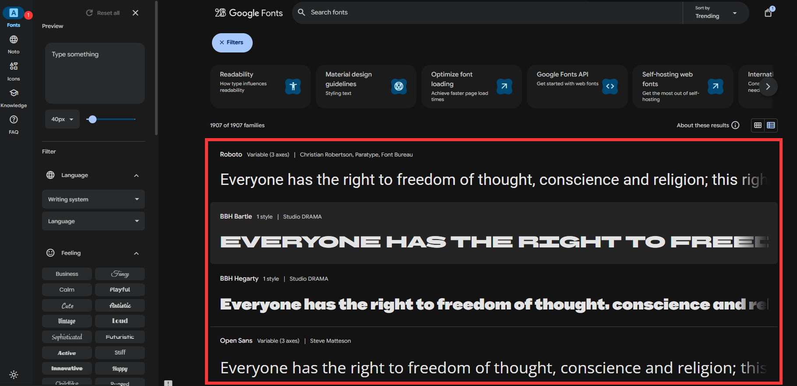

# font字体

`next/font`模块，内置了字体优化功能，其目的是防止`CLS`布局偏移。font模块主要分为两部分，一部分是内置的`Google Fonts`字体，另一部分是本地字体。

### 基本用法


#### Goggle字体

在使用google字体的时候，Google字体和css文件会在构建的时候下载到本地，可以与静态资源一起托管到服务器，所以不会向Google发送请求。

1. 基本使用
```tsx
import { BBH_Sans_Hegarty } from 'next/font/google' //引入字体库
const bbhSansHegarty = BBH_Sans_Hegarty({
  weight: '400', //字体粗细
  display: 'swap', //字体显示方式
})
export default function RootLayout({ children }: Readonly<{ children: React.ReactNode }>) {
  return (
    <html lang="en">
      <body className={bbhSansHegarty.className}> {/** bbhSansHegarty会返回一个类名，用于加载字体 */}
        {children}
        sdsadasdjsalkdjasl
        你好
      </body>
    </html>
  );
}
```


2. 可变字体

可变字体是一种可以适应不同字重和样式的字体，它可以在不同的设备上自动调整字体大小和样式，以适应不同的屏幕大小和分辨率。

```tsx
import { Roboto } from 'next/font/google'
const roboto = Roboto({
  weight: ['400', '700'], //字体粗细 (不是所有字体都支持可变字体)
  style: ['normal', 'italic'], //字体样式   
  subsets: ['latin'],
  display: 'swap',
})
```

如何选择其他字体？可以参考[Google Fonts](https://fonts.google.com/)



```tsx
import { Inter,BBH_Sans_Bartle,Roboto_Slab,Rubik,Montserrat } from 'next/font/google' //引入其他字体库
```

### API 参考

### 配置选项

| 属性 | Google | 本地 | 类型 | 必填 | 说明 |
|------|--------|------|------|------|------|
| `src` | ✗ | ✓ | String/Array | 是 | 字体文件路径 |
| `weight` | ✓ | ✓ | String/Array | 可选 | 字体粗细，如 '400' |
| `style` | ✓ | ✓ | String/Array | - | 字体样式，如 'normal' |
| `subsets` | ✓ | ✗ | Array | - | 字符子集 |
| `axes` | ✓ | ✗ | Array | - | 可变字体轴 |
| `display` | ✓ | ✓ | String | - | 显示策略 |
| `preload` | ✓ | ✓ | Boolean | - | 是否预加载 |
| `fallback` | ✓ | ✓ | Array | - | 备用字体 |
| `adjustFontFallback` | ✓ | ✓ | Boolean/String | - | 调整备用字体 |
| `variable` | ✓ | ✓ | String | - | CSS 变量 |
| `declarations` | ✗ | ✓ | Array | - | 自定义声明 |

#### style

字体样式，如 'normal' 'italic（斜体）' 'oblique（倾斜）' 等。

#### weight

字体粗细，如 '400' '700' '900' 等。


#### display

**auto**：浏览器默认（通常为 block）

**block**：空白 3s → 备用字体 → 自定义字体

**swap**：备用字体 → 自定义字体

**fallback**：空白 100ms → 备用字体，3s 内加载完成则切换

**optional**：空白 100ms，100ms 内加载完成则使用，否则用备用字体

#### 本地字体

字体下载地址：[免费可商用字体](https://nextjs-docs-henna-six.vercel.app/ZhiyongDatongFont.ttf)

本地字体需要通过`src`属性指定字体文件路径，字体文件路径可以是单个文件，也可以是多个文件。

```tsx
import localFont from 'next/font/local'
const local = localFont({
  src:'./font/zydtt.ttf', //本地字体文件路径
  display: 'swap', //字体显示方式
})
export default function RootLayout({ children }: Readonly<{ children: React.ReactNode }>) {
  return (
    <html lang="en">
      <body className={local.className}>
        {children}
        sdsadasdjsalkdjasl
        你好
      </body>
    </html>
  );
}
```

