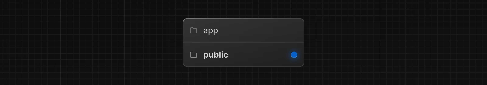
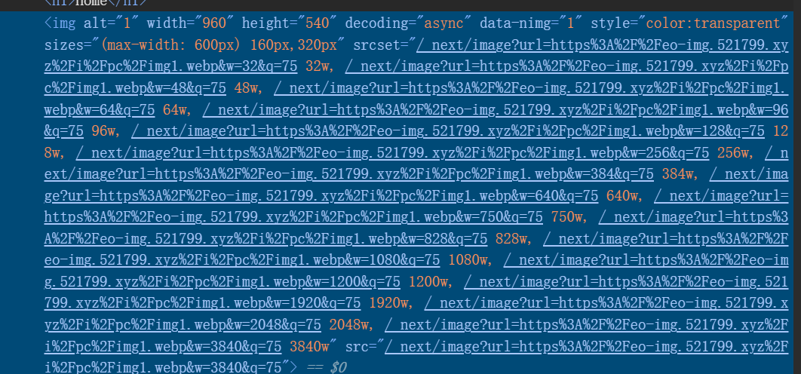

# Image组件

该组件是Next.js内置的图片组件，是基于原生`img`标签进行扩展，并不代表原生`img`标签不能使用。

- 尺寸优化：支持使用现代化图片格式，如`webp`，`avif`，`apng`等,并自动根据设备提供正确的尺寸。
- 视觉稳定性：防止图片加载时发生布局偏移，具体参考[CLS](https://web.dev/articles/cls?hl=zh-cn)
- 懒加载：在图片进入视口才会加载，使用浏览器原生懒加载，并可选择添加模糊显示占位符。
- 灵活性：可按需调整图像大小，即使是存储在远程服务器上的图像也可以调整。


### 图片引入

#### 1. src本地图片引入

Next.js建议我们把图片放在根目录下的`public`文件夹中，然后使用`/`开头访问。


```tsx
import Image from "next/image"
export default function Home() {
    return (
        <div>
            <h1>Home</h1>
            <Image
                src="/1.png"
                width={100}
                height={100}
                alt="1"
            />
        </div>
    )
}
```

#### 2. import静态引入

使用`import`引入图片，是不需要填写宽度和高度，Next.js会自动确定图片的尺寸。

```json
{
    "compilerOptions": {
        "paths": {
            "@/*": ["./src/*"],
            "@/public/*": ["./public/*"] // 新增这一行代码，配置图片路径。
        }
    }
}
```
使用静态`import`引入图片，你会发现无需填写宽度和高度，Next.js会自动确定图片的尺寸。
```tsx
import Image from "next/image"
import test from '@/public/1.png'
export default function Home() {
    return (
        <div>
            <h1>Home</h1>
            <Image
                src={test}
                alt="1"
            />
        </div>
    )
}
```

#### 3. 远程图片引入

```tsx
import Image from "next/image"
export default async function Home() {
    const len = 20;
    return (
        <div>
            <h1>Home</h1>
            {Array.from({ length: len }).map((_, index) => (
                <Image
                    key={index}
                    src={`https://eo-img.521799.xyz/i/pc/img${index + 1}.webp`}
                    alt="1"
                    width={192}
                    height={108}
                />
            ))}
        </div>
    )
}
```
当我们直接使用远程图片引入的时候Next.js会报错，因为Next.js默认只允许加载本地图片，如果需要加载远程图片，需要配置`next.config.js`文件。

image-loader.ts:86 Uncaught Error: Invalid src prop (https://eo-img.521799.xyz/i/pc/img1.webp) on `next/image`, hostname "eo-img.521799.xyz" is not configured under images in your `next.config.js`

```ts
import type { NextConfig } from "next";

const nextConfig: NextConfig = {
  /* config options here */
  images: {
    remotePatterns: [
      {
        protocol: 'https', // 协议
        hostname: 'eo-img.521799.xyz', // 主机名
        pathname: '/i/pc/**', // 路径
        port: '', // 端口
      },
    ],
  },
};
```

#### 4. LCP警告

如果图片是首屏或者LCP图片，需要添加`loading="eager"`属性，否则会触发LCP警告,因为Image组件默认是懒加载的。

- lazy: 懒加载，默认值，在图片进入视口才会加载。
- eager: 立即加载，在图片进入视口就会加载。

Image with src "https://eo-img.521799.xyz/i/pc/img1.webp" was detected as the Largest Contentful Paint (LCP). Please add the `loading="eager"` property if this image is above the fold.
Read more: https://nextjs.org/docs/app/api-reference/components/image#loading

```tsx
import Image from "next/image"
export default async function Home() {
    const len = 20
    return (
        <div>
            <h1>Home</h1>
            {Array.from({ length: len }).map((_, index) => (
                <Image
                    key={index}
                    src={`https://eo-img.521799.xyz/i/pc/img${index + 1}.webp`}
                    alt="1"
                    width={192}
                    height={108}
                    loading="eager" // 立即加载
                />
            ))}
        </div>
    )
}
```

第二种解决方案使用`preload`属性加载图片，表示提前预加载图片，不过Next.js还是更加推荐使用`loading="eager"`属性加载图片。

```tsx
import Image from "next/image"
export default async function Home() {
    const len = 20
    return (
        <div>
            <h1>Home</h1>
            {Array.from({ length: len }).map((_, index) => (
                <Image
                    key={index}
                    src={`https://eo-img.521799.xyz/i/pc/img${index + 1}.webp`}
                    alt="1"
                    width={192}
                    height={108}
                    preload={index < 10} // 优先加载策略
                />
            ))}
        </div>
    )
}
```


#### 5. 图片格式优化

Next.js 会通过请求Accept头自动检测浏览器支持的图像格式，以确定最佳输出格式
```ts
Accept:image/avif,image/webp,image/apng,image/svg+xml,image/*,*/*;q=0.8
```

我们可以同时启用 AVIF 和 WebP 格式。对于支持 AVIF 的浏览器，系统将优先使用 AVIF 格式，WebP 格式作为备选方案。目前AVIF格式最优。

```ts
const nextConfig: NextConfig = {
  /* config options here */
  images: {
    formats: ['image/avif', 'image/webp'], //默认是 ['image/webp']
  },
};
```

#### 6. 设备适配

如果你的老板告诉你要兼容哪些设备，你可以使用`deviceSizes`和`imageSizes`属性来配置。

```ts
const nextConfig: NextConfig = {
  /* config options here */
  images: {
    deviceSizes: [640, 750, 828, 1080, 1200, 1920, 2048, 3840], // 设备尺寸
    imageSizes: [16, 32, 48, 64, 96, 128, 256, 384], // 图片尺寸
  },
};
```

这两个属性结合会最终生成一个`srcset`属性，用于浏览器选择最佳图片。

那为什么需要两个数组去实现呢？

我们观察上图可以发现，`imageSizes`用于生成小图片尺寸例如(缩略图，头像等)，而`deviceSizes`用于生成大图片尺寸例如(横幅图、背景图、全屏展示图)。

```tsx
import Image from "next/image"

// 头像 - 固定 64px
export function Avatar() {
  return (
    <Image
      src="/avatar.jpg"
      width={64}
      height={64}
      alt="用户头像"
      sizes="64px"  // ← 告诉浏览器这张图只需要 64px
    />
  )
}

// 横幅图 - 响应式全宽
export function Banner() {
  return (
    <Image
      src="/banner.jpg"
      width={1920}
      height={600}
      alt="横幅"
      sizes="100vw"  // ← 占满整个视口宽度，使用 deviceSizes
    />
  )
}

// 响应式内容图
export function ContentImage() {
  return (
    <Image
      src="/content.jpg"
      width={1200}
      height={800}
      alt="内容图"
      sizes="(max-width: 768px) 100vw, (max-width: 1200px) 50vw, 1200px"
      // ↑ 手机上 100% 宽度，平板上 50%，桌面最大 1200px
    />
  )
}
```

### Props

以下是 Image 组件可用的属性：

#### 必需属性

| 属性 | 类型 | 示例 | 说明 |
|------|------|------|------|
| src | String | `src="/profile.png"` | 图片源路径，支持本地路径或远程 URL |
| alt | String | `alt="Picture of the author"` | 图片替代文本，用于无障碍访问和 SEO |

#### 尺寸相关

| 属性 | 类型 | 示例 | 说明 |
|------|------|------|------|
| width | Integer (px) | `width={500}` | 图片宽度，静态导入时可选 |
| height | Integer (px) | `height={500}` | 图片高度，静态导入时可选 |
| fill | Boolean | `fill={true}` | 填充父容器，替代 width 和 height |
| sizes | String | `sizes="(max-width: 768px) 100vw"` | 响应式图片尺寸 |

#### 优化相关

| 属性 | 类型 | 示例 | 说明 |
|------|------|------|------|
| quality | Integer (1-100) | `quality={80}` | 图片压缩质量，默认为 75 |
| loader | Function | `loader={imageLoader}` | 自定义图片加载器函数 |
| unoptimized | Boolean | `unoptimized={true}` | 禁用图片优化，使用原图 |

#### 加载相关

| 属性 | 类型 | 示例 | 说明 |
|------|------|------|------|
| loading | String | `loading="lazy"` | 加载策略，"lazy" 或 "eager"  |
| preload | Boolean | `preload={true}` | 是否预加载，用于 LCP 元素 |
| placeholder | String | `placeholder="blur"` | 占位符类型，"blur" 或 "empty" |
| blurDataURL | String | `blurDataURL="data:image/jpeg..."` | 模糊占位符的 Data URL |

#### 事件回调

| 属性 | 类型 | 示例 | 说明 |
|------|------|------|------|
| onLoad | Function | `onLoad={e => done()}` | 图片加载完成时的回调 |
| onError | Function | `onError={e => fail()}` | 图片加载失败时的回调 |

#### 其他属性

| 属性 | 类型 | 示例 | 说明 |
|------|------|------|------|
| style | Object | `style={{objectFit: "contain"}}` | 内联样式对象 |
| overrideSrc | String | `overrideSrc="/seo.png"` | 覆盖 src，用于 SEO 优化 |
| decoding | String | `decoding="async"` | 解码方式，"async"/"sync"/"auto" |

