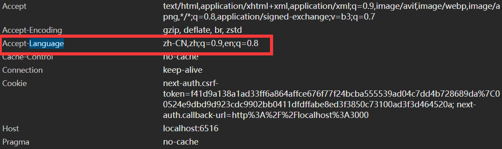
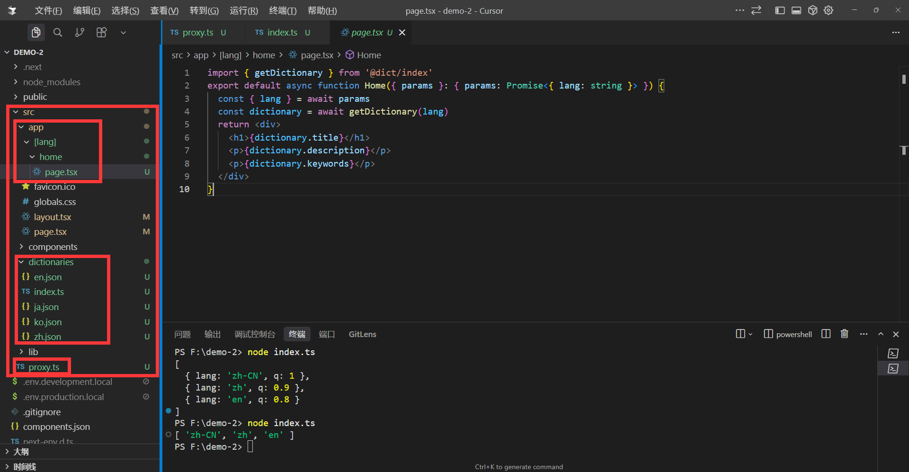

# 国际化(`i18n`)

国际化(Internationalization)是`Next.js`提供的一种机制，用于支持多语言的网站，例如可以实现中英文切换，包括接口同步翻译，以及不同语言所展示的页面不一样等。

小知识：i18n(`internationalization`)的由来是取自开头i和结尾n的中间有18个字母，所以称为i18n，其他的也是类似的例如k8s(`kubernetes`)就是取自开头k和结尾s的中间有8个字母，所以称为k8s。


本章节比较复杂完整源码获取地址[https://github.com/XiaoManZS/Next.js-i18n](https://github.com/XiaoManZS/Next.js-i18n),建议下载配合观看

### 术语解释

在学习之前我们需要了解一些术语：

language: 语言(排名不分先后)

1. 英语(English) 用`en`表示
2. 中文(Chinese) 用`zh`表示(zh取自`Zhongwen`的拼音)
3. 日本语(Japanese) 用`ja`表示
4. 韩国语(Korean) 用`ko`表示

语言速查表: [https://zh.wikipedia.org/wiki/ISO_639-1](https://zh.wikipedia.org/wiki/ISO_639-1)

territory：地区(排名不分先后)
1. 美国(United States) 用`US`表示
2. 中国(China) 用`CN`表示
3. 日本(Japan) 用`JP`表示
4. 韩国(Korea) 用`KR`表示

地区速查表: [https://zh.wikipedia.org/wiki/ISO_3166-1](https://zh.wikipedia.org/wiki/ISO_3166-1)

一般我们把语言和地区组合起来，称为`locale`，例如`en-US`表示英语(美国)，`zh-CN`表示中文(中国)。

### 实现原理

Next.js建议我们使用http报文头来判断用户使用的语言`Accept-Language`，例如`Accept-Language: zh-CN,zh;q=0.9,en;q=0.8`表示用户使用中文(中国)，如果用户没有设置，则使用默认语言。

#### Accept-Language规则

`zh-CN,zh;q=0.9,en;q=0.8` 表示用户使用中文(中国)，权重为1(最大值1会被省略)，中文(中国)权重为0.9，英语(美国)权重为0.8。

#### 安装第三方库

```bash
npm i negotiator # 用于解析Accept-Language
npm i @formatjs/intl-localematcher # 用于匹配语言
```

src/proxy.ts 创建一个代理函数,关于`proxy`代理函数在之前的篇章已经讲过了。

```ts
import { NextRequest, NextResponse } from 'next/server'
import Negotiator from 'negotiator'
import { match } from '@formatjs/intl-localematcher'
export default function proxy(req: NextRequest, res: NextResponse) {
    // 获取请求头
    const headers = {
        'accept-language': req.headers.get('accept-language') || ''
    }
    // 解析请求头
    const negotiator = new Negotiator({ headers })
    // 获取语言
    const language = negotiator.languages()
    //['zh-CN', 'zh', 'en-US', 'en', 'ja']  // 按优先级从高到低排序
}

export const config = {
    matcher:[
        '/((?!api|_next/static|_next/image|favicon.ico).*)', //跳过内部匹配路径
    ]
}
```

例如 `Accept-Language: zh-CN,zh;q=0.9,en-US;q=0.8,en;q=0.7,ja;q=0.6`

解析规则：
| 语言 | 权重 (q值) | 说明 |
|------|------------|------|
| zh-CN | 1.0 (默认) | 最优先 |
| zh | 0.9 | 第二优先 |
| en-US | 0.8 | 第三优先 |
| en | 0.7 | 第四优先 |
| ja | 0.6 | 最低优先 |

```ts
['zh-CN', 'zh', 'en-US', 'en', 'ja']  // 按优先级从高到低排序
```

简单复刻了一下`Negotiator`的实现
```ts
const languages = 'zh-CN,zh;q=0.9,en;q=0.8'.split(',')
const languagesWithQ = languages.map(language=>{
    const [lang,q] = language.split(';')
    return {
        lang,
        q:parseFloat(q?.split('=')[1] || '1')
    }
}).sort((a,b)=>b.q-a.q).map(item=>item.lang)
```

#### 匹配语言

src/dictionaries/index.ts定义项目支持的语言和默认语言。

```ts
export const locales = ['en', 'zh','ja','ko'] // 配置项目支持的语言
export const defaultLocale = 'zh' // 项目默认使用的语言
```
tsconfig.json 配置别名

```json
{
    "paths": {
       //新增别名@dict
      "@dict/*": [
        "./src/dictionaries/*"
      ]
    }
}
```

src/proxy.ts继续完善代理函数(完整代码)
```ts
import { NextRequest, NextResponse } from 'next/server'
import Negotiator from 'negotiator'
import { match } from '@formatjs/intl-localematcher'
import { locales, defaultLocale } from '@dict/index' // 导入项目支持的语言和默认语言
export default function proxy(req: NextRequest, res: NextResponse) {
    // 如果请求路径为根路径，则直接返回 首页不做任何处理
    if(req.nextUrl.pathname === '/') {
        return NextResponse.next()
    }
    //如果路径已经包含所支持的语言，则直接返回 例如 /zh/about /zs/home 等
    if(locales.some(locale => req.nextUrl.pathname.startsWith(`/${locale}`))){
        return NextResponse.next()
    }
    // 获取请求头
    const headers = {
        'accept-language': req.headers.get('accept-language') || ''
    }
    // 解析请求头
    const negotiator = new Negotiator({ headers })
    // 获取语言
    const language = negotiator.languages()
    //['zh-CN', 'zh', 'en-US', 'en', 'ja']  // 按优先级从高到低排序
    const lang = match(language, locales, defaultLocale)
    //language-浏览器支持的语言 locales-项目支持的语言 defaultLocale-项目默认语言
    // 匹配语言例如 zh-CN 则 lang 返回 zh en-US 则 lang 返回 en 如果没有匹配到则返回默认语言defaultLocale
    const pathname = req.nextUrl.pathname
    // 拼接语言
    req.nextUrl.pathname = `/${lang}${pathname}`
    // 重定向 例如用户访问的是/home 我们则读取语言后重定向到/zh/home 给它增加语言前缀
    return NextResponse.redirect(req.nextUrl)
}
export const config = {
    matcher:[
        '/((?!api|_next/static|_next/image|favicon.ico).*)', //跳过内部匹配路径
    ]
}
```

#### 新建测试用例

src/dictionaries/zh.json
```json
{
    "title": "标题",
    "description": "描述",
    "keywords": "关键词"
}
```
src/dictionaries/en.json
```json
{
    "title": "title",
    "description": "description",
    "keywords": "keywords"
}
```
src/dictionaries/ja.json
```json
{
    "title": "タイトル",
    "description": "説明",
    "keywords": " キーワード"
}
```
src/dictionaries/ko.json
```json
{
    "title": "제목",
    "description": "설명",
    "keywords": "키워드"
}
```

上面这四个文件会根据locale参数动态导入，例如locale为zh则导入src/dictionaries/zh.json，locale为en则导入src/dictionaries/en.json等等

src/dictionaries/index.ts 定义测试用例

```ts
export type Dictionary = {
    title: string
    description: string
    keywords: string
}
export const locales = ['en', 'zh','ja','ko'] // 支持的语言
export const defaultLocale = 'zh'
export function getDictionary(locale: string): Promise<Dictionary> {
    //例如locale为zh 则返回 src/dictionaries/zh.json
    //locale为en 则返回 src/dictionaries/en.json
    //locale为ja 则返回 src/dictionaries/ja.json
    //locale为ko 则返回 src/dictionaries/ko.json
    return import(`./${locale}.json`).then(module => module.default)
}
```

src/[lang]/home/page.tsx 测试页面

这个页面的params参数是动态路由参数，例如访问/zh/home 则params参数为{ lang: 'zh' }，访问/en/home 则params参数为{ lang: 'en' }等

```tsx
import { getDictionary } from '@dict/index'
export default async function Home({ params }: { params: Promise<{ lang: string }> }) {
  //获取语言
  const { lang } = await params
  //获取字典 lang = zh/en/ja/ko等
  const dictionary = await getDictionary(lang)
  //返回页面
  return <div>
    <h1>{dictionary.title}</h1>
    <p>{dictionary.description}</p>
    <p>{dictionary.keywords}</p>
  </div>
}
```




#### 封装语言切换组件

src/app/[lang]/home/switchI18n.tsx

这个组件是语言切换组件，他会根据当前语言切换到对应语言的页面，例如当前语言为zh，则切换到/zh/home页面，当前语言为en，则切换到/en/home页面等

```tsx
'use client'
import { locales } from '@dict/index'
import { usePathname,useRouter } from 'next/navigation'
export default function SwitchI18n({lang}: {lang: string}) {
    const pathname = usePathname() // 获取当前路径
    const router = useRouter() // 获取路由实例  
    const handleChange = (e: React.ChangeEvent<HTMLSelectElement>) => {
        const newLang = e.target.value // 获取新语言
        const newPath = pathname.replace(`/${lang}`, `/${newLang}`) // 替换语言
        router.replace(newPath) // 跳转新路径
    }
    return <div>
        <select value={lang} onChange={handleChange}>
            {locales.map(locale=><option key={locale} value={locale}>{locale}</option>)}
        </select>
    </div>
}
```

src/app/[lang]/home/page.tsx 使用语言切换组件

这个页面是首页，他会根据当前语言显示对应语言的标题，描述，关键词，就是刚才那四个json文件中的内容

```tsx
import { getDictionary } from '@dict/index'
import SwitchI18n from './switchI18n'
export default async function Home({ params }: { params: Promise<{ lang: string }> }) {
  const { lang } = await params
  const dictionary = await getDictionary(lang)
  return <div>
    <SwitchI18n lang={lang} /> {/* 语言切换组件并且传入当前语言 */}
    <h1>{dictionary.title}</h1>
    <p>{dictionary.description}</p>
    <p>{dictionary.keywords}</p>
  </div>
}
```
