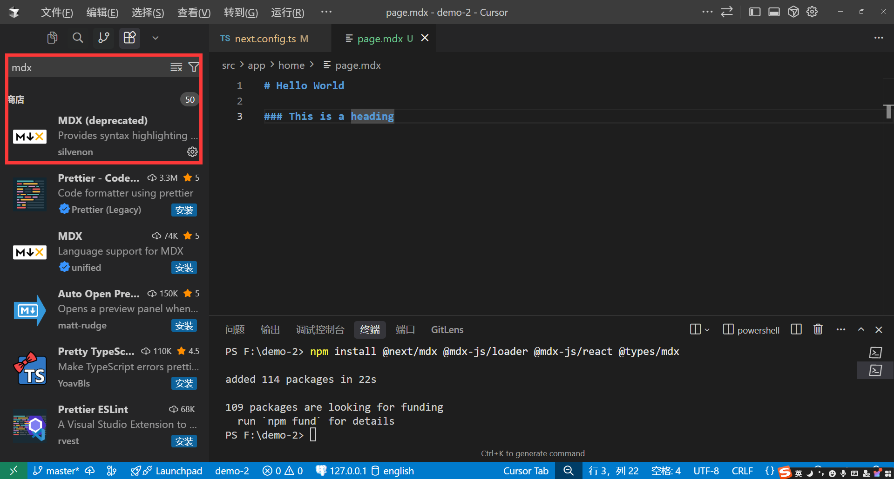

# MDX

MDX是一种将Markdown和React组件混合在一起的语法，它可以在Markdown中使用React组件，从而实现更复杂的页面。另外就是我们在编写技术文档或者博客的时候，配合SSG模式，更喜欢用`Markdown`来编写，MDX他正好将`Markdown`和`React`组件混合在一起，实在是方便至极。

### 安装依赖

```bash
npm install @next/mdx @mdx-js/loader @mdx-js/react @types/mdx
```

### 启用MDX功能

#### 1.next.config.js配置以下内容

```ts
//next.config.js    
import type { NextConfig } from "next";
import createMDX from '@next/mdx'
const withMDX = createMDX({
    //extension: /\.(md|mdx)$/ 默认只支持mdx文件,如果想额外支持md文件编写次行代码。
});
const nextConfig: NextConfig = {
  reactCompiler: true,
  pageExtensions: ['js', 'jsx', 'md', 'mdx', 'ts', 'tsx'],
};
export default withMDX(nextConfig);
```

#### 2.根目录下面创建`mdx-components.tsx`文件

```tsx
import type { MDXComponents } from 'mdx/types'
 
const components: MDXComponents = {}
 
export function useMDXComponents(): MDXComponents {
  return components
}
```

### 创建文件

```
 my-project
  ├── app
  │   └── mdx-page
  │       └── page.(mdx/md)
  |── mdx-components.(tsx/js)
  └── package.json
```

### 代码高亮
打开编辑器-插件市场-搜索`MDX`-安装`MDX`插件



### 基础使用

可以支持(`Markdown`语法 + `React`组件 + `HTML`标签)

```mdx
# welcome to MDX

这是一段文字，**他加粗了**，并且有重点内容`important`。

- one
- two
- three


<div className='bg-red-500'>
  <p>自定义标签</p>
</div>
```

### 引入自定义组件
引入自定义组件一定要跟md语法之间空一行，否则会报错

src/app/home/page.mdx
```mdx
import MyComponent from './my-component'; //引入自定义组件一定要跟md语法之间空一行，否则会报错。

# welcome to MDX

这是一段文字，**他加粗了**，并且有重点内容`important`。

- one
- two
- three


<div className='bg-red-500'>
  <p>自定义标签</p>
</div>

<MyComponent />
```
mdx文件无法实现一些复杂的交付逻辑，如果有复杂的交付逻辑，我们可以使用`React`组件来实现，然后在mdx文件中引入即可。
```tsx
//src/app/home/my-component.tsx
'use client'
import { useState } from 'react';
export default function MyComponent() {
  const [count, setCount] = useState(0);
  return (
    <div>
      <p>Count: {count}</p>
      <button onClick={() => setCount(count + 1)}>Increment</button>
    </div>
  );
}
```