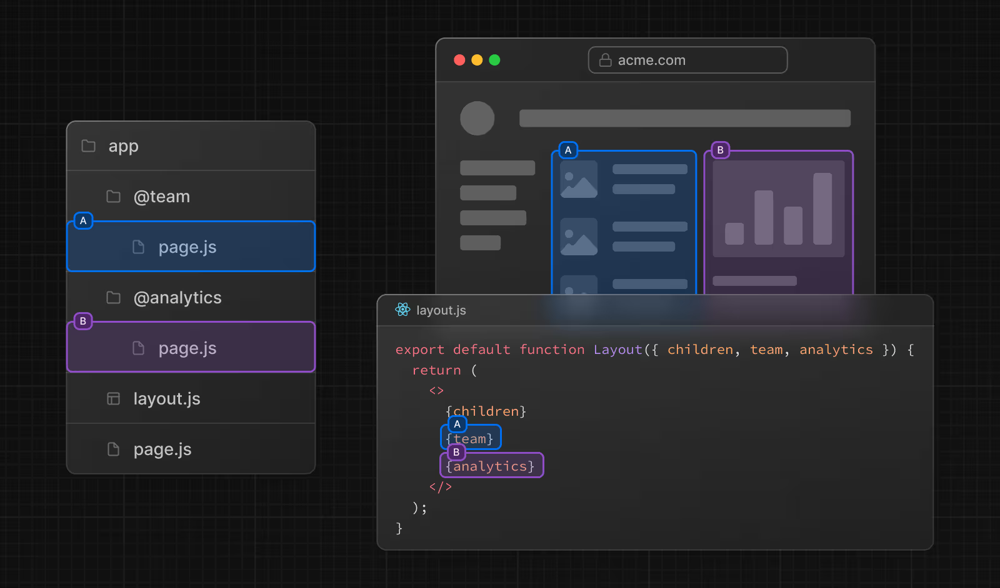
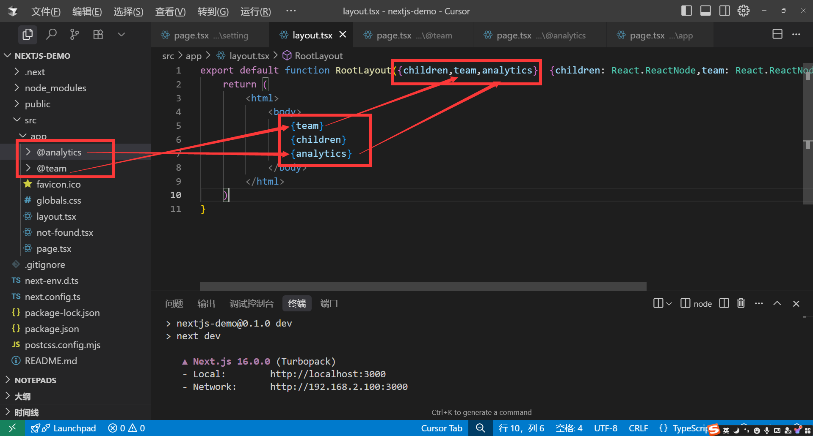
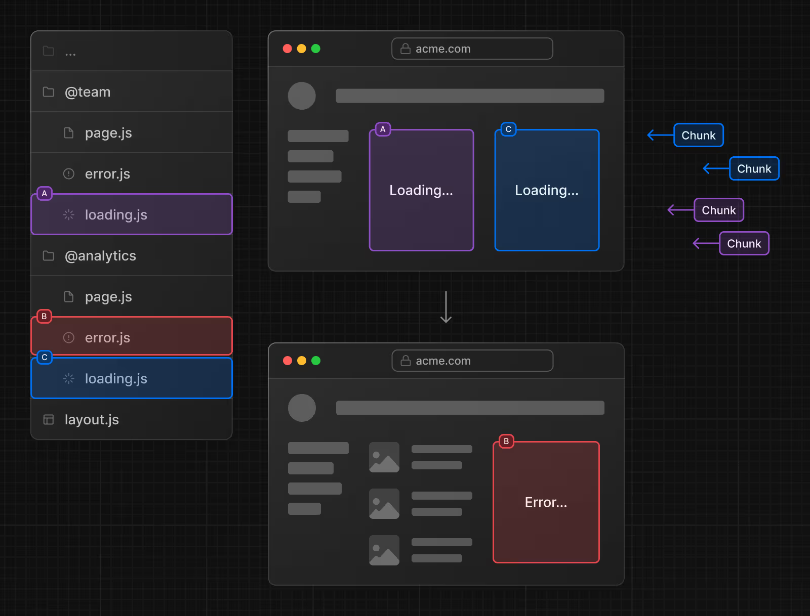
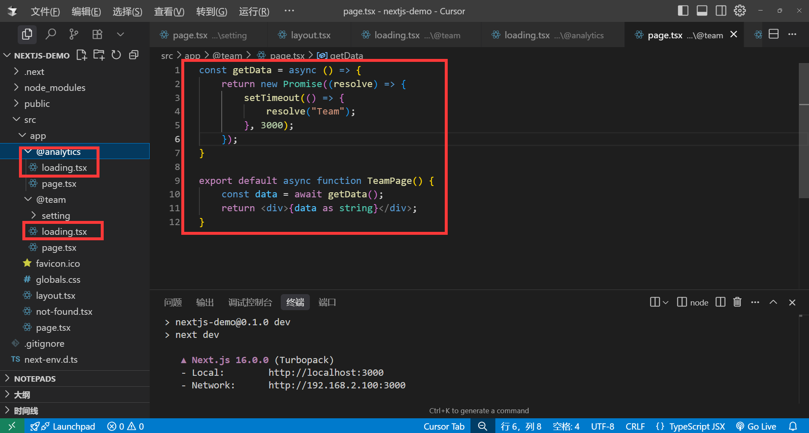

# 平行路由

平行路由指的是在同一布局`layout.tsx`中，可以同时渲染多个页面，例如`team`，`analytics`等，这个东西跟`vue`的`router-view`类似。




### 基本用法

平行路由的使用方法就是通过`@` + 文件夹名来定义，例如`@team`，`@analytics`等，名字可以自定义。

>平行路由也不会影响`URL`路径。



定义完成之后，我们就可以在`layout.tsx`中使用`team`和`analytics`来渲染对应的页面，他会自动注入`layout`的props里面

>注意：例子中我们使用了解构的语法，这里面的名称`team`,`analytics`需跟文件夹名称一致。

```tsx
export default function RootLayout({children,team,analytics}: 
{children: React.ReactNode,team: React.ReactNode,analytics: React.ReactNode}
) {
    return (
        <html>
            <body>
                {team}
                {children}
                {analytics}
            </body>
        </html>
    )
}
```

### 独立路由

当我们使用了平行路由之后，我们为其单独定义`loading`,`error`,等组件使其拥有独立加载和错误处理的能力。






### default.tsx

首先我们先认识一下子导航，每一个平行路由下面还可以接着创建对应的路由，例如`@team`下面可以接着创建`@team/setting`，`@team/user`等。

那我们的目录结构就是：

```txt
├── @team
│   ├── page.tsx
│   ├── setting
│   │   └── page.tsx
└── @analytics
│    └── page.tsx
└── layout.tsx   
└── page.tsx
```

然后我们使用`Link`组件跳转子导航`setting`页面

```tsx
import Link from "next/link"
export default function RootLayout({children,team,analytics}: 
{children: React.ReactNode,team: React.ReactNode,analytics: React.ReactNode}) {
    return (
        <html>
            <body>
                {team}
                {children}
                {analytics}
                <Link className="text-blue-500 block" href="/setting">Setting</Link>
            </body>
        </html>
    )
}
```


观察上图我们发现，子导航使用`Link`组件跳转`setting`页面时，是没有问题的，但是我们在跳转之后刷新页面，就出现`404`了，这是怎么回事?

- 当使用软导航`Link`组件跳转子页面的时候，这时候`@analytics` 和 `children` 依然保持活跃，所以他只会替代`@team`里面的内容。
- 而当我们使用硬导航`浏览器页面刷新`,此时`@analytics` 和 `children` 已经失活，因为它的底层原理其实是同时匹配`@team`和`@analytics`，`children` 目录下面的`setting` 页面，但是只有`@team` 有这个页面，其他两个没有，所以导致`404`。

解决方案：使用`default.tsx`来进行兜底，确保不会`404`

- @analytics/default.tsx 定义default.tsx文件
- app/default.tsx 定义default.tsx文件

