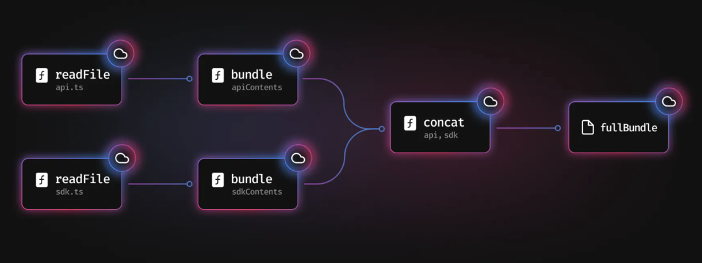
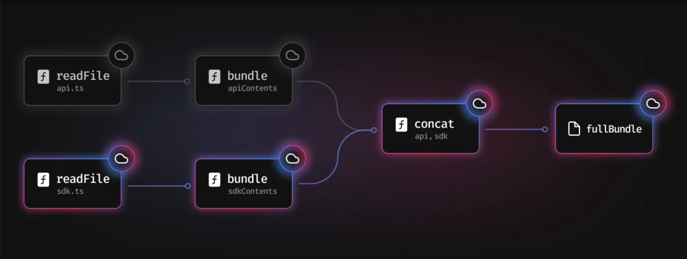

# Next.js 项目搭建

## 创建项目

快速入门

注： 当前教程为16.0.1版本，最低Node.js版本为20.9.0

```bash
npx create-next-app@latest
```
接下来会有几个问题需要你选择，根据你的需求选择即可

- What is your project named? » my-app `项目名称（必填）`
- Would you like to use the recommended Next.js defaults? `是否使用推荐配置` 这里我选自定义配置 `No, customize settings`
- Would you like to use TypeScript? » No / Yes `是否使用TypeScript` 这里我选是 `Yes`
- Which linter would you like to use? » ESLint / Biome / None `是否使用ESLint` 这里我选是 `None`
- Would you like to use React Compiler? » No / Yes `是否使用React Compiler` 这里我选是 `Yes`
- Would you like to use Tailwind CSS? » No / Yes `是否使用Tailwind CSS` 这里我选是 `Yes`
- Would you like to use `src/app` directory? » No / Yes `是否使用src/app目录` 这里我选是 `Yes`
- Would you like to use App Router? (recommended) » No / Yes `是否使用App Router` 这里我选是 `Yes`
- Would you like to use Turbopack? (recommended) » No / Yes `是否使用Turbopack` 这里我选是 `Yes`
- Would you like to customize the import alias (`@/*` by default)? » No / Yes 是否自定义导入别名 `@/*` 这里我选是 `Yes`
- What import alias would you like configured? » @/* 是否自定义导入别名 `@/*` 这里我选是 默认 `@/*`

选择完成之后，他会执行`npm install`安装依赖，安装完成之后，他会执行`npm run dev`启动项目，访问`http://localhost:3000`即可看到项目。

### 目录结构介绍

```txt
public/ -> 静态资源目录
src/ -> 源代码目录
  └─app/ -> App Router目录
     └─layout.tsx -> 跟布局(必须存在 且必须包含html body标签)
     └─page.tsx -> 首页
     └─globals.css -> 全局样式
next-env.d.ts -> TypeScript类型定义文件
next.config.ts -> Next.js配置文件
tsconfig.json -> TypeScript配置文件
postcss.config.mjs -> PostCSS配置文件(主要用于处理tailwindcss)
package.json -> 包管理文件
README.md -> 项目说明文件
```

### 命令介绍

```bash
next dev -> 启动开发服务器 -> npm run dev
next build -> 构建项目 -> npm run build
next start -> 启动生产服务器 -> npm run start
```

### FAQ

**什么是Turbopack？**


Turbopack 是一个**增量打包器**，用于取代`webpack`,它是用Rust语言编写,并且Turbopack转换js/ts使用的是`SWC`,他比vite快10倍，比webpack快700倍，速度更快，性能更优。


核心原理：Turbopack是函数级别的缓存，可以将某些函数，进行标记，当这些函数被调用时，会记住他们被调用的内容，保存到缓存中。



首先我们看到有两个文件`api.ts`/ `sdk.ts` 都调用了`readFile函数`，然后把这两个文件打包成`bundle`,然后拼接起来,最后打成一个`fullBundle`



例如`sdk.js`发生了变化，而`api.js`没有改变，所以他就只会打包`sdk.js`,而不会打包`api.js`,只需要从缓存中读取`api.js`内容即可，这样就可以节省非常多的时间，意味着它永远不需要执行两次相同的工作。

------

**什么是React Compiler?**

React Compiler 是Next.js 用于自动优化组件渲染来提高性能的工具，在之前的话，我们需要手动优化`useMemo` / `useCallback` /`memo`等，现在Next.js会自动优化，你只需要写代码即可,减少心智负担。

如何开启React Compiler? `如果你在选项中选择yes则无需安装`

```bash
npm install -D babel-plugin-react-compiler
```
next.config.ts
```ts
import type { NextConfig } from 'next'
 
const nextConfig: NextConfig = {
  reactCompiler: true, //开启即可
}
 
export default nextConfig
```
------

**什么是App Router?**

Next.js 有两套路由系统，一个是旧的`Pages Router`路由系统，一个是新的`App Router`路由系统。

首先Next.js 首推的是`App Router`路由系统

 - `Pages Router`的路由系统是会把`pages`目录下的所有jsx/tsx文件，都转换成路由，例如`pages/index.tsx`会转换成`/`路由，`pages/about.tsx`会转换成`/about`路由，这样导致我们不能把组件写到`pages`目录下。

目录结构如下
```txt
 └── pages
    ├── index.tsx -> /
    ├── login.tsx -> /login
    ├── api
    │   └── user.tsx -> /api/user
    ├── posts
    │   └── [id].tsx -> /posts/[id]
    └── blog
        ├── index.tsx -> /blog
        └── setting.tsx -> /blog/setting
```


-  `App Router`的路由系统是根据约定定义的，目录结构如下

```txt
src/
└── app
    ├── page.tsx -> / 首页
    ├── layout.tsx -> 布局组件
    ├── template.tsx -> 模板组件
    ├── loading.tsx -> 加载组件
    ├── error.tsx -> 错误组件
    └── not-found.tsx -> 404组件
    ├── xiaoman
    │   └── page.tsx -> /xiaoman 小满页面
    └── daman
        └── page.tsx -> /daman 大满页面
```
- `Pages Router` 读取数据需要使用`getServerSideProps` / `getStaticProps` / `getStaticPaths`等函数，而`App Router`则不需要，直接在组件中使用`fetch`调用即可。

Pages Router:
```tsx
export async function getServerSideProps() {
  const res = await fetch('xxx');
  const data = await res.json();
  return { props: { data } };
}
export default function Home({ data }) {
  return <div>{data.name}</div>;
}
```

App Router:
```tsx
export default async function Home() {
  const res = await fetch('xxx');
  const data = await res.json();
  return <div>{data.name}</div>;
}
```
**预计学习时间**: 10 分钟  
**难度级别**: 初级 🟢

