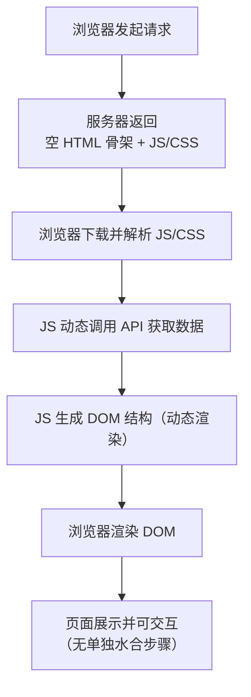
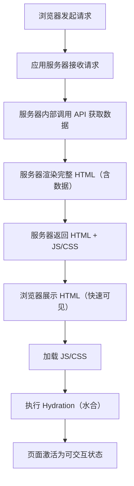

# 渲染基础

本章我们学习 `CSR` `SSR` `SSG` 三种渲染方式,以及`Hydration`水合的概念。


### CSR

CSR是`Client Side Rendering`的缩写，即客户端渲染。像我们使用的`Vue` `React` `Angular` 等框架，都是CSR。

工作流程如下：

浏览器请求服务器 -> 服务器返回HTML/JS/CSS等文件 -> JS动态渲染生成DOM -> 浏览器渲染DOM



优点：

- 交互流畅，可直接响应
- 前后端分离，前端注重UI，后端注重数据

缺点：

- 首屏加载慢，因为需要下载JS/CSS等文件
- SEO不友好，因为JS动态渲染`(现在爬虫普遍已经支持JS抓取了)`

适合场景：

- 后台管理系统开发(后台系统不需要SEO，也不需要首屏加载速度)
- 单页面应用开发(SPA)

### SSR

SSR是`Server Side Rendering`的缩写，即服务端渲染。像我们使用的`Next.js` `Nuxt.js`等框架，都是SSR。

例如我们有一个电商网站，需要保证用户搜索关键词能搜到 `xx商品`, 还要注意 用户还可能是`弱网环境`,在地铁 电梯等，所以我们可以直接把API放到服务器请求，然后渲染成HTML页面返回给浏览器。

工作流程如下：

浏览器请求服务器 -> 服务器(内部调用API接口-> 渲染HTML页面) -> 浏览器直接读取HTML页面 并且 同时加载JS/CSS等文件 -> 执行hydration(水合)



优点：

- 首屏加载快，因为服务器已经渲染了HTML页面
- SEO友好，搜索引擎能爬取到完整内容

缺点：

- 开发成本高，需要懂服务端知识，全栈开发。
- 服务器承担渲染工作，如果用户访问量大，对服务器配置要求高，增大成本

适合场景：

 - 电商网站开发
 - 博客网站开发
 - 官网/首页等

 ### SSG

 SSG是`Static Site Generation`的缩写，即静态站点生成。像我们使用的`Vitepress` `Astro`等框架，都是SSG。

 例如我们需要一个查看文档的网站，例如`Vue` `React` 等文档，大家看到的都是一样的，所以我们在构建的时候，直接编译成静态文件，连接口都不用请求了，如果在部署CDN/Nginx等服务器，基本可以实现秒开。

 工作流程如下：

 项目构建 `npm run build` -> 生成静态文件（每个路由对应一个 HTML） -> 部署到CDN/Nginx等服务器 -> 浏览器请求服务器 -> 服务器返回HTML页面 -> hydration

 ```mermaid
graph TD
    A[本地构建] -->|npm run build| B[生成静态文件<br/>（每个路由对应 HTML）]
    B --> C[部署到 CDN/Nginx]
    C --> D[浏览器发起请求]
    D --> E[CDN/Nginx 返回静态 HTML]
    E --> F[浏览器展示 HTML（瞬间可见）]
    F --> G[加载 JS/CSS]
    G --> H[执行 Hydration（水合）]
    H --> I[页面激活为可交互状态]
 ```

 优点：

 - 首屏加载极快（CDN 分发静态文件，无需服务器实时渲染）
 - 服务器压力小（CDN 直接承载请求，无需服务器执行 JS）
 - SEO 最优（静态 HTML 含完整数据，搜索引擎爬取无压力）

 缺点：

 - 不适用于动态数据（数据更新需要重新构建部署，如实时股价、实时评论）
 - 详情页面如果过多(构建时间会长)

 适合场景：

 - 技术文档
 - 静态营销页
 - 静态新闻站


### Hydration(水合)

简单来说就是HTML他是静态的，需要通过JS才能变成动态的，不然HTML是没有任何交互效果的，当JS下载完成在赋予HTML交互效果的阶段称之为`水合`。

以Next.js水合为例(详细版本):

服务端操作:

 - Next.js 服务器接收到用户请求。
 - 服务器执行 React 组件代码，获取数据（比如从 API 接口请求文章列表）。
 - 服务器将 React 组件渲染成静态 HTML 字符串（包含了文章列表的所有内容）。
 - 服务器将这个 HTML 字符串返回给浏览器。

客户端操作:

 - 浏览器接收到 HTML，立即解析并展示给用户（此时用户能看到文章列表，但点击 “查看详情” 按钮没有反应）
 - 浏览器开始下载页面所需的 JS 文件（包括 React 核心库、组件代码等）
 - JS 下载完成后，React 会执行 ReactDOM.hydrateRoot() 方法（在 React 18+ 中）
 - hydrateRoot() 会对比浏览器中的真实 DOM 和 React 组件的虚拟 DOM：
    - 如果结构一致，React 会给真实 DOM 绑定事件监听器。
    - 如果发现差异（比如服务器和客户端数据不一致），React 会发出警告，并以客户端渲染的结果为准。
 - 水合完成后，页面变成可交互的动态页面（用户可以点击按钮、滚动加载更多内容等）