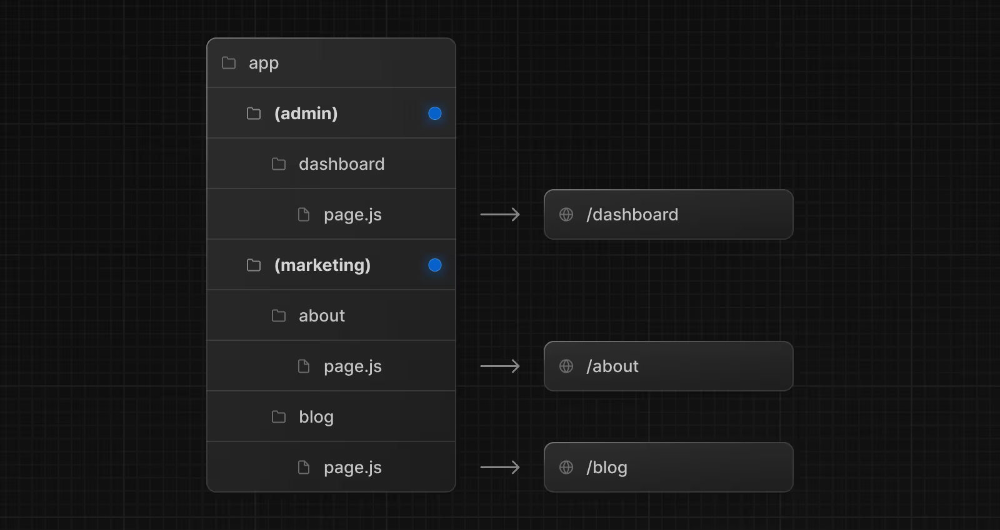
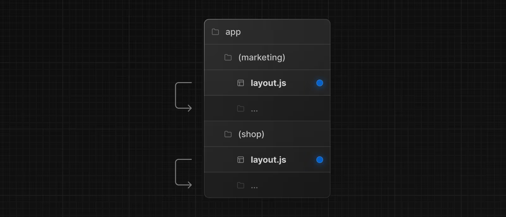
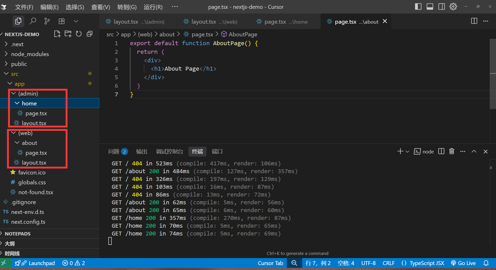

# 路由组

路由组也是一种基于文件夹的约定范式，可以让我们开发者，按类别或者团队组织路由模块，并且不影响 URL 路径。

用法：只需要通过`(groupName)`包裹住文件夹名即可，例如`(shop)`，`(user)`等，名字可以自定义。

### 定义多个根布局

这种一般是大型项目使用的，例如我们需要把，`后台管理系统`和`前台的门户网站`，放到一个项目就可以使用这种方法实现。

使用方法：

1. 先把`app`目录下的`layout.tsx` 文件删除
2. 在每组的目录下创建`layout.tsx`文件，并且定义`html`,`body`标签。

