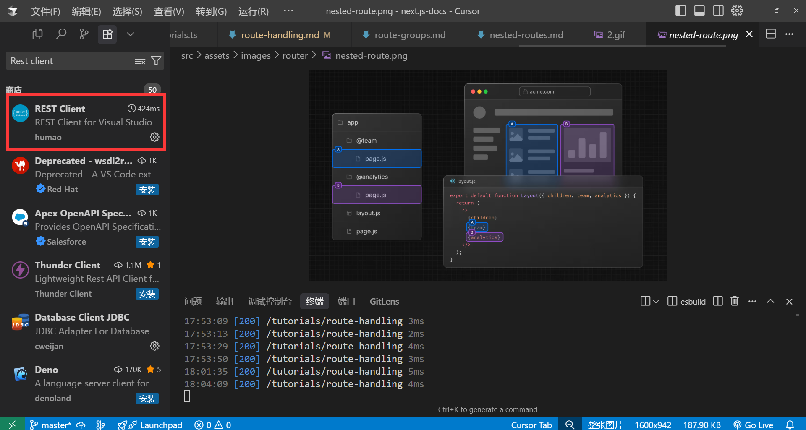
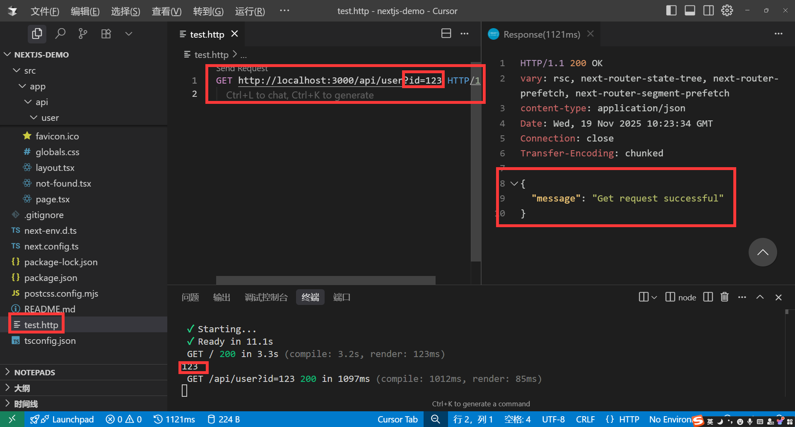
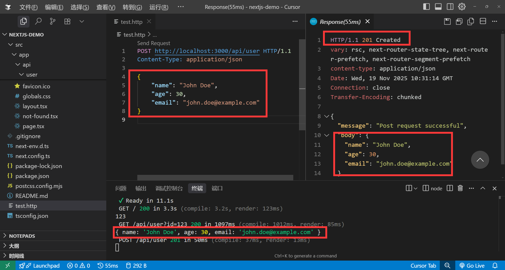
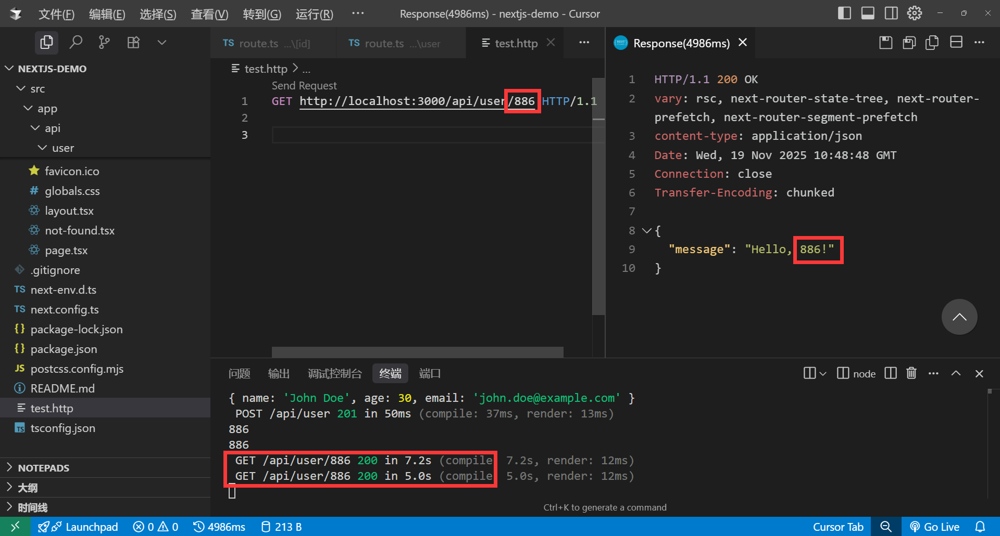

# 路由处理程序(Route Handlers)

路由处理程序，可以让我们在Next.js中编写API接口，并且支持与客户端组件的交互，真正做到了什么叫`前后端分离人不分离`。

### 文件结构

定义前端路由页面我们使用的`page.tsx`文件，而定义API接口我们使用的`route.ts`文件，并且他两都不受文件夹的限制，可以放在任何地方，只需要文件的名称以`route.ts`结尾即可。

>注意：`page.tsx`文件和`route.ts`文件不能放在同一个文件夹下，否则会报错，因为Next.js就搞不清到底用哪一个了，所以我们最好把前后端代码分开。

为此我们可以定义一个`api`文件夹，然后在这个文件夹下创建一对应的模块例如`user` `login` `register`等。

目录结构如下
```txt
app/
├── api
│   ├── user
│   │   └── route.ts
│   ├── login
│   │   └── route.ts
│   └── register
│       └── route.ts
```

### 定义请求

Next.js是遵循`RESTful API`的规范，所以我们可以使用HTTP方法来定义请求。

```tsx
export async function GET(request) {}
 
export async function HEAD(request) {}
 
export async function POST(request) {}
 
export async function PUT(request) {}
 
export async function DELETE(request) {}
 
export async function PATCH(request) {}
 
//如果没有定义OPTIONS方法，则Next.js会自动实现OPTIONS方法
export async function OPTIONS(request) {}
```

>注意: 我们在定义这些请求方法的时候`不能修改方法名称而且必须是大写`，否则无效。

工具准备: 打开vsCode / Cursor 找到插件市场搜索`REST Client`，安装完成后，我们可以使用`REST Client`来测试API接口。



### 定义GET请求

src/app/api/user/route.ts

```tsx
import { NextRequest, NextResponse } from "next/server";
export async function GET(request: NextRequest) {
    const query = request.nextUrl.searchParams; //接受url中的参数
    console.log(query.get('id'));
    return NextResponse.json({ message: 'Get request successful' }); //返回json数据
}
```

REST client测试:

在src目录新建`test.http`文件，编写测试请求

src/test.http

```http
GET http://localhost:3000/api/user?id=123 HTTP/1.1
```



### 定义Post请求

src/app/api/user/route.ts

```tsx
import { NextRequest, NextResponse } from "next/server";
export async function POST(request: NextRequest){
    //const body = await request.formData(); //接受formData数据
    //const body = await request.text(); //接受text数据
    //const body = await request.arrayBuffer(); //接受arrayBuffer数据
    //const body = await request.blob(); //接受blob数据
    const body = await request.json(); //接受json数据
    console.log(body); //打印请求体中的数据
    return NextResponse.json({ message: 'Post request successful', body },{status: 201});
     //返回json数据
}
```

REST client测试:

src/test.http

```http
POST http://localhost:3000/api/user HTTP/1.1
Content-Type: application/json

{
    "name": "张三",
    "age": 18
}
```



### 动态参数

我们可以在路由中使用方括号`[]`来定义动态参数，例如`/api/user/[id]`，其中`[id]`就是动态参数，这个参数可以在请求中传递，这个跟前端路由的动态路由类似。

src/app/api/user/[id]/route.ts

接受动态参参数，需要在第二个参数解构{ params },需注意这个参数是异步的，所以需要使用`await`来等待参数解析完成。

```tsx
import { NextRequest, NextResponse } from "next/server";
export async function GET(request: NextRequest, 
{ params }: { params: Promise<{ id: string }> }) {
    const { id } = await params;
    console.log(id);
    return NextResponse.json({ message: `Hello, ${id}!` });
}
```

REST client测试:

src/test.http
```http
GET http://localhost:3000/api/user/886 HTTP/1.1
```



### cookie

Next.js也内置了cookie的操作可以方便让我们读写，接下来我们用一个登录的例子来演示如何使用cookie。

安装手动挡组件库`shadcn/ui`[官网地址](https://ui.shadcn.com/)

```sh
npx shadcn@latest init 
```

为什么使用这个组件库？因为这个组件库是把组件放入你项目的目录下面，这样做的好处是可以让你随时修改组件库样式，并且还能通过AI分析修改组件库

安装button,input组件

```sh
npx shadcn@latest add button
npx shadcn@latest add input
```
新建login接口
src/app/api/login/route.ts

```tsx
import { cookies } from "next/headers"; //引入cookies
import { NextRequest, NextResponse } from "next/server"; //引入NextRequest, NextResponse
//模拟登录成功后设置cookie
export async function POST(request: NextRequest) {
    const body = await request.json();
    if(body.username === 'admin' && body.password === '123456'){
        const cookieStore = await cookies(); //获取cookie
        cookieStore.set('token', '123456',{
            httpOnly: true, //只允许在服务器端访问
            maxAge: 60 * 60 * 24 * 30, //30天
        });
        return NextResponse.json({ code: 1 }, { status: 200 });
    }else{
        return NextResponse.json({ code: 0 }, { status: 401 });
    }
}
//检查登录状态
export async function GET(request: NextRequest) {
    const cookieStore = await cookies();
    const token = cookieStore.get('token');
    if(token && token.value === '123456'){
        return NextResponse.json({ code:1 }, { status: 200 });
    }else{
        return NextResponse.json({ code:0 }, { status: 401 });
    }
}
```

src/app/page.tsx

```tsx
'use client';
import { useState } from 'react';
import { Button } from '@/components/ui/button';
import { Input } from '@/components/ui/input';
import { useRouter } from 'next/navigation';

export default  function HomePage() {
    const router = useRouter();
    const [username, setUsername] = useState('');
    const [password, setPassword] = useState('');
    const handleLogin = () => {
        fetch('/api/login', {
            method: 'POST',
            headers: {
                'Content-Type': 'application/json',
            },
            body: JSON.stringify({ username, password }),
        }).then(res => {
            return res.json();
        }).then(data => {
            if(data.code === 1){
                router.push('/home');
            }
        });
    }
    return (
        <div className='mt-10 flex flex-col items-center justify-center gap-4'>
            <Input value={username} onChange={(e) => setUsername(e.target.value)} className='w-[250px]' placeholder="请输入用户名" />
            <Input value={password} onChange={(e) => setPassword(e.target.value)} className='w-[250px]' placeholder="请输入密码" />
            <Button onClick={handleLogin}>登录</Button>
        </div>
    )
}
```
src/app/home/page.tsx

```tsx
'use client';
import { useEffect } from 'react';
import { redirect } from 'next/navigation';
const checkLogin = async () => {
    const res = await fetch('/api/login');
    const data = await res.json();
    if (data.code === 1) {
        return true;
    } else {
        redirect('/');
    }
}
export default function HomePage() {
    useEffect(() => {
        checkLogin()    
    }, []);
    return <div>你已经登录进入home页面</div>;
}
```

