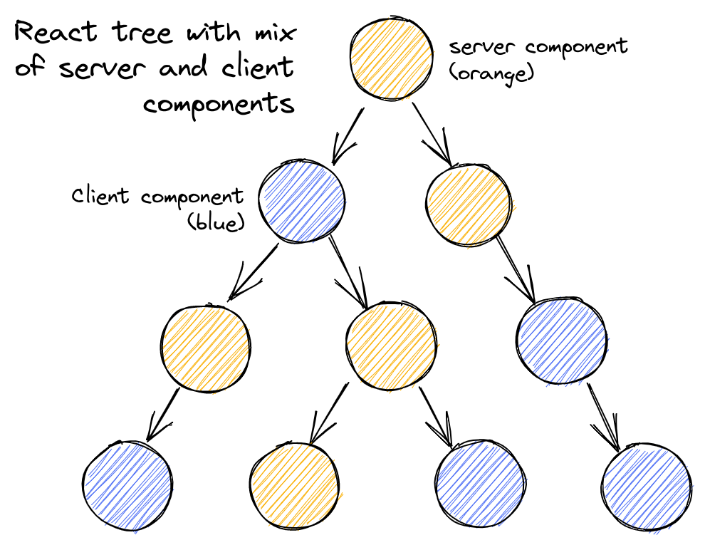
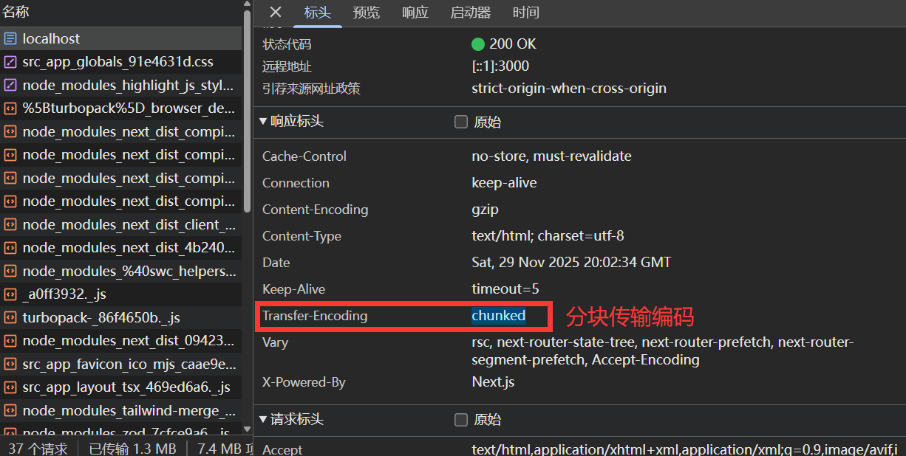

# RSC(React Server Components)

RSC(服务器组件)是React19`正式引入`的一种新的组件类型，它可以在服务器端渲染，也可以在客户端渲染。

像传统的`SSR`他是在服务器提前把页面渲染好，然后返回给浏览器，然后进行水合，`CSR`则是在客户端渲染，而`RSC`则是吸取两方优势，分为`服务器组件`和`客户端组件`。

举个例子:

例如我们有一个官网的页面，上面都是静态内容，但下面留言框是需要交互的。


此时我们就可以拆分成两个组件:

- 服务器组件: 上面都是静态内容，例如正文，标题，图片等，这类组件之所以适合在服务端执行，核心原因在于服务端渲染HTML+CSS的速度更快，生成的内容对搜索引擎完全可见，且无需客户端额外处理交互逻辑，完美匹配静态内容的需求。
```tsx
//Next.js 默认服务器组件
export default function HomePage() {
    return (
        <div>
            <h1>Home Page</h1>
        </div>
    )
}
```
- 客户端组件: 下面留言框是需要交互的，例如交互功能，如点赞按钮、计数器、表单等。这类组件需要依赖浏览器DOM事件、状态管理（useState）、副作用（useEffect）等客户端能力，必须在客户端完成渲染和水合（即添加事件处理程序的过程）才能实现交互效果
```tsx
'use client' //声明这是一个客户端组件
export default function HomePage() {
    return (
        <div>
            <h1>Home Page</h1>
        </div>
    )
}
```

### 渲染(RSC Payload)

SSR模式是在服务器直接渲染成`HTML`页面，返回给浏览器的，而`RSC`他是一种特殊的`紧凑的`格式

```json
b2:["$","span",null,{"className":"line","children":["$","span",null,{"style":{"color":"var(--shiki-color-text)"},"children":"    })"}]}]
b3:["$","span",null,{"className":"line","children":[["$","span",null,{"style":{"color":"var(--shiki-color-text)"},"children":"  }"}],["$","span",null,{"style":{"color":"var(--shiki-token-punctuation)"},"children":","}],["$","span",null,{"style":{"color":"var(--shiki-color-text)"},"children":" [])"}]]}]
b4:["$","span",null,{"className":"line","children":" "}]
b5:["$","span",null,{"className":"line","children":[["$","span",null,{"style":{"color":"var(--shiki-color-text)"},"children":"  "}],["$","span",null,{"style":{"color":"var(--shiki-token-comment)"},"children":"// You can use `isPending` to give users feedback"}]]}]
b6:["$","span",null,{"className":"line","children":[["$","span",null,{"style":{"color":"var(--shiki-color-text)"},"children":"  "}],["$","span",null,{"style":{"color":"var(--shiki-token-keyword)"},"children":"return"}],["$","span",null,{"style":{"color":"var(--shiki-color-text)"},"children":" <"}],["$","span",null,{"style":{"color":"var(--shiki-token-string-expression)"},"children":"p"}],["$","span",null,{"style":{"color":"var(--shiki-color-text)"},"children":">Total Views: {views}</"}],["$","span",null,{"style":{"color":"var(--shiki-token-string-expression)"},"children":"p"}],["$","span",null,{"style":{"color":"var(--shiki-color-text)"},"children":">"}]]}]
```
那为什么这么做呢？因为我们的组件可以进行嵌套`服务器组件`>嵌套`客户端组件`>

黄色节点表示`服务器组件`，虚线节点表示`客户端组件`


在这个结构中，Next.js就会标记哪些是客户端组件并且预留好位置，但是不会进行水合。

那么Next.js发现客户端组件也会在服务器生成这个结构，那干脆直接服务器里面把客户端组件进行预渲染(不包含交互)，这样我们就能快速看到数据，等他加载完成后再进行水合，所以客户端组件也会在服务器进行一次`预渲染`。

### 优点

- 将组件拆分成客户端组件和服务器组件，可以有效的减少`bundle`体积，因为`服务器组件`已经在服务器渲染好了，所以没必要打入`bundle`中,也就是说服务器组件所依赖的包都不会打进去，大大减少了`bundle`体积。

- 局部水合，像传统的SSR同构模式, 所有的页面都要在客户端进行水合，而`RSC`将组件拆分出来，只会把客户端组件进行水合，避免了全量水合带来的性能损耗。

- 流式加载，我们的HTML页面本来就支持流式加载，所以服务器组件可以边渲染边返回，提高了FCP(首次内容绘制)性能。

