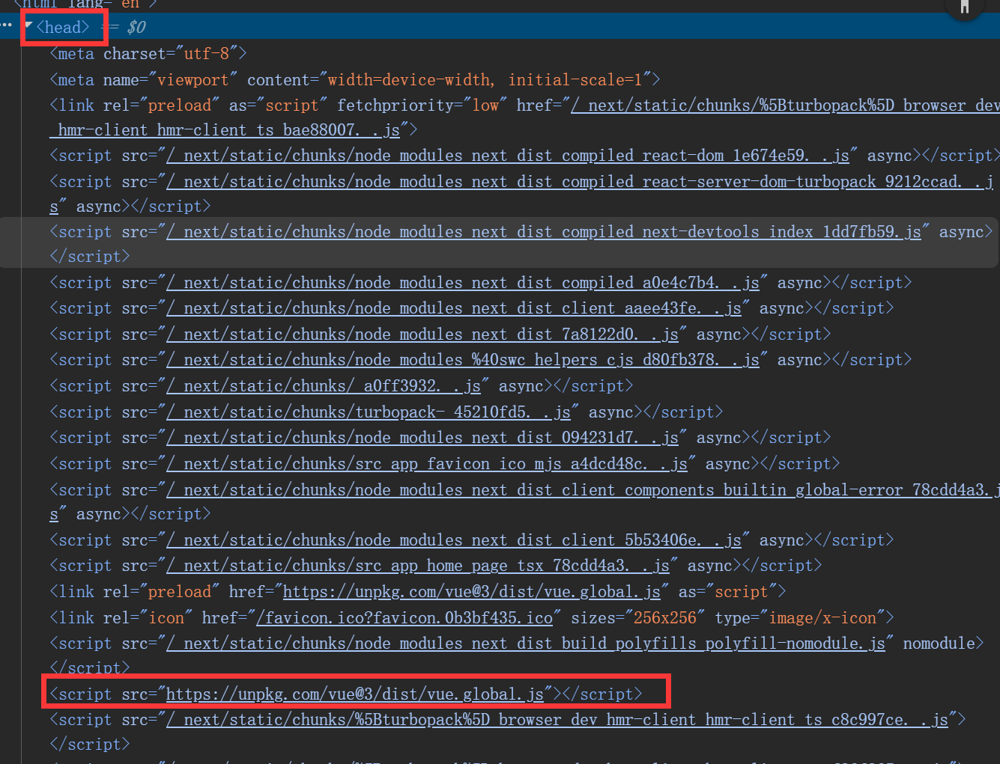

# Script脚本

Next.js允许我们内置脚本`Script`组件，并且他还对`Script`组件进行优化。


### 基本使用

#### 局部引入

src/app/home/page.tsx

在home路由引入一个远程的js脚本，他只会在切换到home路由时才会加载，并且只会加载一次，然后纳入缓存。

```tsx
import Script from 'next/script' //引入Script组件
export default function HomePage() {
    return (
        <div>
            <Script src="https://unpkg.com/vue@3/dist/vue.global.js" />
        </div>
    )
}
```
他的底层原理会把这个`Script`组件转换成`<script>`标签，然后插入到`<head>`标签中。


#### 全局引入

src/app/layout.tsx

全局引入直接在app/layout.tsx中引入，他会自动在所有页面中引入，并且只会加载一次，然后纳入缓存。

```tsx
import Script from 'next/script'
export default function RootLayout({ children }: { children: React.ReactNode }) {
    return (
        <html>
            <head>
                <Script src="https://unpkg.com/vue@3/dist/vue.global.js" />
            </head>
            <body>
                {children}
            </body>
        </html>
    )
}
```

#### 加载策略

Next.js允许我们通过`strategy`属性来控制`Script`组件的加载策略。

- `beforeInteractive`: 在代码也页面之前加载`会阻塞页面渲染`。
- `afterInteractive`(默认值): 在页面渲染到客户端之后加载。
- `lazyOnload`: 在浏览器空闲时稍后加载脚本。
- `worker`(实验性特性): 暂时不建议使用。

```tsx
<Script id="VGUBHJMK1" strategy="beforeInteractive" src="https://unpkg.com/vue@3/dist/vue.global.js" />
<Script id="VGUBHJMK2" strategy="afterInteractive" src="https://unpkg.com/vue@3/dist/vue.global.js" />
<Script id="VGUBHJMK3" strategy="lazyOnload" src="https://unpkg.com/vue@3/dist/vue.global.js" />
<Script id="VGUBHJMK4" strategy="worker" src="https://unpkg.com/vue@3/dist/vue.global.js" />
```
> webWorker模式 尚不稳定，谨慎使用,小提示可以给Script组件添加id，Next.js会追踪优化。


#### 内联脚本

即使不从外部文件载入脚本，Next.js也支持我们通过{}直接在`Script组件`编写代码。

```tsx
import Script from "next/script";
export default function RootLayout({
  children
}: Readonly<{
  children: React.ReactNode;
}>) {
  return (
    <html lang="en">
      <head>
        <Script id="VGUBHJMK5" strategy="beforeInteractive" src="https://unpkg.com/vue@3/dist/vue.global.js"></Script>
      </head>
      <body>
        {children}
        <div id="app"></div>
        <Script id="VGUBHJMK6"
         strategy="afterInteractive">
        {
           `
            const {createApp} = Vue
            createApp({
              template: '<h1>{{ message }}</h1>',
              setup() {
                return {
                  message: 'Next.js + Vue.js'
                }
              }
            }).mount('#app')
          `
        }
        </Script>
      </body>
    </html>
  );
}
```

第二种写法使用 dangerouslySetInnerHTML 属性来设置内联脚本。

```tsx
<Script dangerouslySetInnerHTML={{__html: `
    const {createApp} = Vue
    createApp({
        template: '<h1>{{ message }}</h1>',
        setup() {
        return {
            message: 'Next.js + Vue.js'
        }
        }
    }).mount('#app')
    ` }} strategy="afterInteractive">
</Script>
```

#### 事件监听

- onload: 脚本加载完成时触发。
- onReady: 脚本加载完成后，且组件每次挂载的时候都会触发。
- onError: 脚本加载失败时触发。

Script组件只有在导入客户端的时候才会生效，所以需要使用`'use client'`声明这是一个客户端组件。

```tsx
'use client'
 
import Script from 'next/script'
 
export default function Page() {
  return (
    <>
      <Script
        src="https://example.com/script.js"
        onLoad={() => {
          console.log('Script has loaded')
        }}
      />
    </>
  )
}
```