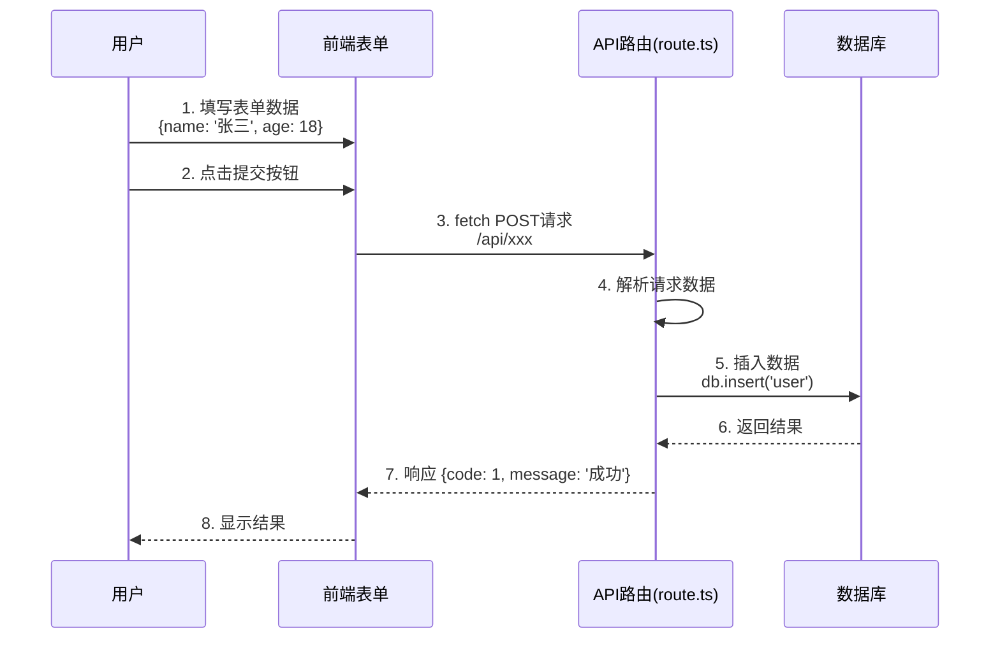
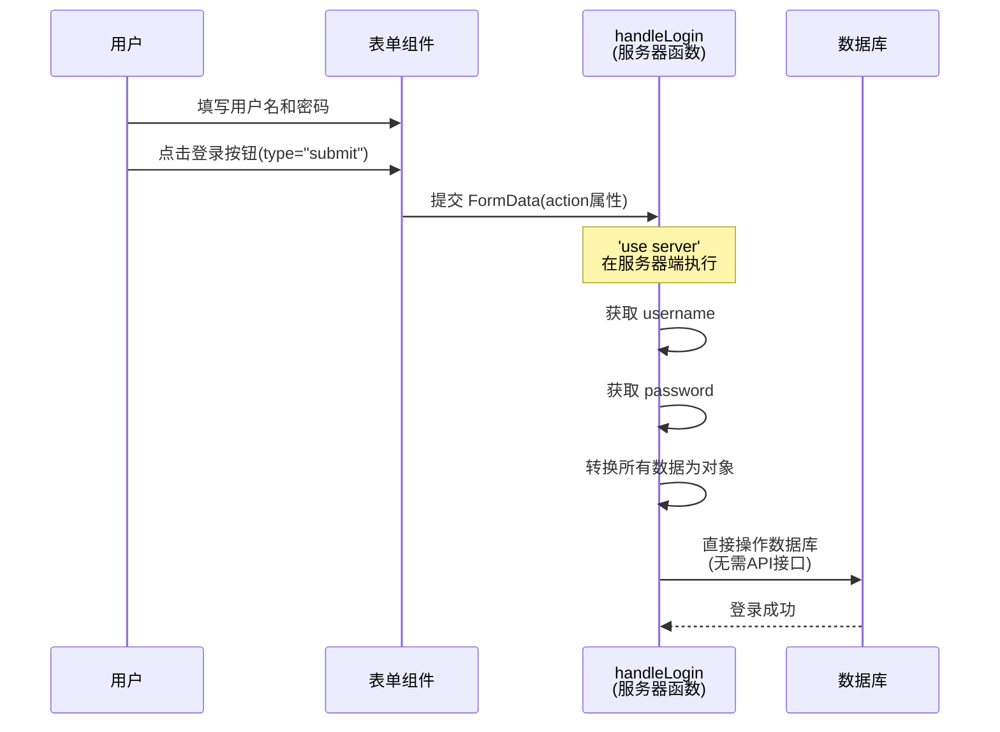

# 服务器函数(Server Actions)

服务器函数指的是可以是服务器组件处理表单的提交，无需手动编写API接口，并且还支持数据的验证，以及状态管理等。


### 核心原理
是因为React扩展了原生HTML`form`表单，允许通过`action`属性直接绑定`server action`函数，当表单提交后，函数会自动接受原生的`FormData`数据。


### 基本用法

我们先回顾一下传统的表单提交方式:


那么来看一下服务器函数的用法:



src/app/login/page.tsx

```tsx
export default function Login() {
    async function handleLogin(formData: FormData) {
        'use server'
        const username = formData.get('username') //接受单个参数
        const password = formData.get('password') //接受单个数据
        const form = Object.fromEntries(formData) //接受所有数据 {username: '张三', password: '123456'}
        //可以直接操作数据库，这样就无需编写API接口了 哇哦太方便了
    }
    return (
        <div>
            <h1>登录页面</h1>
            <div className="flex flex-col gap-2 w-[300px] mx-auto mt-30">
                <form action={handleLogin} className="flex flex-col gap-2">
                    <input className="border border-gray-300 rounded-md p-2" type="text" name="username" placeholder="用户名" />
                    <input className="border border-gray-300 rounded-md p-2" type="password" name="password" placeholder="密码" />
                    <button type="submit" className="bg-blue-500 text-white p-2 rounded-md">登录</button>
                </form>
            </div>
        </div>
    )
}
```

### 额外参数

目前只能携带固定参数例如 `username` `password`,无法携带其他参数。

```tsx
<form action={handleLogin}>
    <input type="text" name="username" placeholder="用户名" />
    <input type="password" name="password" placeholder="密码" />
    <button type="submit">登录</button>
</form>
```
那么我想携带`ID`或者其他自定义参数怎么做？

我们需要使用`bind`方法来进行参数扩展，这样在函数内部就可以接收到`ID`参数。

```tsx
export default function Login() {
                              //接受id参数
    async function handleLogin(id: number,formData: FormData) {
        'use server'
        const username = formData.get('username')
        const password = formData.get('password')
        const form = Object.fromEntries(formData)
        console.log(username, password,form,id)
    }
    const userFunction = handleLogin.bind(null,1) //绑定id参数
    return (
        <div>
            <h1>登录页面</h1>
            <div className="flex flex-col gap-2 w-[300px] mx-auto mt-30">
                        {/*使用新的函数绑定id参数 userFunction*/}
                <form action={userFunction} className="flex flex-col gap-2">
                    <input className="border border-gray-300 rounded-md p-2" type="text" name="username" placeholder="用户名" />
                    <input className="border border-gray-300 rounded-md p-2" type="password" name="password" placeholder="密码" />
                    <button type="submit" className="bg-blue-500 text-white p-2 rounded-md">登录</button>
                </form>
            </div>
        </div>
    )
}
```

### 参数校验(zod) + 读取状态

zod是一个目前非常流行的数据验证库，可以让我们在服务器端进行数据验证，避免用户输入非法数据。

```bash
npm i zod
```

src/app/lib/login/actions.ts

```tsx
'use server'
import { z } from "zod"
const loginSchema = z.object({
    username: z.string().min(6, '用户名不能少于6位'), //zod基本用法表示这是一个字符串，并且不能少于6位
    password: z.string().min(6, '密码不能少于6位') //zod基本用法表示这是一个字符串，并且不能少于6位
})

export async function handleLogin(_prevState: any, formData: FormData) {
    const result = loginSchema.safeParse(Object.fromEntries(formData)) //调用zod的safeParse方法进行校验
    
    if (!result.success) {
        const errorMessage = z.treeifyError(result.error).properties; //调用zod的treeifyError方法将错误信息转换为对象
        let str = ''
        Object.entries(errorMessage!).forEach(([_key, value]) => {
            value.errors.forEach((error: any) => {
                str += error + '\n' //将错误信息拼接成字符串
            })
        })
        return { message: str} //返回错误信息
    }
    //校验成功，进行数据库操作逻辑
    return { message: '登录成功' } //返回成功信息
}
```
src/app/login/page.tsx

如果要读取状态需要使用React19的`useActionState` hook，这个hook必须在客户端组件中使用。所以需要增加`'use client'`声明这是一个客户端组件。

#### 参数

`useActionState` hook接受三个参数:
- **fn**: 表单提交时触发的函数，接收上一次的 state（首次为 initialState）作为第一个参数，其余参数为表单参数
- **initialState**: state 的初始值，可以是任何可序列化的值
- **permalink**(可选): 表单提交后跳转的 URL，用于 JavaScript 加载前的渐进式增强

返回值:
- **state**: 当前状态，初始值为 initialState，之后为 action 的返回值
- **formAction**: 新的 action 函数，用于传递给 form 或 button 组件
- **isPending**: 布尔值，表示是否有正在进行的 Transition

```tsx
'use client'
import { useActionState } from "react"
import { handleLogin } from "../lib/login/actions"
const initialState = { message:'' }
export default function Login() {
    const [state, formAction,isPending] = useActionState(handleLogin, initialState)
    
    return (
        <div>
            <h1>登录页面</h1>
            {isPending && <div>Loading...</div>}
            {state.message}
            <div className="flex flex-col gap-2 w-[300px] mx-auto mt-30">
                <form action={formAction} className="flex flex-col gap-2">
                    <input className="border border-gray-300 rounded-md p-2" type="text" name="username" placeholder="用户名" />
                    <input className="border border-gray-300 rounded-md p-2" type="password" name="password" placeholder="密码" />
                    <button type="submit" className="bg-blue-500 text-white p-2 rounded-md">登录</button>
                </form>
            </div>
        </div>
    )
}
```