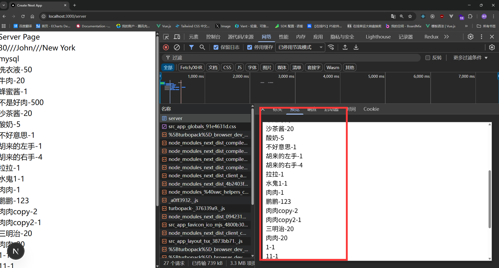
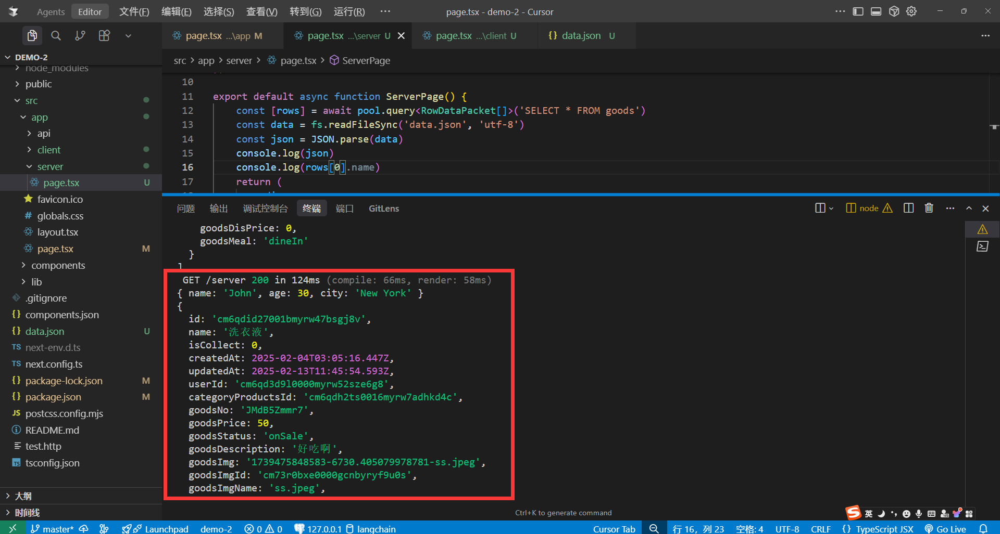

# 服务端组件(Server Components)

在默认情况下, `page` `layout` 都是服务端组件，服务端组件可以访问`node.js` API，包括处理数据库db。


src/app/server/page.tsx
```tsx
import fs from 'node:fs' //引入fs模块
import mysql, { RowDataPacket } from 'mysql2/promise' //操作数据库 仅供演示 非最佳实践
const pool = mysql.createPool({
    host: 'localhost',
    user: 'root',
    password: '123456',
    database: 'catering',
})

export default async function ServerPage() {
    const [rows] = await pool.query<RowDataPacket[]>('SELECT * FROM goods')
    const data = fs.readFileSync('data.json', 'utf-8')
    const json = JSON.parse(data)
    return (
        <div>
            <h1>Server Page</h1>
            {json.age}///{json.name}///{json.city}
            <h3>mysql</h3>
            {rows.map((item: any) => (
                <div key={item.id}>{item.name}-{item.goodsPrice}</div>
            ))}
        </div>
    )
}
```
data.json

```json
{
    "name": "John",
    "age": 30,
    "city": "New York"
}
```


因为是在服务端渲染的所以日志会出现在控制台，那为什么控制台也会出现，是因为`Next.js`在本地开发模式方便我们调试进行的输出，后续生产环境就看不到了。


### 服务端组件的优点

- 安全性: 我们在服务端组件中访问一些API秘钥，令牌等其他机密，不会暴露给客户端。
- 体积: 因为服务端组件在服务器渲染，所以不会被打包到客户端，所以体积更小。
- 全栈：可以在服务端组件访问数据库，文件系统等其他API，实现全栈开发。
- FCP(首次内容绘制): 因为服务端组件是流式传输，所以边渲染边返回，提高了FCP(首次内容绘制)性能。


### 服务端组件的缺点

- 交互性: 因为服务端组件在服务器渲染，所以无法访问浏览器API，所以无法进行交互。
- hooks: `useEffect` `useState` 等hooks在服务端组件中无法使用。

JavaScript: 是由三部分组成的(ECMAScript,DOM,BOM)，在服务端组件只能使用`ECMAScript`部分，无法访问`DOM`和`BOM`。

ECMAScript: 就是我们常用的对象，数组，es6+等这些东西是通用的在客户端和服务端都能用。

>如果要使用以下有交互性的功能，我们需要使用客户端组件。

```tsx
import { useEffect,useState } from 'react'
export default function ServerPage() {
    const [count, setCount] = useState(0)
    useEffect(() => {
        console.log(document,window)
    }, [])
    return (
        <div>
            <h1>Server Page</h1>
            <button onClick={() => setCount(count + 1)}>点击</button>
            <p>{count}</p>
        </div>
    )
}
```

