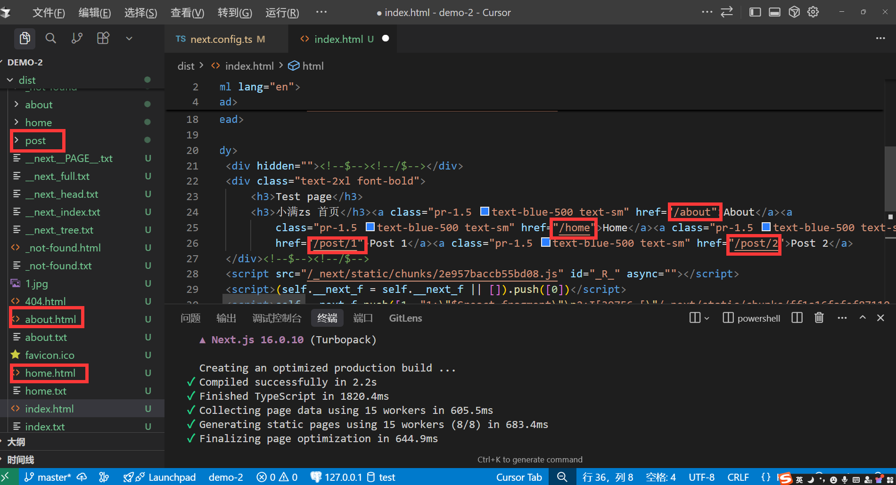
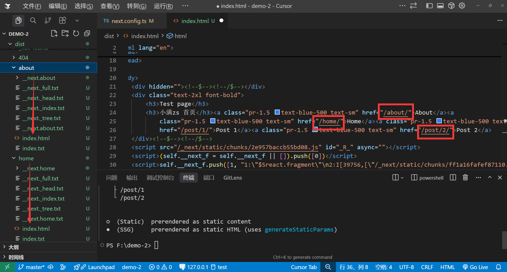
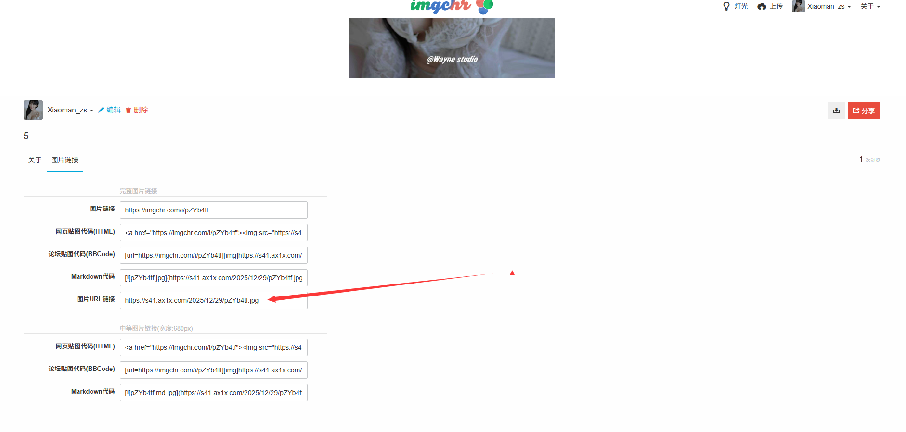
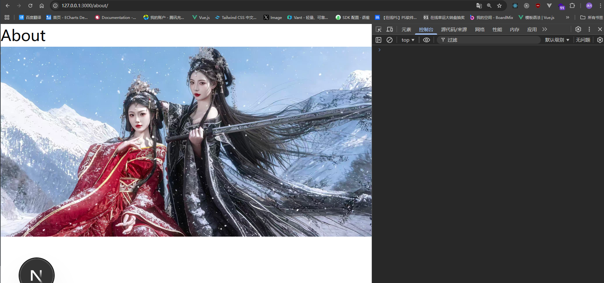

# 静态导出SSG

Next.js 支持静态站点生成（SSG，Static Site Generation），可以在构建时预先生成所有页面的静态 HTML 文件。这种方式特别适合内容相对固定的站点，如**官网**、**博客**、**文档**等，能够提供最佳的性能和 SEO 表现。

### 配置静态导出

需要在`next.config.js`文件中配置`output`为`export`，表示导出静态站点。`distDir`表示导出目录，默认为`out`。

```tsx
import type { NextConfig } from "next";
const nextConfig: NextConfig = {
  /* config options here */
  output: "export", // 导出静态站点
  distDir: "dist", // 导出目录
};

export default nextConfig;
```

接着我们执行`npm run build`命令，构建静态站点。


构建完成之后，我们安装`http-server`来启动静态站点。

```bash
npm install http-server -g #安装http-server
cd dist #进入导出目录
http-server -p 3000 #启动静态站点
```


启动完成之后发现点击`a`标签无法进行跳转，是因为打完包之后的页面叫`about.html`,而我们的跳转链接是`/about`，所以需要修改配置项。


### 修改配置项

需要在`next.config.js`文件中配置`trailingSlash`为`true`，表示添加尾部斜杠，生成`/about/index.html`而不是`/about.html`。

```tsx
import type { NextConfig } from "next";

const nextConfig: NextConfig = {
  /* config options here */
  output: "export", // 导出静态站点
  distDir: "dist", // 导出目录
  trailingSlash: true, // 添加尾部斜杠，生成 /about/index.html 而不是 /about.html
};

export default nextConfig;
```

此时重新点击`a`标签就可以进行跳转了。


### 动态路由处理
新建目录: `src/app/posts/[id]/page.tsx`

如果要使用动态路由，则需要使用`generateStaticParams`函数来生成有多少个动态路由，这个函数需要返回一个数组，数组中包含所有动态路由的参数，例如`{ id: '1' }`表示对应id为1的详情页。

```tsx
export async function generateStaticParams() {
    //支持调用接口请求详情id列表 const res = await fetch('https://api.example.com/posts')
    return [
        { id: '1' }, //返回对应的详情id
        { id: '2' },
    ]
}

export default async function Post({ params }: { params: Promise<{ id: string }> }) {
    const { id } = await params
    return (
        <div>
            <h1>Post {id}</h1>
        </div>
    )
}
```

### 图片优化

如果使用`Image`组件优化图片，在开发模式会进行报错

<div class="custom-block warning">
  <div class="custom-block-title">⚠️ 警告</div>
  <p>
    <code>get-img-props.ts 442 Uncaught Error</code>: Image Optimization using the default loader is not compatible with <code>{ output: 'export' }</code>.
  </p>
  <p>可能的解决方案：</p>
  <ul>
    <li>移除 <code>{ output: 'export' }</code> 并运行 "next start" 以启用包含图片优化 API 的服务器模式。</li>
    <li>在 <code>next.config.js</code> 中配置 <code>{ images: { unoptimized: true } }</code> 来禁用图片优化 API。</li>
    <li>使用自定义loader实现</li>
  </ul>
  <p>了解更多：<a href="https://nextjs.org/docs/messages/export-image-api" target="_blank">https://nextjs.org/docs/messages/export-image-api</a></p>
</div>


```tsx
import Image from "next/image"
import test from '@/public/1.png'
export default function About() {
    return (
        <div>
            <h1>About</h1>
            <Image  loading="eager" src={test} alt="logo" width={250 * 3} height={131 * 3} />
        </div>
    )
}
```

我们使用自定义`loader`来实现图片优化,要求我们通过一个图床托管图片。[路过图床](https://imgchr.com/) 是一个免费的图床，我们可以使用它来托管图片。




```tsx
import type { NextConfig } from "next";

const nextConfig: NextConfig = {
  /* config options here */
  output: "export", // 导出静态站点
  distDir: "dist", // 导出目录
  trailingSlash: true, // 添加尾部斜杠，生成 /about/index.html 而不是 /about.html
  images: {
    loader: 'custom', // 自定义loader
    loaderFile: './image-loader.ts', // 自定义loader文件
  },
};

export default nextConfig;
```

根目录：`/image-loader.ts`

```tsx
export default function imageLoader({ src, width, quality }: { src: string, width: number, quality: number }) {
    return `https://s41.ax1x.com${src}`
}
```

src/app/about/page.tsx

```tsx
import Image from "next/image"

export default function About() {
    return (
        <div>
            <h1>About</h1>
            <Image loading="eager" src='/2025/12/29/pZYbW7t.jpg' alt="logo" width={250 * 3} height={131 * 3} />
        </div>
    )
}
```




### 注意事项

以下功能在SSG中不支持，请勿使用：

- Dynamic Routes with dynamicParams: true
- 动态路由没有使用generateStaticParams()
- 路由处理器依赖于Request
- Cookies
- Rewrites重写
- Redirects重定向
- Headers头
- Proxy代理
- Incremental Static Regeneration增量静态再生
- Image Optimization with the default loader默认加载器的图像优化
- Draft Mode草稿模式
- Server Actions服务器操作
- Intercepting Routes拦截路由