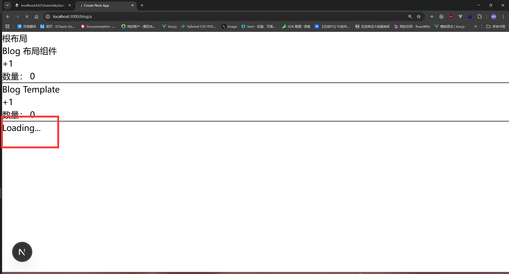
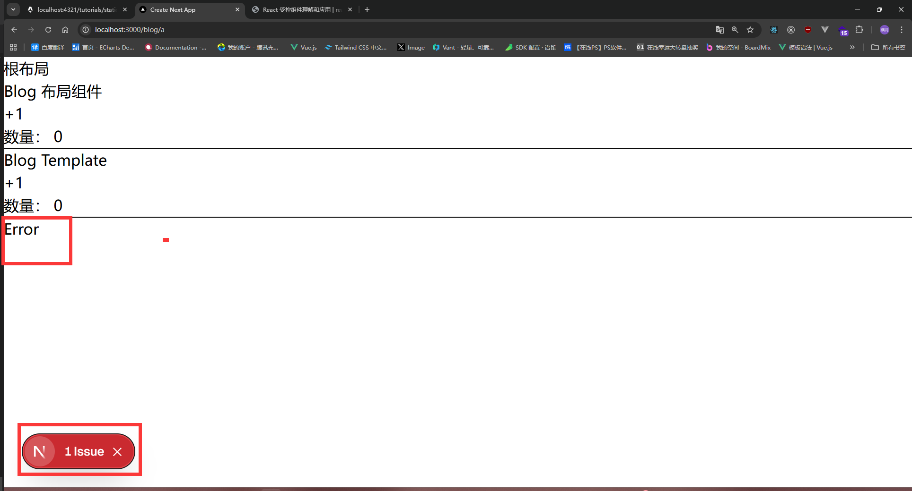
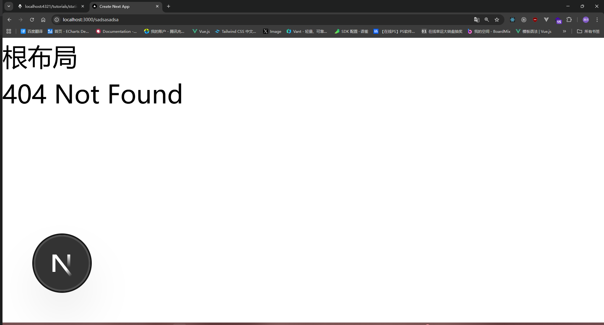

# Next.js 路由基础

Next.js 采用基于文件系统的路由机制，这意味着您只需创建文件和文件夹，框架就会自动为您生成对应的路由结构。这种约定优于配置的设计理念，让路由管理变得简单而直观。

## 文件系统路由的工作原理

在 Next.js 中，app 目录下的每个文件夹都代表一个路由段（route segment），并直接映射到 URL 路径。无需配置路由表，框架会根据您的文件结构自动处理。


### page(页面)

```
app/
├── page.tsx               # /
├── about/
│   └── page.tsx           # /about
├── blog/test
│        └── page.tsx      # /blog/test
└── contact/
    └── page.tsx           # /contact
```

### layout && template

`layout`(布局) 布局是多个页面共享UI，例如导航栏、侧边栏、底部等。

`template`(模板) 基本功能跟布局一样，只是不会保存状态

布局和模板的特点就是：

- **布局嵌套**：支持多层布局嵌套，构建复杂的页面结构
- **状态管理**：布局会在页面切换时保持状态，而模板会重新渲染
- **根布局**：app/layout.tsx 是必须存在的根布局文件
- **渲染顺序**：当布局和模板同时存在时，渲染顺序为 layout → template → page

目录结构如下:

```txt
app
└─ blog
   ├─ layout.tsx
   ├─ template.tsx
   ├─ a
   │  └─ page.tsx
   └─ b
      └─ page.tsx
```
app/blog/layout.tsx

```tsx
'use client' //需要交互的地方要改为客户端组件 默认是服务端组件
import { useState } from "react"
export default function BlogLayout({ children }: { children: React.ReactNode }) {
    const [count, setCount] = useState(0)
    return (
        <div>
            <h1>Blog 布局组件</h1>
            <button onClick={() => setCount(count + 1)}>+1</button>
            <h1>数量： {count}</h1>
            <hr />
            {children}
        </div>
    )
}
```
app/blog/template.tsx

```tsx
'use client' //需要交互的地方要改为客户端组件 默认是服务端组件
import { useState } from "react"
export default function BlogTemplate({ children }: { children: React.ReactNode }) {
    const [count, setCount] = useState(0)
    return (
        <div>
            <h1>Blog Template</h1>
            <button onClick={() => setCount(count + 1)}>+1</button>
            <h1>数量： {count}</h1>
            <hr />
            {children}
        </div>
    )
}
```
app/blog/a/page.tsx

```tsx
import Link from "next/link"
export default function APage() {
    return (
        <div>
            <h1>A Page</h1>
            <Link href="/blog/b">跳转B</Link>
        </div>
    )
}
```
app/blog/b/page.tsx

```tsx
import Link from "next/link"
export default function BPage() {
    return (
        <div>
            <h1>B Page</h1>
            <Link href="/blog/a">跳转A</Link>
        </div>
    )
}
```


### loading(加载)

Next.js的loading是借助了`Suspense`实现的，Suspense的具体用法请参考[Suspense 组件](https://message163.github.io/react-docs/react/components/suspense.html)

app/blog/loading.tsx
```tsx
export default function Loading() {
    return (
        <div>
            <h1>Loading...</h1>
        </div>
    )
}
```

app/blog/a/page.tsx

```tsx
import Link from "next/link"
const getData = async () => {
  //触发异步会自动跳转到loading组件 异步结束正常返回页面
  return new Promise((resolve) => {
    setTimeout(() => {
      resolve("数据")
    }, 5000)
  })
}
export default async function APage() {
    const data = await getData()
    console.log(data)
    return (
        <div>
            <h1>A Page</h1>
            <Link href="/blog/b">跳转B</Link>
        </div>
    )
}
```


### error(错误)

Next.js的error是借助了`Error Boundary`实现的。

app/blog/error.tsx
```tsx
'use client' //错误组件必须是客户端组件
export default function Error() {
    return (
        <div>
            <h1>Error</h1>
        </div>
    )
}
```

app/blog/a/page.tsx
```tsx
import Link from "next/link"
export default async function APage() {
   //遇到异常会自动跳转到error组件
    throw new Error("错误")
    return (
        <div>
            <h1>A Page</h1>
            <Link href="/blog/b">跳转B</Link>
        </div>
    )
}
```


### not-found(404)

其实Next.js 默认会生成一个404页面，但我们可能自定义404页面，只需要在app目录下创建一个not-found.tsx文件即可

app/not-found.tsx
```tsx
export default function NotFound() {
    return (
        <div>
            <h1>404 Page</h1>
        </div>
    )
}
```


**预计学习时间**: 20 分钟  
**难度级别**: 初级 🟢


