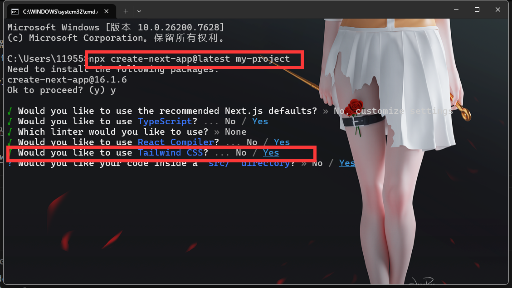
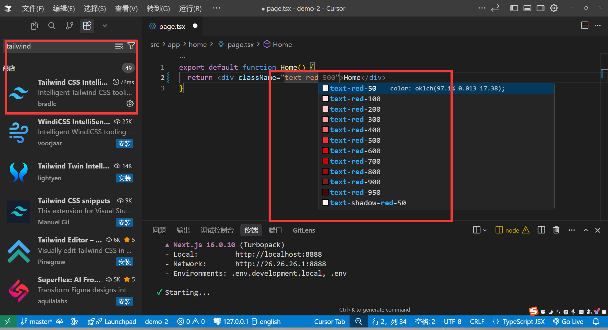

# Next.js CSS方案

在Next.js可以使用多种Css方案，包括：

- Tailwind CSS(个人推荐)
- CSS Modules(创建css模块化，类似于Vue的单文件组件)
- Next.js内置Sass(css预处理器)
- 全局Css(全局的css，可以全局使用)
- Style(内联样式)
- css-in-js(类似于React的styled-components，不推荐)

### Tailwind CSS

Tailwind CSS(原子化CSS)，他是一个css框架，可以让你快速构建网页，他提供了大量的css类，你只需要使用这些类，就可以快速构建网页。

[Tailwind CSS](https://tailwindcss.com/)

#### 安装教程

```bash
npx create-next-app@latest my-project
```

当我们去创建`Next.js`项目的时候，选择`customize settings(自定义选项)` 那么就会出现`Tailwind CSS`的选项，我们选择`Yes`即可。



那么如果我在当时忘记选择`Tailwind CSS`，我该怎么安装呢？

[Next.js Tailwind CSS 安装教程](https://tailwindcss.com/docs/installation/framework-guides/nextjs)

#### 在 Next.js 中安装并使用 Tailwind CSS

下面是如何在 Next.js 项目中集成 Tailwind CSS 的详细流程：

##### 1. 创建你的 Next.js 项目

如果还没有项目，可以使用 Create Next App 快速初始化：

```bash
npx create-next-app@latest my-project --typescript --eslint --app
cd my-project
```

##### 2. 安装 Tailwind CSS 及相关依赖

通过 npm 安装 `tailwindcss`、`@tailwindcss/postcss` 以及 `postcss` 依赖：

```bash
npm install tailwindcss @tailwindcss/postcss postcss
```

##### 3. 配置 PostCSS 插件

在项目根目录下创建 `postcss.config.mjs` 文件，并添加如下内容：

```js
const config = {
  plugins: {
    "@tailwindcss/postcss": {},
  },
};
export default config;
```

##### 4. 导入 Tailwind CSS

在 `./app/globals.css` 文件中添加 Tailwind CSS 的导入：

```css
@import "tailwindcss";
```

##### 5. 启动开发服务

运行开发服务：

```bash
npm run dev
```

##### 6. 在项目中开始使用 Tailwind

现在可以直接在组件或页面中使用 Tailwind CSS 的工具类来进行样式编写。例如：

```tsx
export default function Home() {
  return (
    <h1 className="text-3xl font-bold underline">
      Hello world!
    </h1>
  )
}
```

这样即可在项目中使用 Tailwind CSS 原子类来快速开发样式。


#### FAQ

这么多类名我记不住怎么办？

答：你不需要特意去记忆，tailwindCss的类名都是简称，例如`backdround-color:red` 你可以简写为`bg-red-500`。另外就是官网也提供文档可以查询，再其次就是还提供了`vscode`插件，可以自动补全类名。




### CSS Modules

CSS Modules 是一种 CSS 模块化方案，可以让你在组件中使用CSS模块化，类似于Vue的单文件组件(scoped)。

Next.js已经内置了对CSS Modules的支持，你只需要在创建文件的时候新增`.module.css`后缀即可。例如`index.module.css`。

```css
/** index.module.css */
.container {
  background-color: red;
}
```

```tsx
/** index.tsx */
import styles from './index.module.css';
export default function Home() {
  return (
    <div className={styles.container}>
      <h1>Home</h1>
    </div>
  )
}
```
你会发现他编译出来的类名，就会生成一个唯一的hash值，这样就可以避免类名冲突。
```html
<h1 class="index-module__ifV0vq__test">小满zs Page</h1>
```

### Next.js内置Sass

Next.js已经内置了对Sass的支持，但是依赖还需要手动安装，不过配置项它都内置了，只需要安装一下即可。

```bash
npm install --save-dev sass
```

另外Next.js还支持配置全局sass变量，只需要在`next.config.js`中配置即可。

```ts
import type { NextConfig } from 'next'
const config: NextConfig = {
  reactCompiler: true,
  reactStrictMode: false,
  cacheComponents:false,
  sassOptions:{
    additionalData: `$color: blue;`, // 全局变量
  }
}

export default config
```

### 全局Css

全局CSS，就是把所有样式应用到全局路由/组件，那应该怎么搞呢?

在根目录下创建`globals.css`文件，然后添加全局样式。

```css
/** app/globals.css */
body {
  background-color: red;
}
.flex{
    display: flex;
    justify-content: center;
    align-items: center;
}
```

在`layout.tsx`文件中引入`globals.css`文件。

```tsx
//app/layout.tsx
import './globals.css'
export default function RootLayout({ children }: { children: React.ReactNode }) {
  return (
    <html lang="en">
      <body>{children}</body>
    </html>
  )
}
```

### Style

Style，就是内联样式，就是直接在组件中使用style属性来定义样式。

```tsx
export default function Home() {
  return (
    <div style={{ backgroundColor: 'red' }}>
      <h1>Home</h1>
    </div>
  )
}
```

### css-in-js

css-in-js，就是把css + js + html混合在一起，拨入styled-components，不推荐很多人接受不了这种写法。


#### 1.安装启用styled-components

```bash
npm install styled-components
```

```ts
import type { NextConfig } from 'next'
const config: NextConfig = {
  compiler:{
    styledComponents:true // 启用styled-components
  }
}
export default config
```

#### 2.创建style-component注册表


使用styled-componentsAPI 创建一个全局注册表组件，用于收集渲染过程中生成的所有 CSS 样式规则，以及一个返回这些规则的函数。最后，使用该useServerInsertedHTML钩子将注册表中收集的样式注入到`<head>`根布局的 HTML 标签中。

```tsx
//lib/registry.ts
'use client'
 
import React, { useState } from 'react'
import { useServerInsertedHTML } from 'next/navigation'
import { ServerStyleSheet, StyleSheetManager } from 'styled-components'
 
export default function StyledComponentsRegistry({
  children,
}: {
  children: React.ReactNode
}) {
  // Only create stylesheet once with lazy initial state
  // x-ref: https://reactjs.org/docs/hooks-reference.html#lazy-initial-state
  const [styledComponentsStyleSheet] = useState(() => new ServerStyleSheet())
 
  useServerInsertedHTML(() => {
    const styles = styledComponentsStyleSheet.getStyleElement()
    styledComponentsStyleSheet.instance.clearTag()
    return <>{styles}</>
  })
 
  if (typeof window !== 'undefined') return <>{children}</>
 
  return (
    <StyleSheetManager sheet={styledComponentsStyleSheet.instance}>
      {children}
    </StyleSheetManager>
  )
}
```

#### 3.注册style-component注册表


```tsx
//app/layout.tsx
import StyledComponentsRegistry from './lib/registry'
 
export default function RootLayout({
  children,
}: {
  children: React.ReactNode
}) {
  return (
    <html>
      <body>
        <StyledComponentsRegistry>{children}</StyledComponentsRegistry>
      </body>
    </html>
  )
}
```

#### 4.使用styled-components

```tsx
'use client';
import styled from 'styled-components';
const StyledButton = styled.button`
  background-color: red;
  color: white;
  padding: 10px 20px;
  border-radius: 5px;
`;
export default function Home() {
  return (
    <StyledButton>Click me</StyledButton>
  )
}
```